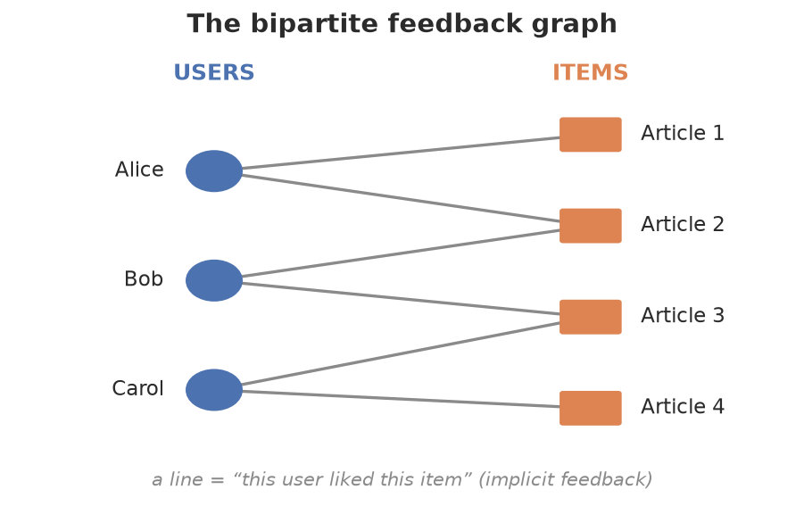
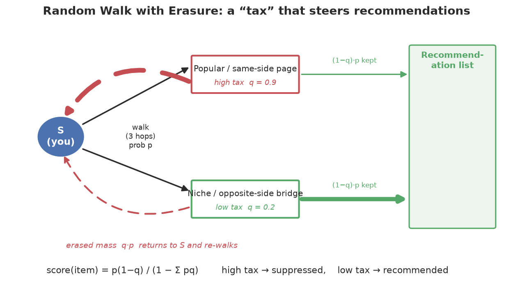
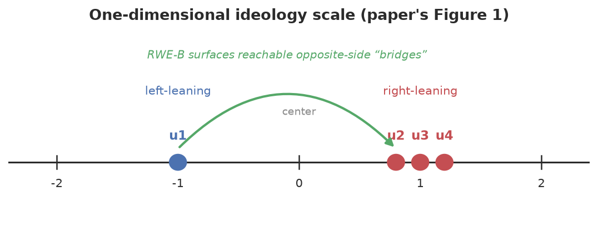

# A Beginner's Guide: What We Built and How

This document explains the whole project from scratch, assuming **no background**
in recommender systems, graphs, or machine learning. If you can read a little
Python, you can follow this. The formal reference (API, usage) lives in
[`README.md`](README.md); this file is the *story and the intuition*.

> **One-sentence summary.** We built a Python toolkit that recommends content to
> people in a way that gently breaks them out of their "bubble" — showing them
> good-but-different viewpoints instead of just more of what they already
> agree with — based on a research paper, plus two extensions that simulate how
> users react to opposing content.

---

## Table of contents

1. [The problem: filter bubbles](#1-the-problem-filter-bubbles)
2. [The big idea in plain words](#2-the-big-idea-in-plain-words)
3. [Background concepts (explained simply)](#3-background-concepts-explained-simply)
4. [What we built, piece by piece](#4-what-we-built-piece-by-piece)
5. [Two extensions we added](#5-two-extensions-we-added)
6. [How we built it from scratch (the journey)](#6-how-we-built-it-from-scratch-the-journey)
7. [How to run everything yourself](#7-how-to-run-everything-yourself)
8. [How we know it actually works](#8-how-we-know-it-actually-works)
9. [Map of every file](#9-map-of-every-file)
10. [Glossary](#10-glossary)

---

## 1. The problem: filter bubbles

When you use a news app or social network, an algorithm decides what to show
you. Most algorithms show you **more of what you already like**. Click on one
political article and you'll get ten more just like it. Over time you end up in a
**filter bubble** (also called an *echo chamber*): you only ever see one side of
the story.

This is comfortable but unhealthy — for you and for democracy. The research
paper this project implements asks: **can we recommend content that is still
relevant and interesting, but that also exposes people to different
viewpoints?**

> 📄 The paper: *"Random Walks with Erasure: Diversifying Personalized
> Recommendations on Social and Information Networks"* by Bibek Paudel and
> Abraham Bernstein (The Web Conference / WWW 2021).

---

## 2. The big idea in plain words

Imagine all the readers and all the articles as dots, with a line drawn whenever
a reader liked an article. This web of dots-and-lines is a **graph**.

Now imagine a tiny wanderer who starts at *you* and walks along the lines at
random: from you to an article you liked, from there to another reader who liked
it, from there to *their* articles, and so on. After a few steps, the places the
wanderer is most likely to end up are good recommendations — they're "close to
you" in the web of shared tastes. This is a **random walk**.

There's a catch: random walks naturally drift toward the **most popular,
most-connected** articles — the ones *everybody* already sees. That makes
recommendations bland and bubble-reinforcing.

The paper's clever fix is **erasure**. Think of it as a **tax** on the
wanderer's attention:

- Every time the wanderer lands on a page, we "erase" (tax) a fraction of its
  attention and send it **back home** to start over.
- We tax some pages **more** than others. If we tax popular pages heavily, the
  wanderer's leftover attention spreads to **lesser-known** pages (more variety).
  If we tax pages that agree with you heavily, the leftover attention reaches
  **different viewpoints** you can still get to.

By choosing *what to tax*, we steer the recommendations toward different kinds of
diversity. That tax schedule is called the **erasure matrix `Q`**, and the whole
method is **Random Walk with Erasure (RWE)**.

The project implements:

- **RWE-D** — tax popular pages → surface "long-tail" (niche) items.
- **RWE-B** — tax same-side pages → "bridge" people toward opposing viewpoints.

…plus the machinery to figure out *which* viewpoint each person and article has,
to measure whether it's working, and (our extensions) to *simulate how users
react* to the opposing content they're shown.

---

## 3. Background concepts (explained simply)

You only need five ideas. Each has a plain explanation first and an optional
"under the hood" note for the curious.

### 3.1 A recommender system

A program that, given a person, produces a ranked list of items (articles,
movies, products) they're likely to want. We only use **implicit feedback**:
we know *which* items a person interacted with (a 1), not a star rating. Anything
they didn't touch is a 0.

### 3.2 The feedback graph (a "bipartite" network)

Picture two columns of dots:

<p align="center">
  
</p>

A line means "this user liked this item." Because lines only ever go between the
two columns (never user-to-user or item-to-item), this is called a **bipartite
graph**. It's the raw material for the random walk.

> 📐 *Under the hood.* We store it as a matrix `A` (rows = users, columns =
> items, entries 0/1). To let the walker move both directions we build a bigger
> square matrix that glues `A` and its mirror image together — the paper calls
> this `A^G`. See `rwe/graph.py`.

### 3.3 A random walk

Start at a node. Repeatedly hop to a random neighbor. After `k` hops, ask: "what
is the probability I'm standing on each node?" That probability spread is what we
use to score items.

We use an **odd** number of hops (3 is standard, hence "3-hop"). Why odd?
Because in a bipartite graph each hop switches columns: user → item → user →
item. Starting at a user, after 3 hops you land on an **item** — exactly what we
want to recommend.

> 📐 *Under the hood.* "Hop to a random neighbor" is one multiplication by a
> **transition matrix** `P`. Three hops = `P` applied three times. See
> `k_step_distribution` in `rwe/graph.py`.

### 3.4 The erasure trick (the heart of the method)

After the walk reaches an item, we **erase** a fraction `q` of the probability
that landed there and send it back to the starting user, who walks again. Repeat
until the leftover is tiny.

<p align="center">
  
</p>

- If `q` is large for an item, that item is **suppressed** (taxed heavily).
- If `q` is small, that item is **kept** (recommended).

We discovered the whole "repeat forever" process has a simple closed form (no
loop needed):

> 📐 `score = (landing_probability × (1 − q)) / (1 − total_erased)`
>
> The bottom part is the same for every item of a given user, so it doesn't
> change the *ranking*. In plain terms: **score = how much probability survives
> the tax.** See `rwe/random_walk.py`.

### 3.5 Ideology positions (the left–right scale)

To bridge viewpoints we need to know each person's and article's **viewpoint**.
We place everyone on a single number line, e.g. from −2 (far left) to +2 (far
right), with 0 in the middle. A user at −1 is left-leaning; an article at +1.5 is
strongly right-leaning.

<p align="center">
  
</p>

We don't get these numbers for free — we **learn** them from behavior (who
shares/retweets whom). That's the job of `rwe/ideology.py`.

> 📐 *Under the hood.* It's a classic "ideal-point model": if two people endorse
> the same sources, they're probably near each other on the line. We find the
> numbers that best explain the observed endorsements. See section 4 below.

### 3.6 Communities

On a web of pages, **communities** are clumps of pages that link to each other a
lot. In news, such clumps tend to share a topic *and* a viewpoint (e.g. a
cluster of left-leaning climate blogs). Finding these clumps automatically is
**community detection**. We use it in the extensions to define "the opposing
community" a user might wander into.

---

## 4. What we built, piece by piece

The code lives in the `rwe/` package. Here's each file in plain language, in the
order it makes sense to learn them.

### `graph.py` — build the network

Takes your user–item table and builds the bipartite graph, the transition matrix
`P`, and a function to run `k`-hop walks for a batch of users. Everything else
stands on this.

- **Main class:** `FeedbackGraph`
- **Key method:** `k_step_distribution(users, k)` → "where does the walk land?"

### `random_walk.py` — the recommenders

This is the core of the paper. It contains:

- `P3` — plain 3-hop random walk (no erasure). The simplest recommender.
- `RP3Beta` — a known method that down-weights popular items (a baseline to beat).
- `RWE` — the general erasure walk; you hand it any tax schedule `Q`.
- `RWED` — RWE with a tax that grows with popularity → **long-tail diversity**.
- `RWEB` — RWE with a tax that grows on *same-side* content → **viewpoint bridging**.

A neat sanity fact we built in: **RWE-D with its knob `v=1` is mathematically the
same as RP3Beta**. We turned that into a test, so if we ever break the math, the
test fails.

### `ideology.py` — figure out who is left vs right

Learns the left–right number for every user, every "elite" (a heavily-endorsed
account), and every article — all on the **same** scale so they're comparable.

- **Main class:** `IdeologyModel`
- Two modes: from endorsements only, or **jointly** from endorsements *and*
  article-sharing (the joint version is more accurate, matching the paper).

> 📐 *Under the hood.* It maximizes how well the numbers explain the data using
> a method called **Adam** (an optimizer). We chose Adam because the raw math
> produces gradients of wildly different sizes, and Adam adapts automatically.

### `baselines.py` — things to compare against

To claim our method is good, we need rivals. This file has two standard
recommenders:

- `ItemKNN` — "people who liked this also liked…" (item-based collaborative filtering).
- `BPRMF` — a matrix-factorization method (learns hidden taste factors).

### `metrics.py` — how we measure success

Numbers that tell us whether recommendations are good. Two families:

- **Accuracy** (did we recommend things the user actually wanted?): `auc`,
  `mean_rank`, `hit_rate_at_k`, `precision_at_k`.
- **Diversity** (are recommendations varied / balanced?): `gini_diversity`,
  `average_item_degree`, `personalization`, `surprisal`, and — for viewpoints —
  `rec_range_at_k` (how wide a span of opinions is in your top-10?) and
  `ks_statistic` (are two methods' viewpoint distributions really different?).

### `data.py` — get data in and make fair test sets

- Loaders for CSV files and the MovieLens-1M movie dataset.
- `train_test_split` — hide 30% of each user's items to test on (you can't grade
  a recommender on items it was trained on).
- **Synthetic generators** that invent realistic fake data with a *known*
  answer, so we can check the code recovers it. (The paper's real Twitter data
  isn't publicly shareable, so these let everything run out-of-the-box.)

### `experiment.py` — run it all and compare

- `evaluate` / `compare` — run one or many recommenders and print a results table.
- `grid_search` — automatically try many settings and keep the best.

---

## 5. Two extensions we added

These go **beyond the paper** — they were your ideas, built on top of the core.

### `satisfaction.py` — adapt how much opposing content each person gets

The idea: don't give everyone the same dose of opposing viewpoints. Measure how
much each person **tolerates** it, and personalize.

1. Turn the user–item graph into a **page-to-page** graph (two pages are linked
   if the same people consumed both).
2. Find **communities** of like-minded pages.
3. Simulate a person browsing; measure their **satisfaction score** = how many
   pages they read inside an *opposing* community before leaving it.
4. Feed that score into `AdaptiveRWEB`: people who linger in opposing content get
   shown more of it; people who bounce right back get a gentler dose.

The payoff (from the demo): a one-size-fits-all aggressive setting flips
*everybody* to ~98% opposing content — overwhelming the sensitive ones — while
the adaptive version gives tolerant users a healthy amount and protects the rest.

> 🛠️ A real bug we hit and fixed: the page-to-page graph was so dense that the
> community finder lumped everything into **one** community. The fix was to keep
> only each page's strongest links before detecting communities (a "k-NN
> sparsify" step), which reveals the real clusters. We kept the *full* graph for
> the browsing walk so rare cross-links still exist.

### `agent_sim.py` — a richer browsing simulation

A second, more detailed take on the satisfaction score, built on the popular
**networkx** graph library with professional community detection
(**Louvain/Leiden**).

- Build a web graph; give each page the average viewpoint of its community.
- A page is **"opposite"** for you if it's on the other side of 0 *and* far
  enough from the center (a "deadband" ignores wishy-washy centrist pages).
- Simulate a browsing **session** as a state machine:
  `your side → first opposite page (start counting) → keep counting while you
  stay in that opposing community → you leave (stop)`.
- A tunable knob **`alpha`** controls behavior:
  - `alpha = 0`: pure random clicking.
  - `alpha > 0`: **confirmation bias** — you drift back to your own side.
  - `alpha < 0`: **"rabbit hole"** — you sink deeper into opposing content.
- Run it thousands of times (**Monte Carlo**) to get a *distribution* of scores
  per user.

We validated it with an **alpha sweep**: as confirmation bias rises, the
satisfaction score falls smoothly to near zero — exactly what should happen.

It also answers a practical question — *"which pages did the user actually
visit?"* — via `SessionLog` (the full trajectory) and `score_trajectory`, which
scores **real** browsing logs with the same logic as the simulation.

---

## 6. How we built it from scratch (the journey)

This is the actual order we worked in — useful if you want to rebuild something
like it.

1. **Read the paper carefully.** We mapped every equation to a plan before
   writing code. The most important early win was a *math derivation*: the
   "erase and repeat forever" process collapses into a one-line closed form. That
   made the code simple and fast.

2. **Set up the skeleton.** A Python package (`rwe/`), dependency list, and
   project config — so it installs with `pip install -e .`.

3. **Built the core bottom-up:** `graph.py` first (everything needs it), then
   `random_walk.py` (the recommenders), then `ideology.py` (the viewpoints),
   then `baselines.py`, `metrics.py`, `data.py`, `experiment.py`.

4. **Wrote tests alongside the code.** Each component got tests that check a
   property we *know* must be true (e.g. closed-form == loop; RWE-D(v=1) ==
   RP3Beta; the viewpoint learner recovers planted answers).

5. **Proved it reproduces the paper** with a synthetic demo: joint viewpoint
   detection beats endorsement-only, RWE-D matches the long-tail baseline, and
   RWE-B produces a measurably wider span of viewpoints.

6. **Added extension #1 (`satisfaction.py`)** — and fixed the "one giant
   community" bug along the way.

7. **Added extension #2 (`agent_sim.py`)** — the networkx agent simulation, the
   alpha sweep validation, and later the session log + real-log scoring.

8. **Validated against the paper's Figure 1** — plugged the four example users
   into our code and confirmed every relationship the paper states (who's left/
   right, distances, similarities, who bridges whom).

Throughout, the rule was: **make a claim, then write a test that would catch us
if the claim were false.**

---

## 7. How to run everything yourself

```bash
# 1. Install (from the project folder)
pip install -e .

# 2. See it work end-to-end on synthetic data
python examples/demo_synthetic.py       # viewpoint detection + diversified recs
python examples/demo_movielens.py       # long-tail diversity benchmark
python examples/demo_satisfaction.py    # adaptive per-user exposure
python examples/demo_agent_sim.py       # agent-based browsing simulation

# 3. Run the test suite (should print "58 passed")
pytest -q
```

Nothing to download — the demos generate their own data. (For the movie demo you
can optionally point it at the real MovieLens-1M file.)

A 10-line taste of the API:

```python
import numpy as np
from rwe import FeedbackGraph, P3, RWED

A = np.array([[1, 1, 0, 0],     # Alice liked items 0 and 1
              [0, 1, 1, 0],     # Bob liked items 1 and 2
              [0, 0, 1, 1]])    # Carol liked items 2 and 3
graph = FeedbackGraph(A)

print(P3(graph).recommend([0], top_k=2))            # plain recommendations for Alice
print(RWED(graph, beta=0.5).recommend([0], top_k=2)) # long-tail-diversified
```

---

## 8. How we know it actually works

We don't just *hope* the code is right — **58 automated tests** check it, and
they're the kind that would fail loudly if the logic broke. A few examples:

- **The math is internally consistent:** the fast closed-form RWE gives the same
  answer as the slow "repeat the loop" version.
- **It agrees with known methods:** RWE-D with `v=1` produces the *exact* same
  ranking as the established RP3Beta method.
- **The learner recovers the truth:** when we plant known viewpoints in fake
  data, `IdeologyModel` recovers them with >0.8 correlation.
- **Behavior is sensible:** in the agent simulation, more confirmation bias
  always yields a lower satisfaction score (we test the whole sweep is
  monotonic).

Run `pytest -q` any time to confirm everything still passes.

---

## 9. Map of every file

| File | What it is |
|------|------------|
| `rwe/graph.py` | Bipartite user–item graph + random-walk engine. |
| `rwe/random_walk.py` | `P3`, `RP3Beta`, `RWE`, `RWED`, `RWEB` recommenders. |
| `rwe/ideology.py` | Learns left–right positions for users/elites/content. |
| `rwe/baselines.py` | `ItemKNN` and `BPRMF` rivals to compare against. |
| `rwe/metrics.py` | Accuracy + diversity measurements. |
| `rwe/data.py` | Loaders, train/test split, synthetic data generators. |
| `rwe/experiment.py` | Runner + automatic hyper-parameter search. |
| `rwe/satisfaction.py` | **Extension 1:** adaptive per-user exposure. |
| `rwe/agent_sim.py` | **Extension 2:** networkx agent browsing simulation. |
| `examples/demo_*.py` | Four runnable, self-contained demos. |
| `tests/test_*.py` | 58 automated correctness checks. |
| `docs/make_diagrams.py` | Regenerates the diagrams in this guide (into `docs/images/`). |
| `README.md` | Reference docs (API, equations, usage). |
| `GUIDE.md` | This beginner walkthrough. |

---

## 10. Glossary

- **Bipartite graph** — a network with two kinds of nodes (users, items) where
  links only go between the two kinds.
- **Random walk** — repeatedly hopping to a random neighbor; used to find nodes
  "near" a starting point.
- **Erasure** — taxing a fraction of the walk's probability at a node and sending
  it back home; the paper's key trick for steering recommendations.
- **Erasure matrix `Q`** — the per-node tax schedule that defines a strategy.
- **Long-tail item** — a niche, rarely-consumed item (opposite of "popular").
- **Ideology / viewpoint position** — a single number placing someone on a
  left(−)–right(+) scale.
- **Ideal-point model** — the technique that learns those numbers from behavior.
- **Bridge** — content on the *opposite* side of you that you can still reach
  through weak links; RWE-B promotes these.
- **Community** — a tightly-linked clump of pages, usually sharing a viewpoint.
- **Louvain / Leiden / Label propagation** — algorithms that find communities.
- **Monte Carlo** — running a random simulation many times to get an average / a
  distribution.
- **Confirmation bias (`alpha > 0`)** — tendency to stay with agreeable content.
- **AUC / Precision / Hit-rate** — accuracy scores (higher = better).
- **Gini / Surprisal / Personalization** — diversity scores.
- **Train/test split** — hiding some data to fairly grade predictions.

---

*New to the project? Read this file top to bottom, run the four demos, then open
`rwe/random_walk.py` — it's the heart of everything and is heavily commented.*
