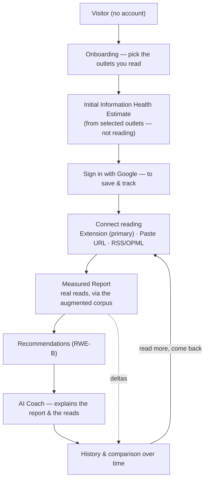
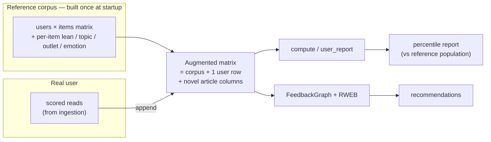

# Information Health — Beta Reference Architecture

**Status:** reference for the closed-beta implementation (Milestones A–D).
**Scope:** turn the working PoC into something a real person can sign into, connect their
reading to, and come back to — *without changing a single algorithm.*

This document is the contract for the beta build. Every implementation commit should be
explainable in its terms. If a change can't be described here, it's out of scope.

---

## 1. The one guiding principle: *append, never modify*

The engine already computes everything we need. Today a "user" is just a **row index into a
click matrix** built once at startup. A real user becomes **one more row** in that same
matrix (plus any articles they read that aren't already in the catalog, as new columns).
Once the row exists, the existing code runs untouched.

**Stays exactly as it is — no edits:**

- `health_report.compute` / `user_report` — the Information Health Report math (percentiles,
  topic/source/viewpoint/echo/emotion/register metrics).
- `rwe.RWEB` / `RWED` / `AdaptiveRWEB` + `FeedbackGraph` — the RWE recommenders and the
  bipartite random walk.
- `narrate_report` — the grounded AI-Coach narrative.
- Dataset profiles (`synthetic` / `qbias` / `mind` / `politosphere`) and the JSON contract in
  `web/types/domain.ts`.

Everything new is **additive**: a persistence layer, an ingestion→scoring pipeline that
*produces the row*, auth, and history. The demo user still works with no account, so both
contract-test suites stay green after every commit.

---

## 2. The user lifecycle



| Stage | What happens | Honest by design |
| --- | --- | --- |
| **Visitor** | Lands on the value screen ("a health check for your news diet"); understands it in ~30s. | No signup wall to *see* value. |
| **Onboarding** | Picks the publishers they read (approved `onboarding.html`, step 2/3). | 30 seconds, no fabricated data. |
| **Initial Estimate** | An **Initial Information Health Estimate** computed *directly from the selected outlets'* known characteristics — **not** from invented article reads. Presented as an estimate (never a measured report), stating plainly that it is derived from the publishers picked, is not yet based on actual reading, sharpens as real reading is collected, and transitions to a measured report automatically once enough reading exists. | We never imply the user read articles they didn't — nor that an estimate is a measurement. |
| **Authentication** | "Save your report & track your score" → **Google OAuth**. Progressive: it comes *after* value, not before. | One provider, minimal friction. |
| **Reading Ingestion** | The user connects a real source. **Browser extension is the primary method**; Paste URL and RSS/OPML are secondary. Each real read is scored and stored. | Real reads, captured with consent. |
| **Updated (Measured) Report** | Once enough real reads exist, the report is recomputed from the **augmented corpus** (§4) and the label transitions **Initial Estimate → Measured (N reads)** automatically. | The estimate is *replaced* by measurement, not blended silently. |
| **Recommendations** | `RWEB` runs over the augmented graph → cross-cutting, bounded-bridging reads. | Same recommender as the research code. |
| **AI Coach** | `narrate_report` grounds its reply in the user's real metrics and the reads behind them. | Grounded, not free-associating. |
| **History** | Every report + recommendation set is snapshotted; the user revisits and compares over time. | Their record, persisted. |
| **Continuous Improvement** | Following recommendations produces new reads → a new measured report whose **deltas explain what changed and why** (the feedback loop). | The core "this changed how I read" moment. |

---

## 3. How a reading event flows through the system

A "reading event" is minimal: `{ url, title, source, observed_at }`. It is captured at the
edge, scored once (and cached), stored against the user, and only *then*, at report time,
folded into the engine.

```mermaid
sequenceDiagram
  autonumber
  participant Src as Extension / Paste / RSS
  participant Web as Next.js (auth + proxy)
  participant Eng as FastAPI engine
  participant DB as SQLite (SQLAlchemy)
  participant Alg as Existing algorithms

  Src->>Web: reading event {url,title,source} (authenticated)
  Web->>Eng: POST /api/ingest (user id + shared secret)
  Eng->>DB: look up scored_articles[url]
  alt cache miss
    Eng->>Eng: resolve outlet from domain + score article
    Note right of Eng: outlet-level lean (AllSides/Qbias table),<br/>political? topic; LLM emotion/register if a key is set,<br/>else graceful degradation
    Eng->>DB: store scored article (deterministic, reusable)
  end
  Eng->>DB: append scored read to the user's reading_history
  Eng-->>Web: 202 Accepted (fast; scoring may finish in the background)

  Note over Eng,Alg: later, on GET /api/report
  Eng->>Eng: build augmented corpus for this user (cached per user+reading-version)
  Eng->>Alg: compute / user_report / RWEB  (UNCHANGED)
  Alg-->>Eng: report + recommendations
  Eng->>DB: snapshot report + recs, compute deltas vs previous
  Eng-->>Web: report JSON (badge: Measured, N reads)
```

**Key properties**

- **Score once, reuse forever.** `scored_articles` is keyed by URL, so a popular article is
  scored a single time and shared across users — cheap, deterministic, and it survives
  restarts.
- **Ingest is fast; compute is lazy.** Ingest returns immediately; the expensive augmented
  build happens at report time and is cached per `(user, reading-version)`, so repeat views
  are free until the user reads something new.
- **Graceful degradation.** Outlet-level lean needs no LLM, so a report is always possible;
  emotion/register/topic enrichment sharpen it when an `ANTHROPIC_API_KEY` is present —
  exactly the behaviour the engine already has.

---

## 4. How real data becomes part of the engine — without modifying it

This is the mechanical heart of §1. The engine consumes a `MINDData`-shaped object: a
users×items matrix plus per-item `outlets`, `item_positions` (lean), `political`, and optional
`register`/`emotion`. To include a real user we build an **augmented** version of the active
corpus in memory:



1. **Map reads to columns.** A read whose article already exists in the catalog reuses that
   column; a novel article is appended as a new column carrying its scored features.
2. **Append the user as a row.** The user's row has feedback on exactly the articles they
   read. This is the *only* new row.
3. **Run the existing code.** `compute(augmented)` + `user_report(pop, augmented, real_row)`
   produce the report; `FeedbackGraph(augmented)` + `RWEB` produce recommendations;
   `narrate_report` narrates. None of these functions know or care that one row is real.

Because the report scores are **percentiles against the population**, the real user is ranked
against the **reference corpus** (see §7). The augmented object is cached per user and
rebuilt only when their reading changes.

**The Initial Information Health Estimate (onboarding) is a separate, clearly-labeled path.**
It is computed *directly from the selected outlets'* characteristics (each outlet's lean
position, typical tone/register, topic profile in the reference data), positioned against the
reference population. It deliberately does **not** inject a fabricated user row — no invented
reads. The UI presents it as an **estimate, not a measured report**, and always communicates
four things: it is derived from the publishers the user selected; it is not yet based on their
actual reading behaviour; accuracy improves as real reading events are collected; and it
transitions to a measured report automatically once sufficient reading data exists. When
enough real reads arrive, the **measured** path above supersedes it.

---

## 5. Component responsibilities

| Component | Owns | Explicitly does *not* |
| --- | --- | --- |
| **Frontend** — Next.js (`web/`) | Onboarding UX, all pages, Google sign-in (NextAuth, JWT session), proxying `/api/*` to the engine with the authenticated user id, rendering Estimate-vs-Measured state. | Never calls the engine from the browser; never computes health metrics; holds no long-term user data. |
| **Backend engine** — FastAPI (`examples/api_fastapi.py` + `api_server.py`) | The reference corpus; the ingestion→scoring pipeline; augmented-corpus construction; running the **unchanged** algorithms; persistence; report/recommendation snapshots + deltas. | Does not modify RWE / health-report / narrate logic; is not exposed directly to browsers. |
| **Browser extension** (new, MV3) | The **primary** ingestion surface: capture the news articles the user opens (domain allowlist / explicit "log this"), authenticate to their account, POST reading events. | Not a product surface — no UI beyond connect/consent; does no scoring itself. |
| **Persistence** — SQLite via SQLAlchemy | Users, identities, reading history, scored-article cache, report/recommendation snapshots, preferences, onboarding choices. Swappable to Postgres later via the connection URL alone. | No new infrastructure (no Postgres/Redis/queues) during beta. |

**Trust boundary:** the browser talks only to Next.js; Next.js authenticates the user
(Google OAuth) and calls the engine server-to-server over the private network with a shared
secret carrying the validated user id. The engine trusts that assertion and is never
browser-facing — the same boundary the current proxy already enforces.

---

## 6. Persistence model (SQLite)

Modular tables, each written behind a small repository function so the storage engine can
change without touching call sites:

| Table | Holds | Notes |
| --- | --- | --- |
| `users` | stable engine user id, display name, created_at | the identity the whole engine keys on |
| `identities` | provider (`google`), provider account id → user id | upserted on sign-in |
| `preferences` | per-user settings, recommender strategy | feeds the recommender/UI |
| `onboarding` | selected outlets, chosen start method | drives the Estimated report |
| `reading_history` | scored reads: url, outlet, lean, political, topic, emotion/register, source, observed_at | the rows appended to the corpus |
| `scored_articles` | url → scored features | global cache; score once, reuse across users |
| `reports` | snapshot JSON, overall, badge (estimate/measured), reading-version, created_at | history + comparison |
| `recommendations` | snapshot per report | recommendation history |

`reading-version` is a monotonic counter per user; it keys the augmented-model cache and
tells us when a report is stale.

---

## 7. Reference population & honesty

- During beta, percentiles are computed against the **existing corpus** (synthetic, or a MIND
  ingest). The UI states this plainly — e.g. *"Compared against the current reference
  population."*
- The onboarding result is always an **Initial Information Health Estimate** until enough real
  reads exist — clearly labeled as derived from the selected publishers, not yet from actual
  reading, improving as reading is collected, and transitioning to a **Measured** report
  automatically. A coverage indicator makes the transition explicit.
- We transition to a **real-user reference population** once there is enough usage data — a
  configuration change, not an algorithm change.

---

## 8. Out of scope for the beta

Deferred until the product is validated with real users: achievements, badges, gamification,
analytics dashboard, advanced profile, advanced settings, notifications, admin dashboard,
enterprise features, and all scaling infrastructure (PostgreSQL, Redis, containers, background
job queues, multi-worker fan-out). Email/password and magic-link auth are deferred until after
the closed beta; **Google OAuth only** for now.

---

## 9. Milestone map (implementation follows this)

| Milestone | Delivers | Lifecycle stages |
| --- | --- | --- |
| **A** | Persistence + Google auth + web↔engine trust | Authentication |
| **B** | Onboarding + Estimated→first report + augmented-corpus builder | Visitor → First Report |
| **C** | Ingestion: extension (primary), paste URL, RSS/OPML + scoring pipeline | Reading Ingestion → Measured Report |
| **D** | History, comparison, deltas, and the visible feedback loop | Recommendations → Continuous Improvement |

Each milestone lands as small, reviewable commits; the full test suite passes after every one.
