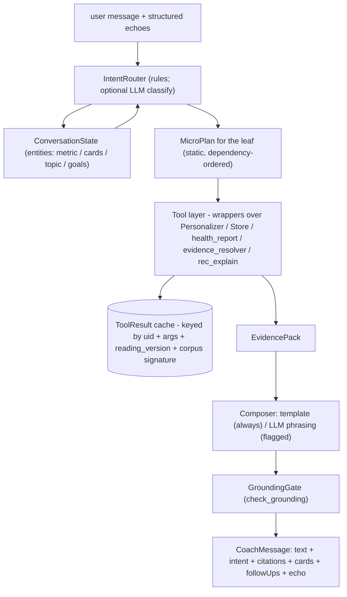
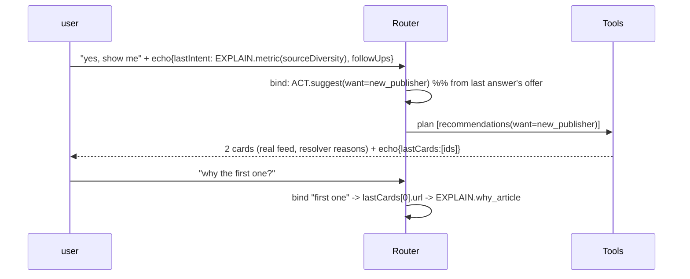

# AI Coach v2 — Architecture Review & Final Design

**Status:** design, post architecture-review (v2 supersedes the v1 draft that previously lived in this file). No production code exists yet; implementation is gated on approval behind `RWE_COACH_V2` (default off).

**How to read this:** the review's twelve binding decisions are labeled **D1–D12**, each with *Why / Alternatives / Tradeoffs / Why it wins*. The twenty numbered sections map 1:1 to the review deliverables. A new engineer should be able to build the system from this document alone.

---

## 1. Executive summary

The coach today is a narrator: `POST /api/coach` → `Personalizer.coach_reply` → `api_server._serialize_coach_reply`, which computes the full report and narrates it **without ever reading the question** (the `message` argument is accepted and ignored). The redesign turns the coach into a thin, deterministic *interface* over the already-production-grade engine: a **hierarchical intent router** feeds **static micro-plans** that call a **typed tool layer** (thin wrappers over existing functions), producing a canonical **Evidence Pack** that a **composer** phrases — LLM optional, per-intent grounded templates always available, and a **grounding gate** guaranteeing no number is ever invented.

The architecture review changed four v1 decisions:

| v1 decision | review verdict | replacement |
|---|---|---|
| flat list of 17 intents | doesn't scale, duplicates plans/templates | **D1:** 6 intent families × leaves, registry-based |
| intent → single tool call → template | can't express compound asks or shared data | **D3:** static micro-plans with declared dependencies |
| tools return ad-hoc dicts | uncheckable grounding, copy-paste drift | **D4:** one typed `ToolResult` envelope (facts + citations + cards + caveats + provenance) |
| memory = client-carried *prose* transcript | re-interpreting prose each turn is the hallucination vector | **D6:** memory = structured *machine* echoes (intent, entities, card ids, goals); the composer never re-reads prior prose |

And it added three things v1 lacked: a **canonical Explanation model** (D7), an explicit **`RWE_COACH_LLM` flag** separating "v2 on" from "LLM on" (D11), and a **ToolResult cache** keyed by the existing model-version keys (D12).

## 2. Current architecture (what exists, verbatim)

```
POST /api/coach {message}                      (examples/api_fastapi.py:1822)
  -> Personalizer.coach_reply(uid, message)    (examples/personalize.py)
  -> Backend._serialize_coach_reply(corpus, rec, u, message)   (examples/api_server.py)
       rep, facts = _facts_of(corpus, u)       # hr.user_report -> narrate_report.report_facts
       content = narrate(facts_to_text(facts), caller, recs)   # iff ANTHROPIC/GEMINI key
       if not content: content = _grounded_fallback(rep)       # deterministic summary
       suggestions = 2 x rwe-b cards           # _rec_cols_of(..., "rwe-b", k=2)
```

Properties worth keeping: grounded fallback; `narrate_report.check_grounding` (numbers in prose must exist in facts); real cards from the real serializer. Properties to fix: question-blind; stateless (GET is a canned greeting); one response shape.

## 3. Proposed architecture

```
CoachTurn(message, echoes[]) 
  -> IntentRouter (rule cascade over families -> leaf; tri-state resolution)   [D1, D2]
  -> ConversationState (entities bound from STRUCTURED echoes)                 [D6]
  -> MicroPlan (static per-leaf tool list + declared dependencies)             [D3]
  -> ToolLayer (typed ToolResults; memoized; thin wrappers over the engine)    [D4, D12]
  -> EvidencePack (canonical, deduplicated)                                    [D5]
  -> Composer (LLM iff RWE_COACH_LLM, else per-leaf template)                  [D11]
  -> GroundingGate (reply numbers ⊆ pack citations, else template fallback)
  -> CoachMessage {text, intent, citations, cards, followUps, echo}
```

New module: `examples/coach_service.py` (router, registry, tools, composer, gate — one module, same style as `evidence_resolver.py`). `narrate_report.py` untouched (the report page legitimately narrates). `_serialize_coach_reply` retained as the v1 path while the flag is off.

## 4. High-level architecture diagram



## 5. Low-level architecture diagram

```mermaid
flowchart LR
    subgraph registry ["INTENTS registry (data, not code paths)"]
        F1["EXPLAIN: metrics | metric | ih_score | echo | viewpoint | recommendations | why_article"]
        F2["ANALYZE: political | sources | topics | blind_spots"]
        F3["COMPARE: over_time"]
        F4["ACT: suggest | weekly_goals | improvement_plan"]
        F5["PROJECT: forecast | compare_candidates"]
        F6["CHAT: general"]
    end
    registry --> PLANS["per-leaf MicroPlan: [tool, args_from(entities), needs]"]
    PLANS --> TOOLS["tools: report | shares | metric | recommendations | why_article | history | trend | blind_spots | forecast | goals | story_context"]
    TOOLS --> ENGINE["existing engine: user_report, _topic/_lean_shares_of, Personalizer.explain/recommendations, er.resolve/story_index, rec_explain.match_band, list_report_snapshots, feed_article_facets, user_settings"]
```



## 6. Sequence diagrams

Simple turn:

```mermaid
sequenceDiagram
    participant U as user
    participant A as /api/coach
    participant R as Router
    participant T as Tools
    participant C as Composer
    U->>A: "why is my source diversity low?" + echoes
    A->>R: classify -> EXPLAIN.metric(sourceDiversity, mode=cause)
    R->>T: plan [report, metric(sourceDiversity, cause)]
    T->>T: report cached (reading_version unchanged)
    T-->>C: EvidencePack {value 55, drivers: top-2 outlets 62%, 4 unread majors}
    C->>C: template or LLM phrase; GroundingGate check
    C-->>U: answer + citations + followUps ["suggest unread outlets"]
```

Follow-up using structured memory:



## 7. Component responsibilities

| component | owns | never does |
|---|---|---|
| IntentRouter | family→leaf resolution, modifier flags (cause/plan/suggest), entity binding, clarification decision | tool calls, prose |
| INTENTS registry | leaf → matchers, MicroPlan, template, word budget, followUps | logic |
| Tool layer | computing facts via existing functions; caveats; provenance | prose, invention, raw ORM/np types |
| EvidencePack | deduplicated results + state for the composer | mutation |
| Composer | phrasing within budget; delta-mode when `already_covered` | numbers not in the pack (gate-enforced) |
| GroundingGate | `narrate_report.check_grounding(reply, pack)`; on failure swap to template | silent acceptance |
| Memory (echoes) | structured last-N turn artifacts | storing/re-reading prior prose |

## 8. Tool interfaces

**D4 — one typed envelope.**
*Why:* ad-hoc dicts (v1) make the grounding gate unenforceable (nothing says which numbers are citable) and invite drift. *Alternatives:* raw model objects (leaks SQLAlchemy/NumPy, un-serializable, tempts the composer to compute); free-form dicts (v1; uncheckable); a full pydantic tool-calling schema for LLM function-calls (heavier, and the LLM is optional here — the ROUTER calls tools, not the model). *Tradeoff:* a little ceremony per tool. *Wins because:* citations become machine-checkable, caching gets a natural key, and every tool looks the same to tests.

```python
@dataclasses.dataclass(frozen=True)
class Citation:
    key: str          # "sourceDiversity", "leanShares.left", "trend.viewpointBalance.delta"
    value: float | int | str
    source: str       # the computing function, e.g. "health_report.user_report"

@dataclasses.dataclass(frozen=True)
class ToolResult:
    tool: str                       # registry name
    facts: dict                     # JSON-safe payload the composer may verbalize
    citations: tuple[Citation, ...] # EVERY number the composer may state
    cards: tuple[dict, ...] = ()    # real rec payloads (serializer output only)
    caveats: tuple[str, ...] = ()   # "estimated", "n=4 (small sample)", "snapshots span 6 days"
    provenance: dict = ...          # {readingVersion, corpusSignature, computedAt}
```

Tool registry (all thin wrappers; the right column is the ONLY place numbers come from):

| tool(args) | wraps |
|---|---|
| `report()` | `hr.user_report` via `Personalizer._model` (scores, viewpoint, mean_lean, top_categories) |
| `shares()` | `api_server._topic_shares_of` + `_lean_shares_of` (C6 parity numbers) |
| `metric(name, mode)` | slice of `report()`; cause mode adds drivers: lean shares, `explanation_context` familiarity, `Personalizer.openmindedness` |
| `recommendations(want?)` | `Personalizer.recommendations` + `er.resolve` per card (story slot included); `want` filters by resolved type/topic |
| `why_article(ref)` | `Personalizer.explain(uid, article=url)` → served evidence or exclusion verdict (+ `story_context` via `er.story_index`) |
| `history(days)` | `store.get_reads` aggregated to topic/outlet/lean counts |
| `trend(metric?)` | `store.list_report_snapshots` + the `build_analytics.metric_trend` computation |
| `blind_spots()` | reader shares/familiarity vs `store.feed_article_facets` (each gap carries its catalog count) |
| `forecast(action, k)` | report recomputation with k hypothetical reads appended — the shipped `viewpointShift` primitive, generalized; always `caveats=("estimated",)` |
| `goals(read/write)` | `user_settings.settings` JSON under a `coachGoals` key (existing table, no schema change) |

## 9. Intent interfaces

**D1 — hierarchical intents.** *Why:* the flat 17 duplicated plans and templates across near-identical leaves (echo/viewpoint/IH are one behavior with a parameter) and made growth O(intents). *Alternatives:* keep flat (v1); free-text intents scored by embedding similarity (non-deterministic, new dependency — rejected). *Tradeoff:* one more indirection level. *Wins because:* families carry the plan/template skeletons; adding a leaf is a registry entry.

**D2 — tri-state resolution, no numeric confidence.** *Why:* a rule cascade has no honest probability to report; a fake 0.87 would violate the never-invent rule *inside our own telemetry*. Resolution ∈ {`rule`, `llm`, `unresolved`} (unresolved → one-line clarification with chips). *Alternative:* calibrated classifier scores — real work, no consumer. *Wins because:* observable, honest, and sufficient to route.

```python
@dataclasses.dataclass(frozen=True)
class IntentSpec:
    family: str                     # EXPLAIN | ANALYZE | COMPARE | ACT | PROJECT | CHAT
    leaf: str
    matchers: tuple[Matcher, ...]   # ordered keyword/pattern predicates (pure functions)
    plan: tuple[PlanStep, ...]      # static MicroPlan (see §12)
    template: str                   # grounded fallback, str.format over the pack
    budget: int                     # composer word budget
    follow_ups: tuple[str, ...]     # default offers (may be overridden by tools)

INTENTS: dict[str, IntentSpec]      # "EXPLAIN.metric", "ACT.suggest", ...  (D10: plugin point)
```

**Modifiers** (orthogonal to leaf, set by the router): `mode=cause` ("why…"), `mode=plan` ("how…"), `attach_cards` ("suggest/show"). **Multi-intent questions** ("am I balanced and what should I read?"): the router picks the *primary* leaf (first match), and if a second family matches, appends that leaf's plan steps **only when the combined plan stays ≤ 4 steps**; otherwise answers the primary and offers the secondary as a followUp chip. This is the deliberate, bounded alternative to a free planner.

## 10. Evidence Pack schema

**D5 — canonical, deduplicated.** Tools declare needs (`metric` needs `report`); the executor resolves shared results once (§12). The pack is what the composer sees — nothing else.

```python
EvidencePack = {
  "intent":   {"family": str, "leaf": str, "modifiers": [...], "entities": {...},
               "resolution": "rule" | "llm" | "unresolved"},
  "results":  [ToolResult, ...],          # plan order; shared deps appear once
  "state":    {"already_covered": bool,   # same leaf+entities answered in echo window
               "prior_citations": [Citation, ...]},   # for delta phrasing
  "budget":   int,
}
```

It expresses all six required content kinds without special cases: explanations (`why_article`/`metric`), recommendations (`recommendations.cards`), trends (`trend`), blind spots (`blind_spots`), projections (`forecast` + caveat), recommendation reasoning (cards carry their resolver explanation verbatim).

## 11. Conversation flow (memory)

**D6 — structured echoes, never prose re-reading.** *Why:* the hallucination vector in chat systems is re-interpreting prior free text. Every coach reply already computes structure (intent, citations, cards, goals); the client echoes back the last N of exactly those (`echo` field), and the router binds pronouns against them: "it" → `entities.metric`; "those recommendations"/"the first one" → `lastCards[i]`; "my goals" → `goals`. The composer receives the current pack + `prior_citations` — never the previous prose. *Alternatives:* (a) v1 prose transcript — rejected as the hallucination vector; (b) server-side `coach_messages` table — durable cross-device threads, but new schema, retention policy, privacy surface; deferred, compatible later; (c) LLM-summarized memory — non-deterministic, rejected. *Tradeoff:* stylistic continuity is weaker (the coach can't quote its own phrasing). *Wins because:* every follow-up binds to machine-verifiable artifacts; a follow-up can not import an unverified fact.

Bounds: echoes capped by the existing `reqlimits` "ai" budget (16 KB); oldest dropped first; `goals` persisted in `user_settings` so truncation never loses them. Clarification: unresolved entity or unresolved intent → deterministic one-liner + chips (counts as `CHAT.general`).

## 12. Planner flow

**D3 — static micro-plans, not an LLM planner.** *Why:* the coach's task space is enumerable (this document enumerates it); determinism and the no-LLM path are product invariants; plans-as-data are unit-testable. A planner (LLM emits a tool sequence) buys open-ended composition at the cost of all three, plus latency and prompt-injection surface. *Alternatives:* (a) v1 intent→single-tool→template — too rigid for compound asks and shared deps; (b) full agent loop — rejected above; (c) **chosen:** per-leaf `PlanStep` lists with `needs`, executed by a tiny dependency resolver (a fixed DAG, no search). *Tradeoff:* genuinely novel compositions need a registry edit. *Wins because:* it is exactly as dynamic as the product needs and no more.

```python
@dataclasses.dataclass(frozen=True)
class PlanStep:
    tool: str
    args: Callable[[Entities], dict]    # pure; reads router entities
    needs: tuple[str, ...] = ()         # tools whose results this step may read

def execute(plan, ctx) -> list[ToolResult]:
    done: dict[str, ToolResult] = {}
    for step in plan:                    # already dependency-ordered at registry-build time
        done[step.tool] = CACHE.get_or_compute(ctx.uid, step, deps={k: done[k] for k in step.needs})
    return list(done.values())
```

Example plans: `EXPLAIN.metric` → `[report, metric]`; `ACT.improvement_plan` → `[report, metric(lowest, cause), recommendations(want=driver), goals(read)]`; `PROJECT.compare_candidates` → `[recommendations, forecast(per-card, k≤5)]`.

## 13. Data flow

```
user_settings/reads/rec_events/report_snapshots/feed_articles   (existing tables; coach ADDS NO TABLE)
        │ read-only (except goals under user_settings.settings["coachGoals"])
        ▼
Personalizer._model (cached per reading_version)  ->  tools  ->  ToolResult cache (D12)
        ▼
EvidencePack -> Composer -> GroundingGate -> CoachMessage(JSON) -> web coach page
                                                   │
                                        structured echo returns next turn
```

**D12 — ToolResult cache.** Key: `(uid, tool, args_hash, reading_version, corpus_signature)` — the same invalidation keys the codebase already trusts (`Personalizer._cache`, `candidate_signature`). TTL irrelevant (keys change when inputs change); LRU-bounded per process. *Why:* `report` is needed by most plans; forecasts recompute it k times. *Alternative:* no cache (fine at beta scale) — accepted as v1-of-v2 if simpler, but the key design costs nothing now.

## 14. Request lifecycle

1. `POST /api/coach` (auth exactly as today: session header / internal secret / token).
2. `reqlimits` bounds message+echo; `ratelimit` unchanged.
3. Router: normalize → entity binding from echoes → family/leaf/modifiers (tri-state).
4. Plan lookup → executor (cache-aware) → EvidencePack.
5. Composer: if `RWE_COACH_LLM` and key → LLM phrase (temperature 0.3, budget-capped) → GroundingGate; any failure/timeout (2 s) → per-leaf template.
6. Reply assembled: `{content, intent, citations, cards, followUps, echo}`; structured log event `{"event":"coach_turn", intent, resolution, tools, ms, grounded, fallback}`.
7. Failure ladder: tool exception → omit its result, template acknowledges the gap ("I can't compute trends right now") — **never** invents; router unresolved → clarification; total-turn deadline → template on whatever the pack holds.

## 15. API contracts

```jsonc
// POST /api/coach   (request)
{ "message": "why is it low?",
  "echo": {                       // OPTIONAL; absent = cold turn (back-compatible)
    "turns": [ { "role": "coach", "intent": "EXPLAIN.metric",
                 "entities": {"metric": "sourceDiversity"},
                 "citations": [{"key":"sourceDiversity","value":55}],
                 "cardIds": ["<canonical-url>", "..."] } ],
    "goals": { "week": "2026-W28", "items": [ ... ] }   // echoed if client holds them
  } }

// response (CoachMessageModel, additive fields)
{ "role": "coach", "content": "...",
  "intent": "EXPLAIN.metric",
  "resolution": "rule",
  "citations": [ {"key": "sourceDiversity", "value": 55, "source": "health_report.user_report"} ],
  "cards": [ /* RecommendationModel, verbatim serializer output */ ],
  "followUps": ["Suggest outlets I've never read"],
  "echo": { /* the structured artifact the client should send back next turn */ } }
```

Back-compat: old clients send `{message}` and render `content` — unchanged behavior; `GET /api/coach` greeting gains `followUps` seeded from the weakest metric.

## 16. Deployment architecture

No new services, containers, threads, or tables. `coach_service.py` runs in-process in the API container (compose `api` service unchanged); flags via env like every other feature; LLM calls use the existing key plumbing (`ANTHROPIC_API_KEY`/`GEMINI_API_KEY` through `narrate_report.make_text_caller`). The Colab beta validates it exactly like `RWE_STORY_SLOT` (env in cell 2).

## 17. Technology stack

Unchanged: Python/FastAPI/SQLAlchemy/SQLite; optional Anthropic/Gemini text call (already a dependency path); no embeddings, no vector store, no new framework. The single new "technology" is a design discipline: plans-as-data + typed evidence.

## 18. Testing strategy

- **Router table tests** (pure, offline): every leaf × 3 phrasings; modifier detection; entity binding incl. pronouns and "first one"; multi-intent bounding; unresolved → clarification. One parametrized file, `tests/test_coach_router.py`.
- **Tool parity tests:** each tool's citations equal the surface it mirrors (report numbers == dashboard; shares == C6 card facts; why_article == explain endpoint) on a seeded store — parity by construction, verified anyway. `tests/test_coach_tools.py`.
- **Grounding-gate test:** a stub composer emitting an un-cited number must be replaced by the template.
- **Golden conversations:** one fixture per leaf + the two memory flows from §6 (suggest→why-first-one; goals→next-week-progress), asserted on intent, cited keys, card presence — not prose bytes (templates may be reworded). `tests/test_coach_conversations.py`.
- **Live smoke:** TestClient turn with flag on/off — off is byte-identical to v1 (the same guarantee the story-slot tests pin).

## 19. Rollout plan

1. Commit A: `coach_service.py` (router+registry+tools+templates+gate) + router/tool tests — no wiring.
2. Commit B: API wiring behind `RWE_COACH_V2` + payload additions + golden conversations + off-is-identical test.
3. Commit C: web coach page renders cards/followUps/chips + echo plumbing (tsc + i18n catalogs ×5).
4. Beta: flag on in Colab cell 2; walk the §6 flows + all leaves against the real corpus; log review (`coach_turn` events).
5. `RWE_COACH_LLM` on (if keys) after template paths are proven; default-on decision afterwards — the same ladder `RWE_FEED_REQUIRE_DATED` and `RWE_STORY_SLOT` used.

## 20. Future roadmap (extensibility proofs, D10)

Each future feature = registry entry + at most one new tool; core untouched:

| feature | family.leaf | tools it composes | new engine capability needed? |
|---|---|---|---|
| debate mode ("argue both sides of this story") | PROJECT.debate | `story_context` (cluster's L/R members) + `why_article` ×2 | none — clusters + lean already exist |
| source comparison ("Guardian vs Fox for me") | ANALYZE.source_compare | `history` + `shares` + `outlet_registry` lean/familiarity | none |
| article comparison ("which of these two?") | PROJECT.compare_candidates | `why_article` ×2 + `forecast` per candidate | none |
| richer rec explanation | EXPLAIN.why_article (exists) | + `rec_explain.match_band`, byStrategy table | none |
| timeline replay ("how did my month evolve?") | COMPARE.replay | `trend` + `history` bucketed by week | none |
| misinformation coaching | (honest caveat) | — | **yes — claim/fact-check data does not exist in this system**; the architecture holds (new tool + leaf) but the data layer must come first. Do not promise this until an upstream source exists. |


### Build catalog appendix (every leaf, one line each)

`plan` steps reference §8 tools; `mode`/`attach_cards` modifiers apply per §9; worked example conversations for each leaf are in the v1 draft (git history of this file, commit a9a8860) and become the golden-conversation fixtures of §18.

| leaf | matcher hints | plan | template sketch |
|---|---|---|---|
| EXPLAIN.metrics | "what do these metrics mean", "explain my report" | [report] | one line per score + what it measures |
| EXPLAIN.metric | metric name or bound "it" (+why→cause) | [report, metric] | value + 2–3 drivers + one offer |
| EXPLAIN.ih_score | "information health", "overall score" | [report] | roll-up composition + dominant drag |
| EXPLAIN.echo | "echo chamber" | [report, metric(echoChamber)] | score + one-sidedness drivers |
| EXPLAIN.viewpoint | "viewpoint", "balance score" | [report, metric(viewpointBalance), shares] | score + L/C/R shares |
| EXPLAIN.recommendations | "how does my feed work" | [recommendations] | mix by explanation type + slot rule + why_article offer |
| EXPLAIN.why_article | URL / "this article" / lastCards[i] + "why" | [why_article(, story_context)] | evidence chain, or truthful exclusion verdict |
| ANALYZE.political | "am I balanced", "left/right" | [shares, metric(viewpointBalance, cause)] | split + concentration + bridge offer |
| ANALYZE.sources | "source/outlet diversity" | [metric(sourceDiversity, cause), history] | outlet counts, concentration, unread majors |
| ANALYZE.topics | "what topics do I read" | [shares, history] | top shares + thin topics with catalog counts |
| ANALYZE.blind_spots | "missing", "blind spot", "not reading" | [blind_spots] | 2–3 gaps, each with catalog-count proof + card offer |
| COMPARE.over_time | "improving", "trend", "last month" | [trend] | only metrics that moved, first→last deltas |
| ACT.suggest | "suggest/recommend/show me" (+want from context) | [recommendations(want)] | 2–3 cards with resolver reasons, nothing invented |
| ACT.weekly_goals | "goals", "this week" | [goals(read), blind_spots, trend] | 2–3 goals bound to measured gaps, sized to the reading goal |
| ACT.improvement_plan | "how do I improve/fix" | [report, metric(lowest, cause), recommendations(want=driver), goals(read)] | lowest metric → 3 concrete actions (cards / slider / story follow-up) |
| PROJECT.forecast | "what if I read…", "could improve" | [report, forecast(action, k)] | current → estimated-after deltas, labeled estimates |
| PROJECT.compare_candidates | "which helps more" | [recommendations, forecast(per-card)] | ranked by projected delta, each labeled estimated |
| CHAT.general | greeting / unresolved | [] | short reply + two capability chips; clarification lives here |

### Explainability appendix (D7 — canonical Explanation model)

Every card the coach surfaces carries, and every "why" answer is composed from, one shape — all fields **measured or explicitly estimated**, none LLM-generated:

```python
Explanation = {
  "why":        er.resolve(rec, ctx, index),          # P1..P6 type + message + evidence (verbatim)
  "strategy":   {"chosenBy", "byStrategy": {s: {rank, inSlice}}},   # rec_explain
  "improves":   {"metric", "current", "projected", "delta", "estimated": True},  # viewpointShift-style recompute
  "confidence": {"band": rec_explain.match_band(rank, n),           # strong|good|candidate
                 "basis": "rank percentile"},                        # measured, never a made-up %
  "provenance": {"storyId?", "readUrl?", "readingVersion", "corpusSignature"},
}
```

*Why this shape:* it is the union of three things that already exist (resolver output, explain diagnostics, the drawer's projection) — the design names the composite rather than inventing a parallel one. *Alternative:* a new free-text "explanation generator" — rejected; it would be the narrator problem reborn.

### Forecasting appendix (D8)

`forecast` = recompute `hr.user_report` over the augmented history plus k hypothetical reads (the exact computation the drawer's `viewpointShift.after` ships today), diff the scores, label `estimated`. "Which helps more?" ranks candidates by projected delta (k ≤ 5 recomputes; report math, not model retraining — cheap). Explicitly rejected: reusing `rwe/opinion_dynamics.py` or `agent_sim` for user-facing forecasts — research simulators with different semantics; presenting their outputs as personal predictions would violate the grounding rules.

### Coaching-without-gamification appendix (D9)

Rules: every coaching statement is a measured fact or a labeled estimate; **no points, badges, or streak mechanics**. "Streaks" are reported as *consistency facts* ("you've read 5+ articles four weeks running — your goal is 5/week") from `reads` + the existing reading goal in `user_settings`; "achievements" are *factual milestones* surfaced by `trend`/`history` ("first center-outlet read this month"); progress is snapshot deltas (`report_snapshots`). Goals are 2–3 items, each bound to a measured gap and checkable next week by `COMPARE.over_time` — which is what makes them coaching rather than gamification: the reward is the evidence.
