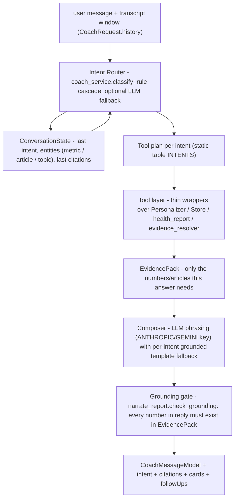

# AI Coach Redesign — from report narrator to tool-using assistant

**Status:** design (no code changed). Implementation gated on approval, behind `RWE_COACH_V2` (default off), following the repo's flag → beta-validate → default-on pattern.

---

## 1. The problem, precisely

Today's coach (`api_server._serialize_coach_reply`, served by `POST /api/coach` → `Personalizer.coach_reply`) computes `hr.user_report` → `narrate_report.report_facts` → `narrate()` (or `_grounded_fallback`) **regardless of what the user asked** — the `message` parameter arrives and is never routed. Every answer is the same report summary plus up to two rwe‑b suggestions. `GET /api/coach` returns only a canned greeting; there is no conversational state, so a follow-up question re-narrates the same report.

The redesign keeps everything this product is right about — every number measured, LLM optional, grounded fallback always available — and adds the missing layer: **intent routing over a tool registry, with conversational memory.**

## 2. Design principles (inherited from the codebase)

1. **Route first, generate last.** A deterministic classifier picks the intent; tools compute an *evidence pack*; the composer only phrases it. The LLM never invents a number — enforced by reusing `narrate_report.check_grounding` / `extract_numbers` on the composed reply.
2. **No-LLM path is first-class.** Every intent has a grounded template fallback (the `_grounded_fallback` pattern, per intent), so the coach works with no API key.
3. **Reuse, never reimplement.** Every tool below is a thin wrapper over an existing function (`user_report`, `Personalizer.explain`, `er.resolve`, `list_report_snapshots`, `feed_article_facets`, …).
4. **Answer the question; never dump the report** unless the intent is explicitly "explain my metrics/report".
5. **Evidence in the payload.** Replies carry structured `citations` (metric values used) and `cards` (real articles with resolver reasons) so the UI can render proof, exactly like recommendation cards do.

## 3. Architecture



New module: **`examples/coach_service.py`** (router + tool registry + composers). `narrate_report.py` stays untouched (the report page's narrative is a different, legitimate use). `Backend._serialize_coach_reply` remains as the v1 fallback while the flag is off.

## 4. Conversational memory

- **Transport:** the client already holds the thread; `CoachRequest` gains `history: list[{role, content}]` (bounded by the existing `reqlimits` "ai" cap of 16 KB — oldest turns dropped first). No new table, no server session state; stateless server preserved. (A persisted `coach_messages` table is a compatible later step if cross-device threads are wanted.)
- **Derived state:** the router derives a `ConversationState` from the window each turn: `last_intent`, `entities` (last metric named, last article URL/headline discussed, last topic), `last_citations`.
- **Follow-up rules:**
  - Pronoun/ellipsis resolution: "why is *it* low?" → entity = last metric → `explain_specific_metric(cause_mode)`.
  - "what about *sources*?" after a balance answer → same intent family, new metric.
  - "show me" / "suggest some" after any analysis → `suggest_articles` scoped to that analysis (e.g., after blind-spot analysis → suggestions from the named blind spot).
  - Repetition guard: if the same intent+entity was answered in the window, the composer is told `already_covered=True` → it deltas ("as I mentioned, 34/100 — the new part is…") instead of re-stating.

## 5. Function interfaces (the tool layer)

All tools take `(pers: Personalizer, store: Store, uid: int)` plus intent-specific args, and return plain dicts (the EvidencePack pieces). Existing functions they wrap are named on the right.

```python
def tool_report(pers, uid) -> dict
    # hr.user_report via pers._model: scores {overall, echoChamber, viewpointBalance,
    # emotionalBalance, openMindedness, sourceDiversity}, viewpoint (L/C/R), mean_lean,
    # top_categories.  == the numbers the dashboard shows (parity by construction).

def tool_shares(pers, uid) -> dict
    # api_server._topic_shares_of + _lean_shares_of over the same report -> topicShares,
    # leanShares.  (C6 — the same shares the cards cite.)

def tool_metric(pers, uid, metric: str, mode: Literal["value","cause"]) -> dict
    # one metric extracted from tool_report; cause mode adds its drivers:
    # echoChamber/viewpointBalance -> leanShares + top one-sided outlets (familiarity);
    # sourceDiversity -> outlet counts (explanation_context familiarity);
    # openMindedness -> pers.openmindedness(uid) (shownCross/openedCross/thresholds).

def tool_recommendations(pers, uid, want: str | None) -> list[dict]
    # pers.recommendations(uid) + er.resolve per card (the REAL feed, story slot included).
    # want filters by resolved type: "bridge"|"story_match"|"new_publisher"|topic name.

def tool_why_article(pers, uid, article: str) -> dict
    # pers.explain(uid, article=url): served -> strategy + resolver explanation + evidence;
    # unserved -> exclusion verdict (seen_excluded / below_cutoff+ranks / not_in_graph).

def tool_history(store, uid, days: int = 30) -> dict
    # store.get_reads -> per-topic/outlet/lean counts for the window (the analytics slices).

def tool_trend(pers, store, uid, metric: str | None) -> dict
    # store.list_report_snapshots + api_server.build_analytics.metric_trend ->
    # first/last/delta per metric between snapshot windows.

def tool_blind_spots(pers, store, uid) -> dict
    # reader's topicShares + familiarity vs store.feed_article_facets() ->
    # topics with catalog coverage but 0 reads; outlets never read; the lean side
    # with the lowest share.  Every gap carries its catalog count (provable).

def tool_forecast(pers, uid, action: str, k: int = 3) -> dict
    # the rec_explain viewpointShift primitive generalized: recompute hr.user_report
    # with k hypothetical reads appended (e.g. k bridge cards from the live feed)
    # -> current vs "after" viewpoint/lean deltas, ALWAYS labeled estimated=True.

def tool_goals(store, uid) -> dict
    # user_settings JSON (reading goal, politicalOpenness, recommendationStrength)
    # + tool_trend deltas -> inputs for goal/plan composition.

def tool_story_context(store, uid, article: str) -> dict
    # evidence_resolver.story_index -> the cluster behind an article (for "what else
    # covers this story" follow-ups).
```

## 6. Routing logic

Deterministic rule cascade — evaluated top-down, first match wins; the optional LLM classifier runs **only** if nothing matches and a key is configured (prompt in §8.1); otherwise fall through to `general_conversation`.

```python
def classify(msg, state) -> Intent:
    t = normalize(msg)                                   # lowercase, strip
    if has_url(t) or refers_to_card(t, state):           # "this article", headline echo
        if any(w in t for w in ("why", "how come")):     return WHY_ARTICLE
        if "story" in t:                                  return WHY_ARTICLE  # story ctx variant
    if mentions(t, METRIC_LEXICON):                       # "echo chamber", "viewpoint", ...
        m = extract_metric(t, state)                      # state resolves "it"/"that score"
        if m == "information_health":                     return EXPLAIN_IH_SCORE
        if m == "echo_chamber":                           return EXPLAIN_ECHO
        if m == "viewpoint_balance":                      return EXPLAIN_VIEWPOINT
        if asks_future(t):                                return FORECAST      # "could improve"
        return EXPLAIN_SPECIFIC_METRIC
    if asks(t, "suggest", "recommend", "show me", "give me articles"):  return SUGGEST_ARTICLES
    if asks(t, "why") and mentions(t, "recommend"):       return EXPLAIN_RECOMMENDATIONS
    if mentions(t, "blind spot", "missing", "not reading", "haven't read"): return FIND_BLIND_SPOTS
    if mentions(t, "balance", "left", "right", "political") and asks_analysis(t): return ANALYZE_POLITICAL
    if mentions(t, "source", "outlet", "publisher") and asks_analysis(t):  return ANALYZE_SOURCES
    if mentions(t, "topic", "subject", "category") and asks_analysis(t):   return ANALYZE_TOPICS
    if mentions(t, "compare", "last week", "last month", "trend", "changed"): return COMPARE_OVER_TIME
    if mentions(t, "goal") and mentions(t, "week"):       return WEEKLY_GOALS
    if asks(t, "how") and mentions(t, "improve", "better", "fix"):        return IMPROVEMENT_PLAN
    if asks_future(t) and mentions(t, "score", "improve"):                return FORECAST
    if mentions(t, "metric", "score", "report") and asks(t, "explain", "what do"): return EXPLAIN_METRICS
    if mentions(t, "recommendation", "feed") and asks(t, "explain", "what", "how work"): return EXPLAIN_RECOMMENDATIONS
    return llm_classify(msg, state) or GENERAL_CONVERSATION
```

Global modifiers (apply to whatever intent wins): **"why" → cause mode** (drivers, not just values); **"how" → plan mode** (actions, not description); **"suggest" → attach cards**. Ambiguity between two matches is resolved by `state.last_intent` affinity, then by asking a one-line clarifying question (a legitimate `general_conversation` reply).

## 7. Intent catalog

Summary table, then per-intent detail with an example. (Numbers in examples are illustrative.)

| # | intent | tools | response shape |
|---|---|---|---|
| 1 | explain_metrics | tool_report | one line per metric + what it measures; ≤120 words |
| 2 | explain_specific_metric | tool_metric(value/cause) | value + 2–3 drivers + 1 follow-up offer |
| 3 | explain_recommendations | tool_recommendations | feed mix by explanation type + how slots work |
| 4 | suggest_articles | tool_recommendations(want) | 2–3 cards, each with its resolver reason |
| 5 | why_article | tool_why_article (+tool_story_context) | the card's evidence chain, or the truthful exclusion |
| 6 | analyze_political | tool_shares + tool_metric(cause) | L/C/R split + strongest driver + optional bridge offer |
| 7 | analyze_sources | tool_metric(sourceDiversity,cause) + tool_history | outlet counts, concentration, never-read majors |
| 8 | analyze_topics | tool_shares + tool_history | top topics with %, thin topics with catalog counts |
| 9 | find_blind_spots | tool_blind_spots | 2–3 gaps, each with catalog-count proof + card offer |
| 10 | compare_over_time | tool_trend | per-metric first→last deltas; only metrics that moved |
| 11 | weekly_goals | tool_goals + tool_blind_spots | 2–3 SMART goals bound to real gaps + current goal setting |
| 12 | improvement_plan | tool_metric(cause) + tool_recommendations + tool_goals | lowest metric → 3 concrete actions with cards/sliders |
| 13 | explain_ih_score | tool_report | composition of overall + the one dominant drag |
| 14 | explain_echo | tool_metric(echoChamber,cause) | score + one-sidedness drivers |
| 15 | explain_viewpoint | tool_metric(viewpointBalance,cause) + tool_shares | score + L/C/R shares |
| 16 | forecast | tool_forecast | current → estimated-after deltas, labeled estimates |
| 17 | general_conversation | none (or tool_report if pivotable) | short helpful reply + 2 capability follow-ups |

**1 · explain_metrics** — the only intent allowed to survey the report, and still compact.
> U: “What do all these metrics mean?”
> C: “Five measurements of your reading, all from your recorded articles: **Information Health 61/100** (the roll-up), **Echo Chamber 34** (how one-sided your political reading is — lower is more one-sided), **Viewpoint Balance 41** (your left/center/right spread), **Source Diversity 55** (how many distinct outlets), **Open-Mindedness n/a** (activates after you've opened 3 cross-perspective recommendations; you've opened 1). Ask about any of them — or ‘how do I improve’ for a plan.”

**2 · explain_specific_metric** (with cause mode on "why")
> U: “Why is my source diversity low?”
> C: “55/100. Two drivers: 62% of your reads come from just two outlets (The Guardian 9, Fox News 5), and you haven't read 4 of the catalog's major publishers at all (NPR, BBC, AP, The Hill). Want suggestions from outlets you've never read?” *(cards offered, not dumped)*
> U: “yes” → routed to suggest_articles(want="new_publisher") via memory.

**3 · explain_recommendations**
> U: “How does my feed get picked?”
> C: “Three ranking strategies fill your feed — Bridging (6 slots, political articles from your opposite side), Discovery (4, widens sources), For-you (4, balanced blend) — then one ‘Same story’ card can replace the weakest slot when another outlet covers a story you read. Right now your feed is 6 Bridging, 2 Discovery, 1 Topic, 1 Same-story. Each card's explanation is provable — ask ‘why was X recommended’ about any of them.”

**4 · suggest_articles** — always invokes the real engine, never invents.
> U: “Suggest something outside my bubble.”
> C: “From your live feed, the two strongest cross-perspective cards: **Fox News — ‘Platner terminates Senate bid’** (right-leaning; your political reading is 72% left) and **NY Post — ‘Michigan Senate hopeful on AIPAC’** (right; an outlet you've never read). Both are in your Recommendations tab.” *(cards attached with resolver reasons)*

**5 · why_article** — the drawer's answer, conversationally; unserved gets the truthful exclusion.
> U: “Why did you recommend the BBC Graham piece?”
> C: “It's a ‘Same story’ card: you read this story 3 times (Fox Jul 12, NYT, Guardian) and BBC is a publisher you haven't seen on it — same validated story cluster, different outlet, newest coverage. That's the strongest evidence type we have.”
> U: “And why not the Reuters one?” → tool_why_article: “Reuters' piece ranked #68 by Discovery against a top-4 cutoff — it lost on ranking, and the story card for that cluster was already taken.”

**6 · analyze_political**
> U: “Am I politically balanced?”
> C: “Not currently: your political reads split 72% left / 8% center / 20% right (Viewpoint Balance 41/100). The imbalance is concentrated in Politics — your World reading is nearly even. One good-faith right-side read per day would move the split fastest. Want the two best candidates from your feed?”

**7 · analyze_sources**
> U: “How diverse are my sources?”
> C: “12 outlets in 30 days, but concentrated: Guardian 34%, Fox 19% — the top two are over half. You've never read NPR, BBC, AP or The Hill despite full catalog coverage. Source Diversity 55/100.”

**8 · analyze_topics**
> U: “What topics do I read?”
> C: “Politics 42%, Sports 30%, World 12% — those three are 84% of your month. Thin: Business (1 read) and Science/Health (0) despite 40+ catalog articles each. Topic spread is what your Discovery slots widen.”

**9 · find_blind_spots**
> U: “What am I missing?”
> C: “Three measurable gaps: (1) center outlets — 8% of your political reading, though AP/BBC/The Hill publish daily here; (2) Science & Health — 0 reads vs 47 catalog articles this month; (3) right-side coverage of stories you followed — you read the Graham story 3× from left/right tabloid, never a center wire. Want a card for any of these?”

**10 · compare_over_time**
> U: “Am I improving?”
> C: “Since June 12: Viewpoint Balance 33 → 41 (+8, your biggest gain), Echo Chamber 29 → 34 (+5), Source Diversity flat at 55, overall 56 → 61. The 4 cross-perspective cards you opened account for most of the viewpoint move.”

**11 · weekly_goals**
> U: “Give me goals for this week.”
> C: “Three, sized to your data: (1) open 2 Bridging cards (you open ~1/week; Open-Mindedness needs 3 total to activate); (2) read 1 article from an outlet you've never used — NPR or AP; (3) 1 Science/Health read (currently 0%). Your reading goal is set to 5 articles/week — these fit inside it.”

**12 · improvement_plan**
> U: “How do I get my score up?”
> C: “Your overall 61 is dragged mainly by Viewpoint Balance (41). Plan: (a) one right-of-center read per day — the feed keeps 6 ready; (b) raise Political openness one notch in Settings (it widens the bridge slice); (c) finish the Graham story from BBC (center) — story follow-ups are the easiest cross-reads. Re-check ‘compare over time’ in a week; +6–10 viewpoint points is realistic at that pace.” *(estimated, and labeled so)*

**13 · explain_ih_score**
> U: “What's my Information Health score actually made of?”
> C: “61/100 — a weighted roll-up of the four sub-scores; your Emotional Balance (74) and Echo Chamber (34) are the top and bottom. It's computed only from your recorded reads (n=23 this month), nothing inferred.”

**14 · explain_echo / 15 · explain_viewpoint** — as intent 2, pinned to that metric; viewpoint always includes the L/C/R shares (the same numbers the bridge cards cite).

**16 · forecast**
> U: “What would happen if I read more center sources?”
> C: “Estimated: appending 3 center reads to your current history moves your split from 72/8/20 to about 62/21/17 and Viewpoint Balance from 41 to ≈49. That's the same ‘after’ computation your card drawer shows — an estimate, not a promise.”

**17 · general_conversation** — greeting/thanks/off-topic: short, friendly, and steers to capabilities; never dumps the report.

## 8. Prompts

**8.1 Classifier fallback prompt** (only when rules don't match AND a key exists; temperature 0; output = one label):
> You route questions for a reading-health coach. Choose exactly one intent for the LAST user message, given the conversation. Intents: [17 labels + one-line definitions]. Prefer the more specific intent. If the message references “it/that” use the conversation to resolve what it refers to. Reply with the label only.

**8.2 Composer system prompt** (phrasing only; the numbers are already computed):
> You are the Information Health reading coach. You receive an EVIDENCE pack (measured numbers, article cards with reasons) and an intent. Write a reply that answers ONLY the user's question, in ≤ {intent_budget} words. Rules: every number you state must appear verbatim in EVIDENCE; never invent articles, scores, or causes; estimates must be called estimates; do not summarize the whole report unless intent=explain_metrics; if already_covered=true, acknowledge and add only what's new; end with at most one concrete follow-up offer.
> *(The reply is then checked with `narrate_report.check_grounding` — any ungrounded number falls back to the template.)*

**8.3 Grounded templates** — one per intent, `str.format` over the EvidencePack (the no-key path and the grounding-failure path). Same discipline as `_grounded_fallback` today, but per intent instead of one-size-fits-all.

## 9. API and payload changes (additive, back-compatible)

```
POST /api/coach
  request:  { message: str, history?: [{role: "user"|"coach", content: str}] }   # bounded by reqlimits "ai"
  response: CoachMessageModel + {
      intent: str,                       # the routed label (also great for analytics)
      citations: [{metric, value}],      # numbers used, for the UI to chip
      cards: [RecommendationModel],      # real articles, when suggested
      followUps: [str]                   # tappable next questions
  }
```
Old clients ignore the new fields; `GET /api/coach` greeting gains `followUps` seeded from the reader's weakest metric. Web: `web/app/coach` renders `cards` with the existing card component and `followUps` as chips.

## 10. Rollout & validation

- **Flag:** `RWE_COACH_V2` (default off) selects `coach_service.reply()` over `_serialize_coach_reply`; off = byte-identical current behavior.
- **Tests:** router unit tests (every intent + follow-up resolution + modifier rules — fully offline); tool tests against a seeded store (numbers equal the report/dashboard — parity by construction); grounding-gate test (a composer that invents a number must fall back); golden conversations (one fixture per intent, `tests/test_coach_service.py`, same style as the rec goldens).
- **Beta validation:** flag on in the Colab beta; walk the 17 example conversations against the real corpus; verify no reply restates the full report unprompted.
- **Out of scope:** persisted threads (table sketched, not needed for v1), voice/UI redesign, multi-user memory, new metrics.

## 11. Risks

- **Rule router misroutes** → the follow-up chips make recovery one tap; `intent` in the payload makes misroutes measurable from logs.
- **LLM latency/cost on classify** → rules handle the overwhelming majority; the LLM path is rare and optional.
- **Forecast over-trust** → every forecast phrase carries "estimated", and the tool reuses the drawer's existing, already-shipped computation rather than a new model.
- **Memory cap** → 16 KB window ≈ 20–30 turns; the derived state keeps follow-ups working even after truncation.
