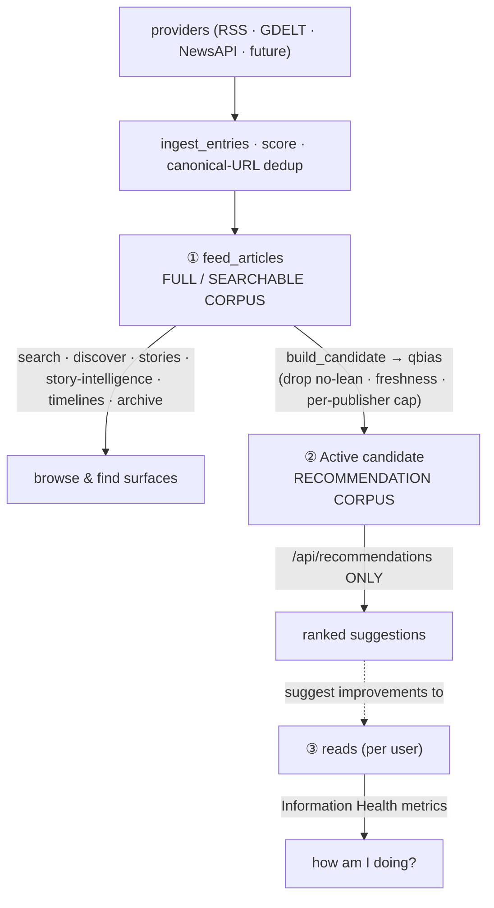

# Corpus Architecture — the three datasets (canonical reference)

**Status:** intentional architectural contract · **Audience:** every contributor adding an ingestion
source, a browse/search surface, a recommendation feature, or a metric.

Hidden View keeps **three logically distinct datasets**. They are *not* interchangeable, and the
boundaries between them are contracts — not implementation details. This document is the canonical
reference; the guardrail tests in `tests/test_corpus_boundaries.py` enforce the boundaries below.

> The one-line principle: **searchable ≠ recommendable; ingestion ≠ recommendation; a user's reads are
> a separate concern.**

## The three datasets

| # | Dataset | Storage / source of truth | What it is |
|---|---|---|---|
| ① | **Full / Searchable Corpus** | `feed_articles` (SQLite) | *Everything* ingested, from every provider (RSS, GDELT, NewsAPI, future), regardless of quality or recommendability. |
| ② | **Recommendation Corpus** | derived qbias projection → the hot-swapped `Active` backend | A **quality-filtered projection of ①** (lean-resolvable, fresh, per-publisher-balanced) used *only* to generate recommendations. |
| ③ | **User Reading History** | `reads` (SQLite), per user | What each user actually read — from a rec, search, discover, or the extension on any site. Drives Information Health metrics. |

## Responsibilities

- **① Full Corpus** — be *complete and findable*. Every ingested article stays here and stays searchable
  unless removed by **retention** (`corpus_health.run_retention`) or **moderation**. No quality gate.
- **② Recommendation Corpus** — be *safe to recommend*. It is rebuilt from ① each poll cycle
  (`corpus_refresh`) through the qbias serializer, which **drops rows with no resolvable lean**
  (`feed_source.py:47-64`, `_bias_label` → `""` → dropped by `catalog_from_qbias`), applies the
  **freshness gate** (`corpus_health.fresh_articles`), and caps per-publisher volume. It never feeds
  search/browse.
- **③ Reads** — be the *truth about the user's diet*. Information Health metrics derive from ③, scored
  by the same scorer. Recommendations (from ②) are only *suggestions to improve* ③ — they never define it.

## Data flow

- **① is the input to ②, never the reverse.** The candidate builder reads the whole store
  (`corpus_refresh.py:104`) and produces the filtered projection.
- **② is a rebuildable cache.** Losing/rebuilding it changes no stored article; it's re-derived from ①.
- **③ is independent of both** — a read can originate anywhere; it is never gated by recommendability.

## Design principles

1. **Every ingested article remains searchable** unless removed by retention or moderation.
2. **Recommendation eligibility is independent of searchability.** A non-recommendable article
   (e.g. an unknown-outlet GDELT item with no resolvable lean) is still fully searchable.
3. **The Recommendation Corpus is a quality-filtered projection of the Full Corpus** — derived, not
   authored; rebuilt each cycle.
4. **Browse surfaces read ①; recommendations read ②; metrics read ③.**
5. **Providers add to ① only.** Whether a provider's articles reach ② is decided by the *same*
   projection gates (lean/freshness/caps) as every other source — never by provider-specific logic.

## Invariants (enforced by `tests/test_corpus_boundaries.py`)

| Invariant | Guard |
|---|---|
| A no-lean article is **searchable** (in ①) but **excluded from ②** | behavioral test: `search.search` returns it; the qbias serializer gives it an empty `bias_rating` → dropped |
| **Search / Discover / Stories / Story-Intelligence endpoints never read ②** | structural test: their source references no `active.backend` / `active.personalizer` / `_serve(` |
| **`/api/recommendations` reads ② (the projection), not ① directly** | structural test: its source references `active.` and never `list_feed_articles` |
| **Information Health metrics derive from ③ (reads)** | by design (`personalizer.report(uid)` over the user's reads); covered by the existing report/personalizer suites |

## Rationale — why these are separate

- **Why searchable ≠ recommendable.** Recommendations must be *balanced and trustworthy* (viewpoint
  diversity needs a resolvable lean; stale/firehose items hurt quality). Search must be *complete*
  (users expect to find anything that exists). Forcing one gate on both would either pollute
  recommendations or hide real content from search. The qbias lean-drop makes this automatic: thin,
  unresolvable-lean items (a large share of a broad source like GDELT) are stored + searchable but never
  recommended — no separate "exclude from recs" mechanism required.
- **Why ingestion ≠ recommendation.** Ingestion is *additive and provider-shaped*; recommendation is a
  *curated, balanced product*. Coupling them would mean every new provider could silently change
  recommendation quality. Keeping ② a projection means adding a provider is safe by construction.
- **Why user reads are a separate concern.** Metrics must reflect what the user *actually did*, not what
  the system *offered*. If metrics were computed from the recommendation corpus, they'd measure the
  product's menu, not the user's diet — and they'd move whenever the catalog changed. Reads (③) keep
  metrics honest and stable.

## Future provider guidance

When you add an ingestion provider (a new `SourceAdapter`):

- It writes to **① only** (via `ingest_entries`). Do **not** special-case it in the recommendation path.
- Its articles reach **②** only if they pass the *existing* projection gates (resolvable lean, freshness,
  per-publisher cap) — the same gates every source passes. Broad, thin, or unknown-outlet items will be
  **searchable but not recommendable** automatically. That is the intended behavior, not a bug.
- If you add a browse/search/story/timeline/archive feature, read **①**. If you add a *ranked, diet-
  improving suggestion* surface, read **②**. If you add a "how am I doing" metric, read **③**.
- Do not point a browse surface at ②, or `/api/recommendations` at ① — the guardrail tests will fail.

See also: `docs/PRODUCT_SIMULATION.md`, `docs/PA1_PRODUCT_ANALYTICS.md` (events are a *fourth*, separate
stream — neither corpus), and the recommendation-corpus construction in `examples/corpus_refresh.py` /
`examples/feed_source.py`.
