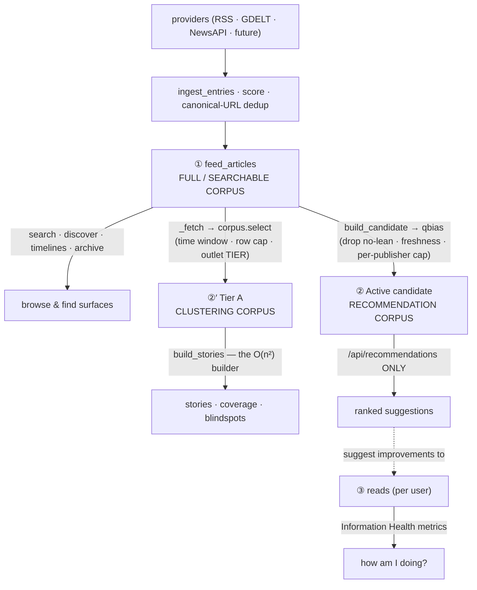

# Corpus Architecture — the four datasets (canonical reference)

**Status:** intentional architectural contract · **Audience:** every contributor adding an ingestion
source, a browse/search surface, a recommendation feature, or a metric.

Hidden View keeps **four logically distinct datasets**. They are *not* interchangeable, and the
boundaries between them are contracts — not implementation details. This document is the canonical
reference; the guardrail tests in `tests/test_corpus_boundaries.py` enforce the boundaries below.

> The one-line principle: **searchable ≠ clusterable ≠ recommendable; ingestion ≠ recommendation; a
> user's reads are a separate concern.**

## The four datasets

| # | Dataset | Storage / source of truth | What it is |
|---|---|---|---|
| ① | **Full / Searchable Corpus** | `feed_articles` (SQLite) | *Everything* ingested, from every provider (RSS, GDELT, NewsAPI, future), regardless of quality or recommendability. |
| ②′ | **Clustering Corpus (Tier A)** | derived projection → `corpus.select` inside `story_service._fetch` | The articles allowed to **form and vote in stories**. A projection of ① bounded by a time window, a row cap and an outlet **tier**. |
| ② | **Recommendation Corpus** | derived qbias projection → the hot-swapped `Active` backend | A **quality-filtered projection of ①** (lean-resolvable, fresh, per-publisher-balanced) used *only* to generate recommendations. |
| ③ | **User Reading History** | `reads` (SQLite), per user | What each user actually read — from a rec, search, discover, or the extension on any site. Drives Information Health metrics. |

## Responsibilities

- **① Full Corpus** — be *complete and findable*. Every ingested article stays here and stays searchable
  unless removed by **retention** (`corpus_health.run_retention`) or **moderation**. No quality gate.
- **②′ Clustering Corpus** — be *bounded and honest about its bounds*. The story builder is O(n²) in
  this corpus and in nothing else, so ②′ is the only dataset with a **size budget**
  (`corpus.tier_a_budget()`). Membership is a property of the OUTLET, not the article: an outlet is
  Tier `A` (forms stories), `B` (searchable and attributable, never clustered) or `shadow` (stored,
  surfaced nowhere). **Everything defaults to `A`**, so this boundary changes nothing until an
  outlet is deliberately moved. Added by M1 of `docs/SCALE_ROADMAP.md`; before it, Stories read ①
  directly and the clustering corpus was whatever the fetch happened to return.
  The boundary is applied in two layers (M2): a SQL prefilter so excluded rows never consume the
  row cap — the cap must bound **Tier A**, not the mixture — and `corpus.select`, which is the
  contract and catches what SQL cannot express. The prefilter is provably a *subset* of what
  `select` drops, so SQL stays an optimization and never becomes a second policy.
- **② Recommendation Corpus** — be *safe to recommend*. It is rebuilt from ① each poll cycle
  (`corpus_refresh`) through the qbias serializer, which **drops rows with no resolvable lean**
  (`feed_source.py:47-64`, `_bias_label` → `""` → dropped by `catalog_from_qbias`), applies the
  **freshness gate** (`corpus_health.fresh_articles`), and caps per-publisher volume. It never feeds
  search/browse.
- **③ Reads** — be the *truth about the user's diet*. Information Health metrics derive from ③, scored
  by the same scorer. Recommendations (from ②) are only *suggestions to improve* ③ — they never define it.

## Data flow

- **① is the input to ②′ and ②, never the reverse.** Both are filtered projections; the candidate
  builder reads the whole store (`corpus_refresh.py:104`), and `_fetch` selects the clustering slice.
- **②′ and ② are independent of each other.** An article can be clusterable and not recommendable
  (no resolvable lean), or recommendable and not clusterable (a Tier B outlet). Neither gate is
  derived from the other, and nothing should make one imply the other.
- **② is a rebuildable cache.** Losing/rebuilding it changes no stored article; it's re-derived from ①.
  ②′ is not stored at all — it is recomputed per build.
- **③ is independent of all of them** — a read can originate anywhere; it is never gated by
  recommendability or by tier.

## Design principles

1. **Every ingested article remains searchable** unless removed by retention or moderation, **or its
   outlet is in the `shadow` lane** (M5). Shadow is the third exception and it is deliberate: an
   outlet under evaluation is stored, deduped and attributed, and surfaced to nobody until it is
   promoted. It *withholds*, it never discards — the rows are in ① the whole time, and
   `include_shadow=True` reveals them to evaluation paths.
2. **Recommendation eligibility is independent of searchability.** A non-recommendable article
   (e.g. an unknown-outlet GDELT item with no resolvable lean) is still fully searchable.
3. **Clustering eligibility is independent of both.** A Tier B outlet's article is searchable and
   attributable and never forms or joins a story. This is what lets source coverage grow without the
   O(n²) builder growing with it.
4. **The derived corpora are projections of the Full Corpus** — derived, not authored; ② rebuilt each
   cycle, ②′ recomputed per build.
5. **Browse surfaces read ①; stories read ②′; recommendations read ②; metrics read ③.**
6. **Providers add to ① only.** Whether a provider's articles reach ② or ②′ is decided by the *same*
   projection gates (lean/freshness/caps; window/cap/tier) as every other source — never by
   provider-specific logic.

## Invariants (enforced by `tests/test_corpus_boundaries.py`)

| Invariant | Guard |
|---|---|
| A no-lean article is **searchable** (in ①) but **excluded from ②** | behavioral test: `search.search` returns it; the qbias serializer gives it an empty `bias_rating` → dropped |
| A **Tier B article is searchable (①) but never enters ②′**, and its presence leaves the Tier A story set **byte-identical** | behavioral test: `search.search` returns it, `_fetch` does not, and `cluster_from_store` fingerprints match a catalog where the row never existed — with a **control arm** proving the same article does move the story set when tiering is off |
| A **`shadow` article is stored but reaches NO reader surface** — not Search, not Discover, not a facet — while the same query with `include_shadow=True` still sees it | behavioral test asserting Tier B **is** searchable and shadow is not, in the same fixture, so the distinction cannot collapse |
| **Shadow exclusion is the store DEFAULT, never a caller opt-in** | structural test on the signature: seven reader surfaces funnel through `search_feed_articles`, and enforcing at each is how shadow came to be half implemented. The default makes a NEW surface safe the day it is written |
| **The clustering corpus is selected, not merely fetched** | structural test: `story_service._fetch` calls `corpus.select` and keeps the pre-pagination `total` (the only thing that makes a truncated window detectable) |
| **Search / Discover / Stories / Story-Intelligence endpoints never read ②** | structural test: their source references no `active.backend` / `active.personalizer` / `_serve(` |
| **`/api/recommendations` reads ② (the projection), not ① directly** | structural test: its source references `active.` and never `list_feed_articles` |
| **Information Health metrics derive from ③ (reads)** | by design (`personalizer.report(uid)` over the user's reads); covered by the existing report/personalizer suites |

## Rationale — why these are separate

- **Why searchable ≠ recommendable.** Recommendations must be *balanced and trustworthy* (viewpoint
  diversity needs a resolvable lean; stale/firehose items hurt quality). Search must be *complete*
  (users expect to find anything that exists). Forcing one gate on both would either pollute
  recommendations or hide real content from search. The qbias lean-drop makes this automatic: thin,
  unresolvable-lean items (a large share of a broad source like GDELT) are stored + searchable but never
  recommended — no separate "exclude from recs" mechanism required.
- **Why ingestion ≠ recommendation.** Ingestion is *additive and provider-shaped*; recommendation is a
  *curated, balanced product*. Coupling them would mean every new provider could silently change
  recommendation quality. Keeping ② a projection means adding a provider is safe by construction.
- **Why user reads are a separate concern.** Metrics must reflect what the user *actually did*, not what
  the system *offered*. If metrics were computed from the recommendation corpus, they'd measure the
  product's menu, not the user's diet — and they'd move whenever the catalog changed. Reads (③) keep
  metrics honest and stable.

## Future provider guidance

When you add an ingestion provider (a new `SourceAdapter`):

- It writes to **① only** (via `ingest_entries`). Do **not** special-case it in the recommendation path.
- Its articles reach **②** only if they pass the *existing* projection gates (resolvable lean, freshness,
  per-publisher cap) — the same gates every source passes. Broad, thin, or unknown-outlet items will be
  **searchable but not recommendable** automatically. That is the intended behavior, not a bug.
- Its articles reach **②′** unless their outlet has been moved off Tier A. A provider that delivers
  high-volume, low-value or syndicated material is a candidate for `RWE_CORPUS_TIER_B` — but moving
  an outlet is a **measured** decision with its own counterfactual (`audit_corpus_boundary.py` for
  the containment bars, `audit_clustering_change.py` for the production ones), never a default.
- If you add a browse/search/timeline/archive feature, read **①**. If you add a story/clustering
  feature, read **②′** (which means: go through `story_service._fetch`, never `search_feed_articles`
  directly). If you add a *ranked, diet-improving suggestion* surface, read **②**. If you add a
  "how am I doing" metric, read **③**.
- Do not point a browse surface at ②, `/api/recommendations` at ①, or a story builder at ① — the
  guardrail tests will fail.

See also: `docs/PRODUCT_SIMULATION.md`, `docs/PA1_PRODUCT_ANALYTICS.md` (events are a *fourth*, separate
stream — neither corpus), and the recommendation-corpus construction in `examples/corpus_refresh.py` /
`examples/feed_source.py`.
