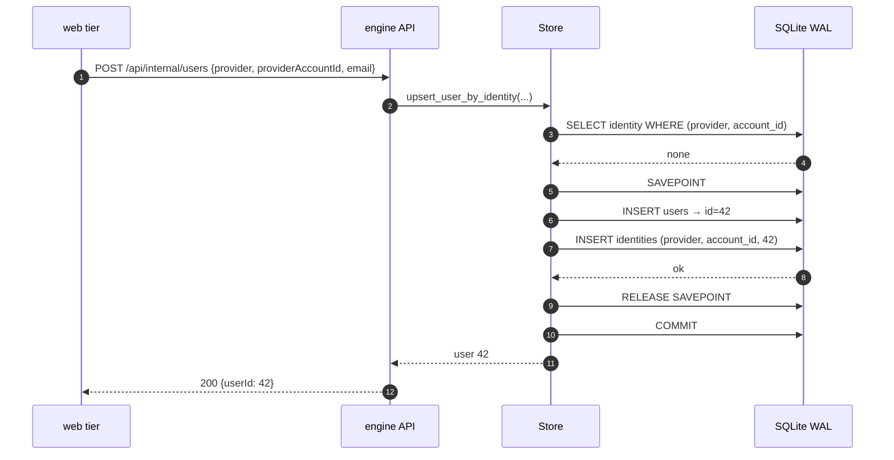
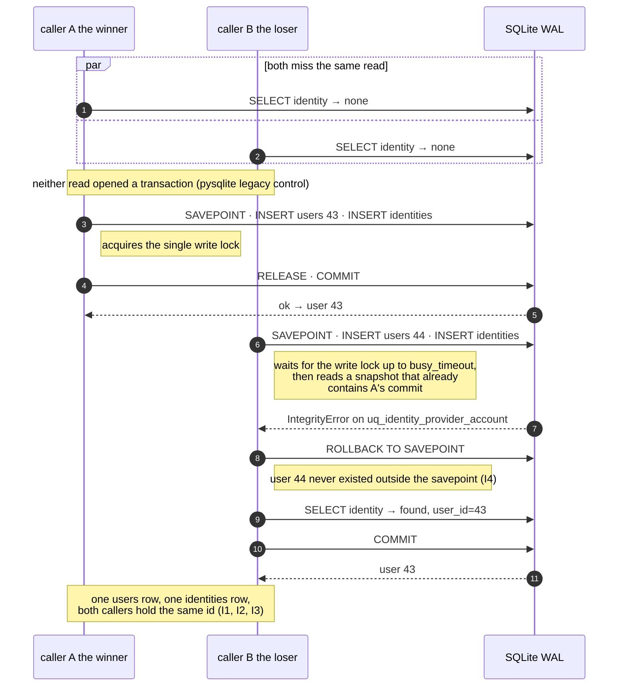
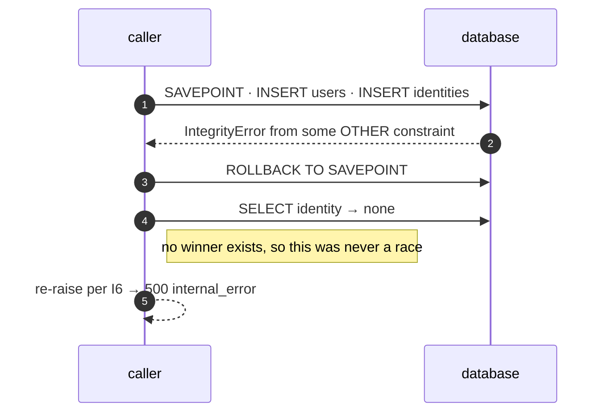
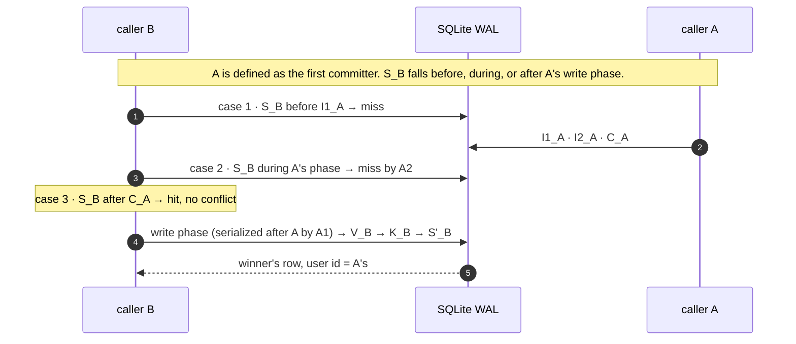

# Identity Upsert — Concurrency Contract

**Scope:** `Store.upsert_user_by_identity` in `examples/store.py`, reached over
`POST /api/internal/users`. It is the only way a third-party login becomes an engine user, so its
concurrency behaviour is the foundation every authenticated surface stands on.

**Status:** specification. The invariants and the normal path describe code that exists today; §4
specifies a change (savepoint + conflict handling) that does **not** exist yet and is a prerequisite
for [`SESSION_IDENTITY_RECOVERY_DESIGN.md`](SESSION_IDENTITY_RECOVERY_DESIGN.md), which multiplies
concurrent first-sightings of the same identity.

This document owns the storage-level reasoning. Callers should reference it rather than restate it.

---

## 1. Invariants

These hold for every caller, at every concurrency level, on every supported backend. They are the
contract; everything after this section is how it is kept.

| # | Invariant |
|---|---|
| **I1** | **One engine user per `(provider, provider_account_id)`.** The pair resolves to the same `users.id` forever. Enforced by `UniqueConstraint("provider", "provider_account_id", name="uq_identity_provider_account")` — the database, not application logic, is the arbiter. |
| **I2** | **Idempotent.** Any number of calls with the same pair — sequential, concurrent, from any number of processes — create at most one `users` row and exactly one `identities` row, and all return the same user. |
| **I3** | **No duplicate identities.** Two rows with the same pair are unrepresentable. There is no code path, including every failure path, that can produce one. |
| **I4** | **No orphan users.** A `users` row is never committed without its `identities` row. A lost race must leave the store exactly as a successful re-resolve would. |
| **I5** | **Email is never an identity key.** It is refreshed as profile context when supplied and matched never, so two providers carrying the same address resolve to two distinct users. |
| **I6** | **Unrelated integrity failures are never swallowed.** Conflict handling recognises *this* conflict; anything else propagates. |

I4 and I6 are the two the current code does not yet guarantee. See §4.

## 2. Concurrency guarantees offered to callers

What a caller may rely on:

- **Safe to call concurrently** with itself for the same identity or any other, from any thread or
  process. No caller-side locking, ordering, or deduplication is required.
- **Safe to retry** — I2. A caller that times out and retries cannot create a second account.
- **Returns a fully resolved user or raises.** There is no partial success and no sentinel.
- **Contention manifests as latency, not error**, up to `busy_timeout` (5 s, §5). Beyond it, and for
  any other failure, the caller sees an exception — surfaced by the API as a typed
  `500 internal_error` — and is expected to treat it as transient.

What a caller may **not** rely on:

- **Which** concurrent call performs the insert. First-sighting is a race with no defined winner; both
  callers receive the same user, and neither can tell which one created it.
- **`users.email` / `display_name` reflecting its own arguments** after a concurrent call. Both are
  last-write-wins profile context, refreshed only when a non-`None` value is supplied. Nothing in the
  product keys on them (I5).
- **Row ids being contiguous or gap-free.** SQLite reuses the id after a rolled-back savepoint
  (measured); PostgreSQL sequences consume it. Nothing may infer ordering or population size from an id.

## 3. How concurrent first-sighting must behave

Two or more callers see no identity and both attempt to create one.

**Required outcome:** one `users` row, one `identities` row, and *every* caller returns that same
user. No caller observes an error caused solely by having lost the race.

**Required mechanism:** the unique constraint decides, and the loser recovers by reading the winner's
row. Specifically:

1. The loser must not create a second identity — guaranteed by the constraint (I3).
2. The loser must not leave a `users` row behind — this is what the savepoint is for (I4).
3. The loser must find the winner's row on re-read. This is not a hope: the constraint violation is
   *evidence* that the winner's row is visible to the loser's transaction, since a violation can only
   be raised against data the statement can see. If the re-read comes back empty, the failure was not
   this race, and I6 requires re-raising.
4. Neither caller may spin. One conflict, one re-read, done — no retry loop, no backoff, no jitter.

**Explicitly not required:** a lock, an advisory lock, table-level serialisation, or a "get-or-create"
mutex in the web tier. The constraint already provides mutual exclusion at exactly the granularity
needed, and paying for a lock on every sign-in to make a rare race tidier is the wrong trade.

## 4. The specified algorithm

The pattern is not novel here: `record_improvement_lifecycle` in the same file already does
savepoint → `IntegrityError` → re-select for `(user_id, rec_key)`, with a comment naming the unique
constraint as the arbiter. This is that pattern, with one difference that matters.

```python
with self.session() as s:
    identity = s.scalar(select(Identity).where(
        Identity.provider == provider,
        Identity.provider_account_id == provider_account_id))

    if identity is None:
        try:
            # THE SAVEPOINT SPANS BOTH INSERTS. `users` is written first (to assign the id the
            # identity references), so a savepoint around only the identity insert would leave the
            # user row behind in the enclosing transaction when the identity conflicts — an orphan
            # user per lost race (I4). This is the one way this differs from the lifecycle pattern,
            # which inserts a single row.
            with s.begin_nested():
                user = User(email=email, display_name=display_name)
                s.add(user)
                s.flush()                        # assigns user.id
                s.add(Identity(provider=provider,
                               provider_account_id=provider_account_id, user_id=user.id))
                s.flush()                        # surfaces the conflict here rather than at RELEASE
        except IntegrityError:
            # Lost the race. The savepoint rollback discards both inserts and expunges the `User`
            # instance created inside it, so `user` must be rebound from the winner's row — which the
            # violation proves is visible to this transaction.
            identity = s.scalar(select(Identity).where(
                Identity.provider == provider,
                Identity.provider_account_id == provider_account_id))
            if identity is None:
                raise                            # not this race — I6, never swallow it
            user = identity.user
    else:
        user = identity.user

    if email is not None:
        user.email = email                       # profile context, last-write-wins (I5)
    if display_name is not None:
        user.display_name = display_name
    s.flush()
    s.refresh(user)
    return user
```

Four details are load-bearing, and each is a way a plausible-looking variant would be wrong:

| Detail | Why |
|---|---|
| `begin_nested()`, not bare `try` | Mandatory, and on SQLite too: without it the handler's re-read raises `PendingRollbackError`, as does the commit, so the call returns no user at all (measured, §9.7). On PostgreSQL a failed statement additionally aborts the whole transaction. |
| The savepoint spans **both** inserts | Otherwise every lost race commits an orphan `users` row (I4). |
| The explicit second `s.flush()` | **Not** required for correctness — exiting `begin_nested()` flushes, so the conflict still lands inside the `with` and reaches the handler (measured, §9.7). Kept because it puts the failure at the statement rather than at a block boundary. |
| `raise` when the re-read is empty | An `IntegrityError` from something else (a foreign-key failure, a future constraint) must not be reported as success (I6). |
| Rebinding `user` in the handler | The savepoint rollback expunges the instance added inside it. Reusing that stale object instead of the winner's would return a user that is not in the database. |

## 5. Why this is safe on SQLite today

Verified against the running configuration rather than assumed:

| Fact | Value | Where |
|---|---|---|
| SQLAlchemy | 2.0.51 | installed |
| SQLite | 3.45.1 | installed |
| Journal mode | `wal` | `SQLITE_PRAGMAS`, confirmed via `PRAGMA journal_mode` |
| Busy timeout | 5000 ms | idem |
| Pool (file DB) | `QueuePool` — several connections, one per active thread | `_make_engine` |
| Pool (in-memory) | `StaticPool` — a single shared connection | idem (matters for testing, §7) |
| Driver transaction control | pysqlite legacy (`isolation_level == ''`) | confirmed at runtime |
| API process model | one uvicorn process, no `--workers`; sync `def` endpoints run in the anyio threadpool | `api_fastapi.py`, `Dockerfile.api` |
| Other writer processes | `ingest` and the backup scheduler share the same file | `docker-compose.yml` |

So concurrency is real today — multiple threads in the API process, plus other containers on the same
database file. Three properties combine to make the algorithm correct:

1. **WAL gives one writer at a time, and readers never block.** Two threads can both run the initial
   `SELECT` concurrently and both miss.
2. **The driver's legacy transaction control means the `SELECT` runs outside any transaction.** pysqlite
   issues no `BEGIN` for a read; it begins a deferred transaction on the first DML statement. So the
   loser's write transaction starts *after* its own read and after the winner's commit, and therefore
   sees the winner's row. This is why the loser gets a clean `IntegrityError` rather than
   `SQLITE_BUSY_SNAPSHOT` from trying to upgrade a stale read snapshot — a distinction that decides
   which exception the handler must catch.
3. **`busy_timeout=5000` absorbs write-lock contention.** The loser waits for the writer's lock rather
   than failing immediately; only a >5 s stall surfaces as `OperationalError: database is locked`,
   which is contention, not conflict, and is correctly treated as transient by the caller.

Point 2 is now measured, not inferred: a session's DBAPI connection reports `in_transaction == False`
after the initial `SELECT` and `True` after the first `INSERT` (§9.5 A3).

**Assumption to state, because a future change could silently invalidate point 2:** the algorithm's
exception type depends on the driver's legacy transaction control. Switching to explicit
`BEGIN IMMEDIATE`, setting `isolation_level=None` with manual transaction management, or adopting
SQLAlchemy 2.1's SQLite transaction-control options could move the loser's failure from
`IntegrityError` to an `OperationalError` snapshot conflict. If any of those lands, the handler must
also treat that as "lost the race, re-read" — and §7's race test is what would catch it.

## 6. Sequence diagrams

### Normal path — first sighting, uncontended



A returning identity is shorter still: the `SELECT` hits, the savepoint block is skipped, and only the
profile refresh is written.

### Concurrent first sighting — the race



### The failure that must not be swallowed



## 7. Testing requirements

| # | Test | Asserts |
|---|---|---|
| 1 | Two threads, file-backed DB, barrier-synchronised on the same new identity | `users` count == 1, `identities` count == 1, both threads return the same id (I1, I2, I3) |
| 2 | Same, then count `users` | == 1 — the orphan-user regression (I4). Fails against a savepoint that wraps only the identity insert. |
| 3 | Sequential repeat: same pair called five times | one user, one identity, same id each time (I2) |
| 4 | Same email under `google` and `dev` | two distinct users (I5) — the anti-hijack test; must fail if the join key ever becomes email |
| 5 | `email=None` / `display_name=None` on a returning identity | existing values preserved, not nulled |
| 6 | An `IntegrityError` whose re-read finds nothing | propagates (I6). Inject via a monkeypatched `Identity` insert or a deliberately violated foreign key. |
| 7 | Race under contention: N threads, one identity | no `OperationalError` escapes; `busy_timeout` absorbs the waiting (§5.3). Measured clean at N = 2, 8, 15. |
| 8 | The **class** of exception the handler catches, in the race | it is `IntegrityError`. Counts alone would stay green if the mechanism silently changed to something accidentally equivalent — this is what pins premise A3 (§9.9 R1, R2). |
| 9 | A session's DBAPI connection after a bare `SELECT` | `in_transaction is False`; `True` after the first `INSERT`. Promotes the F5 probe to a guard, so a future `isolation_level` or `BEGIN IMMEDIATE` change fails here rather than in production (§9.9 R2). |

Tests 1, 2, 6, 8 and 9 are new; 3–5 extend existing coverage.

**Two constraints on how the concurrent tests are written**, both measured:

- **Use a file-backed temporary database.** `tests/test_store.py` builds
  `Store("sqlite:///:memory:")`, which uses `StaticPool` — a *single* shared connection, so concurrent
  sessions serialise and no conflict can occur at all. A race test on that fixture passes for the wrong
  reason, which is worse than no test.
- **Keep N ≤ 15.** The engine's pool ceiling is `pool_size 5 + max_overflow 10`. A barrier-style test
  where each of N threads holds a connection while waiting **deadlocks** at N = 16 — every thread fails
  on checkout (`TimeoutError`) and the barrier breaks. This is a property of the harness, not of the
  algorithm, and it costs an afternoon to rediscover.

**One ops confirmation.** `Base.metadata.create_all` does not add a constraint to a table that already
exists, so in principle a production `identities` table older than `uq_identity_provider_account` would
lack it — and then nothing in this document is enforced. Checked: the constraint and the table entered
history in the **same commit** (`3aa0ca7`), so the table has never shipped without it and any
`create_all`-built database has the index. Confirm once anyway, because it is one line and it underwrites
every invariant here: `PRAGMA index_list('identities')` on the live file (§9.9 R3).

## 8. If the engine migrates to PostgreSQL

The algorithm is chosen to be portable, so the answer is short: **the code does not change.** What
changes is the reasoning behind why it works, and one configuration detail that must be checked.

| Aspect | SQLite today | PostgreSQL |
|---|---|---|
| Arbiter of I1/I3 | `UNIQUE` constraint | the same constraint, unchanged by the migration |
| Concurrency of first-sighting | rare — one writer at a time | **common** — true concurrent writers, so the handler moves from a corner case to a routine one. This is why it must be correct rather than merely present. |
| Loser's failure | `IntegrityError` (unique violation), thanks to the driver's read-outside-transaction behaviour | `IntegrityError` wrapping SQLSTATE `23505`. Same exception class from SQLAlchemy; the handler is unchanged. |
| Is the savepoint still needed? | yes, to keep the enclosing transaction usable and to prevent orphan users | **more** than needed — mandatory. A failed statement aborts the whole PostgreSQL transaction; without a savepoint, every subsequent statement raises until rollback. |
| Does the re-read see the winner? | yes — proven by the violation being raised against visible data | yes **under READ COMMITTED** (the default), which takes a fresh snapshot per statement. **Under REPEATABLE READ or SERIALIZABLE it does not** — the snapshot is fixed at transaction start, so the re-read returns nothing and the algorithm must instead roll the whole transaction back and retry it. **Check the isolation level before migrating**; if anything sets it above READ COMMITTED, §4 needs a transaction-level retry wrapper. |
| Lock-wait behaviour | `busy_timeout=5000` | `lock_timeout` / `statement_timeout`; contention appears as waiting on the conflicting row, resolved when the winner commits |
| Cheaper alternative | — | `INSERT … ON CONFLICT (provider, provider_account_id) DO NOTHING RETURNING id`, one round trip, no savepoint. Available in SQLite 3.24+ too, but only through dialect-specific constructs (`sqlalchemy.dialects.{sqlite,postgresql}.insert`), so it trades one portable implementation for two. Not worth it unless profiling says so — this path runs at most once per sign-in. |

Migration checklist for this table specifically: (a) confirm the transaction isolation level is READ
COMMITTED; (b) confirm `uq_identity_provider_account` came across as a real unique index, not an
advisory or partial one; (c) re-run the §7 tests against PostgreSQL — tests 1 and 2 are the ones that
would catch a regression, and they will now exercise genuine concurrency rather than a narrow window.

## 9. Correctness argument

A semi-formal proof: every storage-level premise is either cited to documented behaviour or
**measured** on this exact stack (SQLAlchemy 2.0.51, SQLite 3.45.1, the real `_make_engine`).
Measurements are labelled `[M]` with the probe id. The probes were ad-hoc scripts against throwaway
file-backed databases; §7 is where the ones worth keeping become tests, and §9.9 says which those are
and why. Two claims made earlier in this document did not survive measurement — see §9.7.

### 9.1 Preconditions

| # | Precondition | Enforced by |
|---|---|---|
| **P1** | `provider` and `provider_account_id` are non-empty strings, ≤ 40 and ≤ 255 chars | caller; column widths truncate silently otherwise |
| **P2** | The caller holds no open transaction on this store and passes no session in | the method opens and owns its own `session()` |
| **P3** | The schema is present and `uq_identity_provider_account` exists **in the live database** | `create_all`; the constraint has shipped with the table since `3aa0ca7`, so no released schema lacks it (**R3** keeps the one-line confirmation) |
| **P4** | The engine is built by `_make_engine` (WAL, `busy_timeout=5000`, `foreign_keys=ON`) | `Store.__init__` |
| **P5** | `email` / `display_name` are `None` or strings; `None` means "do not touch" | signature |

### 9.2 Postconditions

On return, in the committed state of the database:

| # | Postcondition |
|---|---|
| **Q1** | Exactly one `identities` row exists with `(provider, provider_account_id)`. |
| **Q2** | The returned `User` is the one that row references, and is persistent (loaded, id assigned). |
| **Q3** | `users.email` / `display_name` equal the supplied arguments where those were not `None`, and are otherwise unchanged. |
| **Q4** | Exactly one `users` row was created across all calls for this identity — never zero, never two. |
| **Q5** | On raise, nothing this call attempted is committed: no `users` row, no `identities` row. The store is exactly as it was. |
| **Q6** | The call terminates. There is no retry loop, no wait that is not bounded by `busy_timeout`. |

Q5 is what makes the caller's retry safe, and it is the postcondition the savepoint exists to
provide.

### 9.3 Invariants guaranteed

I1–I6 from §1 restated as what the proof must show, plus two that only appear once you reason about
sequences of calls:

| # | Invariant | Scope |
|---|---|---|
| I1 | One engine user per `(provider, provider_account_id)`, forever | global, all time |
| I2 | Idempotent under any number of calls, sequential or concurrent | global |
| I3 | No two `identities` rows share the pair | global, enforced by the constraint |
| I4 | No `users` row is committed without its `identities` row | per call |
| I5 | Email is never an identity key | per call |
| I6 | An `IntegrityError` that is not this conflict propagates | per call |
| **I7** | **The user id, once returned, never changes for that identity.** Nothing in the algorithm updates `identities.user_id` or deletes rows, so the mapping is append-only. | global |
| **I8** | **No caller observes an error caused solely by losing the race.** Losing produces a resolved user, not a failure. | per call |

### 9.4 The algorithm as atomic steps

For a caller X:

```
S_X    SELECT identity WHERE (provider, account_id)          -- no transaction open  [M: F5]
        found?  -->  U_X, C_X                                 -- the "exists" branch
        miss?   -->  N_X
N_X    SAVEPOINT
I1_X     INSERT INTO users ...                                -- opens the write transaction here
I2_X     INSERT INTO identities ...                           -- succeeds, or raises V_X
        success -->  R_X (RELEASE), U_X, C_X
        V_X     -->  K_X (ROLLBACK TO SAVEPOINT), S'_X, U_X, C_X
U_X    UPDATE users SET email/display_name                    -- only for non-None arguments
C_X    COMMIT
```

The write phase of X is the interval `[I1_X, C_X]`. This is the unit that matters, because of A1
below: **write phases of distinct callers cannot interleave.** That single fact reduces the space of
interleavings from unbounded to the handful enumerated in §9.5.

### 9.5 Storage-level premises

| # | Premise | Status |
|---|---|---|
| **A1** | SQLite in WAL mode permits **one write transaction at a time**; a second writer blocks. | documented SQLite semantics; corroborated `[M: F3, F4]` |
| **A2** | WAL readers observe the last committed snapshot and never another transaction's uncommitted writes. | documented SQLite semantics |
| **A3** | pysqlite legacy transaction control: no `BEGIN` before a read; `BEGIN` deferred until the first DML. | `[M: F5]` — DBAPI `in_transaction` is `False` after `S_X`, `True` after `I1_X` |
| **A4** | A `UNIQUE` violation is raised only against data visible to the statement. Therefore after `V_X`, `S'_X` finds the winner. | `[M: E6, F1, F2]` — every loser resolved, 14/14 at N=15 |
| **A5** | `Session.begin_nested()` emits a real `SAVEPOINT` that behaves correctly under A3, and rolling it back discards **all** work inside it. | `[M: E2, E3]` — with the savepoint spanning both inserts, final counts `(1,1)`; spanning only the identity insert, `(2,1)` |
| **A6** | Exiting the `begin_nested()` block flushes pending work, so a deferred `I2_X` still raises **inside** the `with`. | `[M: F1]` — handler fired with and without an explicit `flush()` |
| **A7** | Savepoint rollback expunges instances added inside it; they revert to transient. | `[M: E6]` — `transient=True`, `in_session=False` |
| **A8** | A blocked writer waits up to `busy_timeout` (5 s), then raises `OperationalError: database is locked`. | `[M: F3]` 5.02 s to failure; `[M: F4]` acquires at 1.03 s when the holder commits |
| **A9** | The connection pool ceiling is `pool_size 5 + max_overflow 10 = 15`. | `[M: E11]` — the 16th concurrent holder fails on checkout |
| **A10** | `foreign_keys=ON`, so an FK violation also surfaces as `IntegrityError`. | `[M: E10]` |

### 9.6 All interleavings of two concurrent first-time sign-ins

Let A and B be two callers for the same identity, both starting with no row present. By **A1**, their
write phases are totally ordered; without loss of generality let **A** be the caller whose write phase
commits first. Then B's `S_B` falls in exactly one of three places, and B's write phase in one of two.
That is the complete space — six leaves, of which two are the same case reached differently.



| # | Interleaving | What B does | Outcome | Invariants |
|---|---|---|---|---|
| **1** | `S_B` … `I1_A I2_A C_A` … `I1_B` | misses, then attempts its inserts entirely after `C_A` (A1) | `V_B` → `K_B` → `S'_B` finds A's row (A4) → returns A's user | I1 ✔ (one identity) I3 ✔ (constraint) I4 ✔ (A5 discards B's user) I8 ✔ (no error) |
| **2** | `I1_A` … `S_B` … `C_A` … `I1_B` | `S_B` reads the committed snapshot, so it misses (A2); its write phase is blocked until `C_A` (A1) | identical to case 1 | as case 1 |
| **3** | `I1_A I2_A C_A` … `S_B` | `S_B` **hits** | takes the exists branch; only `U_B` runs; no insert, no conflict | I1 ✔ I4 ✔ trivially, I5 ✔ (only profile columns written) |
| **4** | `S_A S_B` then B's write phase first | relabel: B is the first committer, A is the loser | symmetric to case 1 | as case 1 |
| **5** | `I1_A` open, `I1_B` attempts, A does **not** commit within 5 s | B blocks on the write lock and then raises (A8) | B's call fails having written nothing (Q5); the caller's retry re-enters at `S_B` and lands in case 1 or 3 | I2 ✔ (retry safe) Q5 ✔ I8 — *see the note below* |
| **6** | A's write phase aborts (unrelated error, crash, rollback) | nothing of A's is committed | B's phase succeeds and B becomes the first committer | I1 ✔ I4 ✔; A's caller sees the raise (I6) |

**The one honest wrinkle, case 5.** I8 says no caller fails *solely* for losing a race. In case 5 B
does fail — but not because of the conflict: it fails because A held the write lock for more than five
seconds, which is a caller-discipline failure (a slow operation inside an open transaction), not a
property of this algorithm. `upsert_user_by_identity` itself holds the write lock for two inserts and
an update, microseconds of work. The invariant survives with that reading, and R6 records the
obligation it puts on callers.

**Generalisation to N callers.** By induction on the write-phase order: the first committer creates the
row; every later caller either misses and conflicts (case 1/2 → resolves to the first committer's user)
or hits (case 3). Measured at N = 2, 8 and 15 real threads: `handler_fired == N − 1` exactly, all N
resolved to the same id, final counts `(1, 1)`, no exception escaped `[M: F2]`.

### 9.7 Two corrections from measurement

**The explicit second `flush()` is not load-bearing.** §4 claimed the conflict would escape the handler
without it. It does not: exiting `begin_nested()` flushes, and the resulting `IntegrityError`
propagates out of the `with` block into the handler (A6, `[M: F1]` — the handler fired in both
variants). The explicit flush is retained because it puts the failure at the statement rather than at a
block boundary, which is easier to read and to debug — but it is style, not correctness.

**Omitting the savepoint fails harder than described.** §4 said a bare `try` "leaves the failed inserts
pending on SQLite". Measured, it is worse: the re-read inside the handler raises
`PendingRollbackError`, and so does the subsequent `commit()`, so the whole call fails and returns no
user at all `[M: E4]`. The savepoint is mandatory on SQLite, for its own reason, and not merely
tidiness before a PostgreSQL migration.

**One caveat narrowed.** §2 warns that a rolled-back savepoint "may consume a rowid on some backends".
On SQLite it does not — the next insert reuses the id `[M: E7]`. On PostgreSQL, sequence values *are*
consumed. The caveat stands as written for portability; the SQLite behaviour is now known.

### 9.8 Assumptions the proof depends on — and where each is checked

| Layer | Assumption | If it changed |
|---|---|---|
| SQLite | A1 single writer, A2 snapshot reads | The enumeration in §9.6 assumes write phases cannot interleave. Without A1 the case analysis is invalid and the constraint alone would carry correctness (still I1/I3, but I4's argument would need re-deriving). |
| Driver | A3 legacy transaction control | The loser's exception class could become `OperationalError` (`SQLITE_BUSY_SNAPSHOT`) from upgrading a stale read snapshot. The handler catches only `IntegrityError`, so I8 would break — losers would fail instead of resolving. **This is the single most fragile premise.** |
| SQLAlchemy | A5 savepoint semantics, A6 flush-on-release, A7 expunge-on-rollback | I4 depends on A5; the handler firing at all depends on A6; rebinding `user` depends on A7. All three are version-pinned behaviours, verified on 2.0.51. |
| Transaction boundary | The write phase is `[I1_X, C_X]`, opened by the first DML and closed by exactly one commit | A caller that wraps this method in an outer transaction (violating P2) changes the boundary and invalidates Q5. |
| Flush semantics | `s.flush()` emits SQL immediately; the session's autoflush does not emit the identity insert earlier than intended | An autoflush triggered by `S'_X` inside the handler is harmless here (the pending inserts were expunged by A5/A7), but it is why the re-read must come *after* the savepoint rollback, never before. |
| Pooling | A9 ceiling of 15 connections | Concurrency above 15 does not corrupt anything, but callers queue and then fail on checkout (`TimeoutError`, default 30 s). FastAPI's threadpool is 40 wide, so the pool — not this algorithm — is the first limit on concurrent sign-ins. |

### 9.9 The residue: what tests must establish, because the code cannot

These are the assumptions no amount of reading the implementation can settle. Each needs a test whose
failure is the alarm.

| # | Residual assumption | Required test |
|---|---|---|
| **R1** | A5/A6/A7 hold in whatever SQLAlchemy version is installed *next*. | §7 tests 1–2, plus an assertion that the **caught exception class is `IntegrityError`** — not merely that the final counts are right. Counts alone stay green if the mechanism changes to something accidentally equivalent. |
| **R2** | A3 (no `BEGIN` before a read) still holds. Nothing in the algorithm expresses this dependency, and a future `isolation_level` change is a one-line diff elsewhere. | A test asserting the loser's caught exception is `IntegrityError`, and a direct assertion that a session's DBAPI connection is **not** `in_transaction` after a SELECT — the F5 probe, promoted to a test. |
| **R3** | `uq_identity_provider_account` exists in the **production** database. `create_all` never adds a constraint retroactively, so a table older than the constraint would leave every invariant here unenforced. Git says this cannot have happened — the constraint and the table arrived in the same commit (`3aa0ca7`), so no released schema ever lacked it. What remains is confirmation rather than suspicion. | One ops line: `PRAGMA index_list('identities')` on the live database. Worth doing because it underwrites everything else, not because it is likely to fail. |
| **R4** | Multi-process safety. E9 modelled a second process with a second engine in one process; SQLite's file locking is what would actually carry it. | A subprocess-based test, or an explicit decision that E9's model plus SQLite's documented file locking is sufficient evidence. |
| **R5** | These two inserts are the only writes in the transaction. | A test that fails if the method grows another write inside the same session — or simply the review discipline of re-reading §9.2 when it does. |
| **R6** | Callers never hold the write transaction across a slow operation (case 5). | Not unit-testable. It is a code-review rule: no network call, no sleep, no user-facing wait inside a `session()` block. |

A test suite that satisfies R1–R4 turns this section from an argument into a checked property. Until
then it is exactly what it says it is: a proof against premises, six of which were measured on this
stack today and one of which (R3) has not yet been checked at all.

## 10. Non-goals

- **Merging identities.** Two providers for one person are two users today (I5). Account linking is a
  product feature with its own design, not a storage concern.
- **Deleting or reassigning identities.** Out of scope; nothing does it.
- **Serialising sign-ins.** A lock would make the race disappear and make every sign-in pay for it.
  The constraint is cheaper and stronger.
- **Retry loops.** One conflict, one re-read. A loop here would be masking a different bug.
