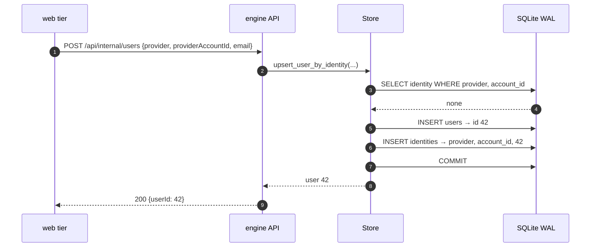
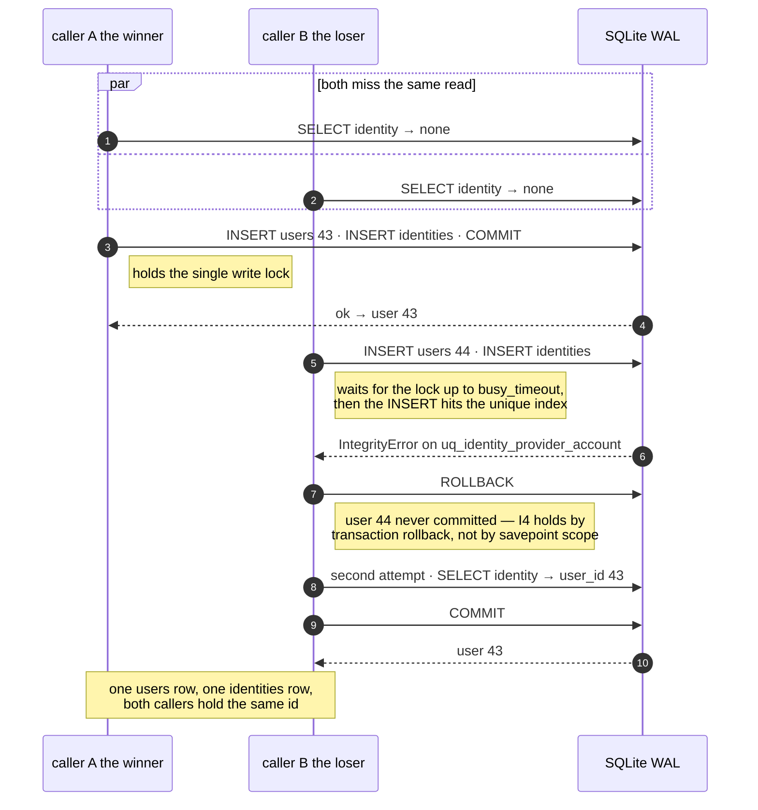
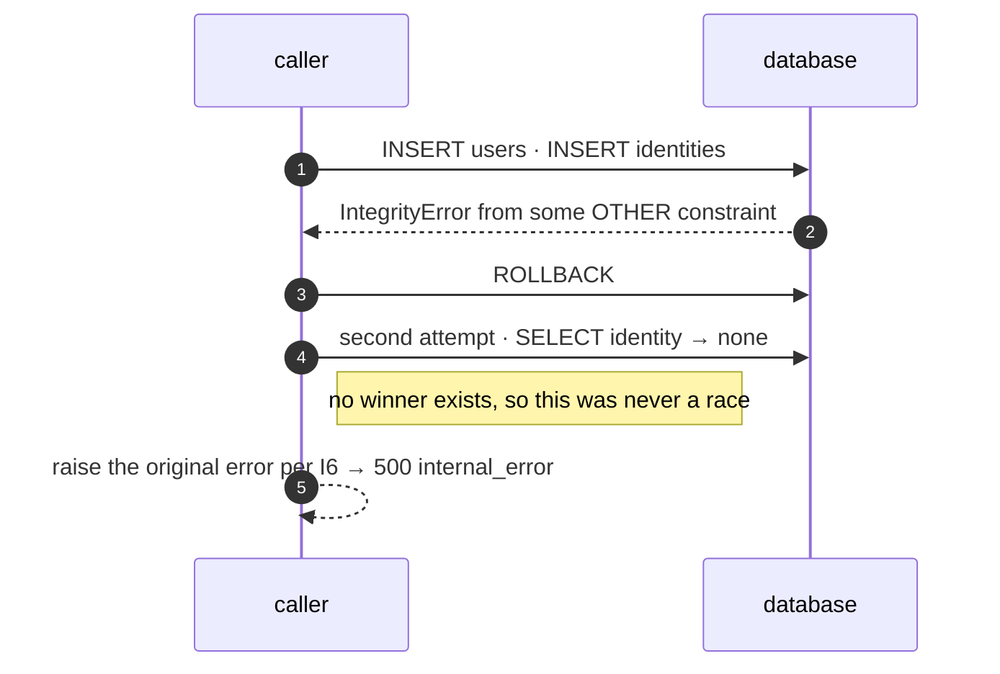

# Identity Upsert — Concurrency Contract

**Scope:** `Store.upsert_user_by_identity` in `examples/store.py`, reached over
`POST /api/internal/users`. It is the only way a third-party login becomes an engine user, so its
concurrency behaviour is the foundation every authenticated surface stands on.

**Status:** **implemented.** §4 is what `Store.upsert_user_by_identity` does as of commit 1 of
[`IDENTITY_RECOVERY_IMPLEMENTATION_PLAN.md`](IDENTITY_RECOVERY_IMPLEMENTATION_PLAN.md). It was a
prerequisite for [`SESSION_IDENTITY_RECOVERY_DESIGN.md`](SESSION_IDENTITY_RECOVERY_DESIGN.md), which
multiplies concurrent first-sightings of the same identity and **has since shipped** — so the race this
document specifies is now reached in production by recovery as well as by sign-in.

> **`refresh_profile`, and what it does to the retry.** `upsert_user_by_identity` takes a keyword-only
> `refresh_profile: bool = True`, threaded to both attempts. The default is the behaviour described
> throughout this document and is what every existing caller gets. With `refresh_profile=False` the
> profile refresh is skipped **for an existing user** — creation still writes email and display name,
> because creation is not a refresh — which makes `_resolve_identity(create=False)` a pure `SELECT`:
> nothing is dirty, so the flush emits no `UPDATE`. Asserted at statement level by
> `test_refresh_profile_false_leaves_the_losers_retry_read_only`.
>
> This **narrows** the open item rather than closing it. On the default path the retry still applies the
> refresh and can emit an `UPDATE` when the supplied profile differs from what is stored, so the loser's
> second transaction is not guaranteed read-only for sign-in. Under WAL with `busy_timeout=5000` a
> reader never blocks, and concurrent callers for one identity normally carry identical profiles — which
> SQLAlchemy's dirty-check turns into no statement at all (measured: identical profile → 0 `UPDATE`s,
> changed profile → 1). The caller that passes `False` is web-tier identity recovery
> ([`SESSION_IDENTITY_RECOVERY_DESIGN.md`](SESSION_IDENTITY_RECOVERY_DESIGN.md) §10, **S2**), which
> resolves an id from a session token that may be weeks old and must not write a stale profile over a
> newer one.

> **Revision note.** An earlier revision of §4 specified a `SAVEPOINT`-based algorithm. It is
> withdrawn. SQLAlchemy's own documentation for the installed version states that SAVEPOINT
> "fails to participate in the enclosing transaction" under the sqlite3 driver's default mode, and
> measurement confirmed the consequence: a released savepoint's rows are **already committed** before
> `COMMIT` is reached, so a later failure cannot roll them back. §4 is now savepoint-free, and §10
> classifies every assumption so this class of mistake is visible next time.

This document owns the storage-level reasoning. Callers should reference it rather than restate it.
The commit-by-commit route from here to production is
[`IDENTITY_RECOVERY_IMPLEMENTATION_PLAN.md`](IDENTITY_RECOVERY_IMPLEMENTATION_PLAN.md).

---

## 1. Invariants

These hold for every caller, at every concurrency level, on every supported backend.

| # | Invariant |
|---|---|
| **I1** | **One engine user per `(provider, provider_account_id)`.** The pair resolves to the same `users.id` forever. Enforced by `UniqueConstraint("provider", "provider_account_id", name="uq_identity_provider_account")` — the database, not application logic, is the arbiter. |
| **I2** | **Idempotent.** Any number of calls with the same pair — sequential, concurrent, from any number of processes — create at most one `users` row and exactly one `identities` row, and all return the same user. |
| **I3** | **No duplicate identities.** Two rows with the same pair are unrepresentable. |
| **I4** | **No orphan users.** A `users` row is never committed without its `identities` row. |
| **I5** | **Email is never an identity key.** Refreshed as profile context when supplied, matched never, so two providers carrying the same address resolve to two distinct users. |
| **I6** | **Unrelated integrity failures are never swallowed.** Conflict handling recognises *this* conflict; anything else propagates. |
| **I7** | **The user id, once returned, never changes for that identity.** Nothing updates `identities.user_id` or deletes rows; the mapping is append-only. |
| **I8** | **No caller observes an error caused solely by losing the race.** Losing produces a resolved user, not a failure. |

**Before and after, measured.** Fifteen concurrent first-sightings of one identity:

| | before | after |
|---|---|---|
| callers that resolved | 10 | **15** |
| callers that raised `IntegrityError` | 5 | **0** |
| `users`, `identities` rows | 1, 1 | 1, 1 |

So the defect this closed was narrow and specific — **I8** (a loser got a `500` instead of a user) and
**I2 under concurrency** (idempotent when serialised, not when raced). **I4 and I6 held before and
still hold**: I4 because the whole transaction rolls back, I6 because a failure no winner explains is
re-raised rather than swallowed. Keeping I4 while fixing I8 was the constraint, and it is exactly the
trap the withdrawn savepoint version fell into.

## 2. Concurrency guarantees offered to callers

What a caller may rely on:

- **Safe to call concurrently** with itself for the same identity or any other, from any thread or
  process. No caller-side locking, ordering, or deduplication is required.
- **Safe to retry** — I2. A caller that times out and retries cannot create a second account.
- **Returns a fully resolved user or raises.** No partial success, no sentinel. The returned instance
  is detached but fully loaded (`expire_on_commit=False`), so attribute access after return is safe.
- **Contention manifests as latency, not error**, up to `busy_timeout` (5 s, §5). Beyond it, and for
  any other failure, the caller sees an exception — surfaced by the API as a typed
  `500 internal_error` — and should treat it as transient.
- **At most two transactions per call.** No unbounded retry, no backoff loop.

What a caller may **not** rely on:

- **Which** concurrent call performs the insert. First-sighting is a race with no defined winner.
- **`users.email` / `display_name` reflecting its own arguments** after a concurrent call. Both are
  last-write-wins profile context, refreshed only when a non-`None` value is supplied. Nothing in the
  product keys on them (I5).
- **Row ids being contiguous or gap-free.** SQLite reuses the id after a rolled-back transaction
  (measured); PostgreSQL sequences consume it. Nothing may infer ordering or population from an id.

## 3. How concurrent first-sighting must behave

Two or more callers see no identity and both attempt to create one.

**Required outcome:** one `users` row, one `identities` row, and *every* caller returns that same
user. No caller observes an error caused solely by having lost the race.

**Required mechanism:** the unique constraint decides, and the loser recovers by reading the winner's
row in a **fresh transaction**. Specifically:

1. The loser must not create a second identity — guaranteed by the constraint (I3).
2. The loser must not leave a `users` row behind. Its whole transaction rolls back, so neither insert
   survives (I4).
3. The loser must find the winner's row on its second attempt. The winner has committed, and a new
   transaction reads committed data — ordinary visibility, not a subtlety.
4. Neither caller may spin. One conflict, one fresh read, done.

**Explicitly not required:** a lock, an advisory lock, table-level serialisation, or a get-or-create
mutex in the web tier. The constraint provides mutual exclusion at exactly the granularity needed.

## 4. The specified algorithm

Two attempts, each its own transaction. No savepoint (see the revision note, and §10 ID2).

```python
def upsert_user_by_identity(self, provider: str, provider_account_id: str,
                            email: str | None = None,
                            display_name: str | None = None) -> User:
    """Return the user for (provider, provider_account_id), creating user + identity on first sight.

    Idempotent and concurrency-safe: see docs/IDENTITY_UPSERT_CONCURRENCY.md.
    """
    try:
        return self._resolve_identity(provider, provider_account_id, email, display_name,
                                      create=True)
    except (IntegrityError, OperationalError) as first:
        # Either we lost a first-sighting race (the UNIQUE constraint rejected our identity insert) or
        # we could not get the write transaction against a concurrent writer. In both cases our
        # transaction rolled back whole, so nothing of ours is committed and a second attempt is safe.
        # OperationalError is included deliberately: if the driver ever stops running in legacy
        # transaction mode, a lost race can surface as a snapshot conflict rather than a constraint
        # violation (§10 ID1).
        user = self._resolve_identity(provider, provider_account_id, email, display_name,
                                      create=False)
        if user is None:
            raise first          # nobody won, so this was never a race — I6, never swallow it
        return user


def _resolve_identity(self, provider: str, account_id: str, email: str | None,
                      display_name: str | None, *, create: bool) -> "User | None":
    """One attempt, one transaction. With `create=False`, resolves an existing identity or returns
    None — which the caller reads as "there was no winner, so the failure was not a race"."""
    with self.session() as s:
        identity = s.scalar(select(Identity).where(
            Identity.provider == provider,
            Identity.provider_account_id == account_id))

        if identity is None:
            if not create:
                return None
            user = User(email=email, display_name=display_name)
            s.add(user)
            s.flush()                                   # assigns user.id
            s.add(Identity(provider=provider, provider_account_id=account_id, user_id=user.id))
            s.flush()                                   # the conflict surfaces here
        else:
            user = identity.user

        if email is not None:
            user.email = email                          # profile context, last-write-wins (I5)
        if display_name is not None:
            user.display_name = display_name
        s.flush()
        s.refresh(user)
        return user
```

Why this shape:

| Detail | Why |
|---|---|
| **Transaction-scoped retry, not savepoint-scoped** | A rolled-back transaction is documented to discard all of its work, and was measured to. A released savepoint under this driver is not (§9.7, §10 ID2). |
| **A second `session()`, not a continuation of the first** | After a flush error the first session is unusable (`PendingRollbackError`, measured). A fresh transaction is also what makes the winner's row plainly visible. |
| `except (IntegrityError, OperationalError)` | Covers both shapes a lost race can take: a constraint violation today, or a snapshot/lock conflict if the driver's transaction mode ever changes (§10 ID1, OB1). |
| **`raise first` when the second attempt finds nothing** | An `IntegrityError` from a foreign key, or a genuine lock timeout, must not be reported as success (I6). |
| **Exactly two attempts** | Bounded (Q6). A loop here would mask a different bug. |

The loser's path costs one extra short transaction, on a path that runs at most once per identity per
sign-in.

## 5. Why this is safe on SQLite today

Verified against the running configuration rather than assumed:

| Fact | Value | Where |
|---|---|---|
| SQLAlchemy | 2.0.51 | installed |
| SQLite / Python | 3.45.1 / 3.11.15 | installed |
| Journal mode | `wal` | `SQLITE_PRAGMAS`, confirmed via `PRAGMA journal_mode` |
| Busy timeout | 5000 ms | idem |
| Pool (file DB) | `QueuePool`, `pool_size=5`, `max_overflow=10` → 15 connections | `_make_engine` |
| Pool (in-memory) | `StaticPool` — a single shared connection | idem (matters for testing, §7) |
| Session | `expire_on_commit=False` | `Store.__init__` |
| Driver transaction control | sqlite3 **legacy transaction control** (`isolation_level == ''`) | confirmed at runtime |
| API process model | one uvicorn process, no `--workers`; sync `def` endpoints on the anyio threadpool | `api_fastapi.py`, `Dockerfile.api` |
| Other writer processes | `ingest` and the backup scheduler share the same file | `docker-compose.yml` |

Concurrency is real today — multiple threads in the API process plus other containers on the same
file. Three properties make the algorithm correct:

1. **WAL gives one writer at a time, and readers never block.** Two threads can both run the initial
   `SELECT` and both miss.
2. **The loser's whole transaction rolls back.** Nothing it inserted survives, so I4 holds regardless
   of where in the attempt the failure happened.
3. **`busy_timeout=5000` absorbs write-lock contention.** A blocked writer waits rather than failing;
   only a >5 s stall raises `OperationalError: database is locked`, which §4 treats as a possible lost
   race and re-raises if the second attempt finds no winner.

Note what is *not* in that list: the driver's legacy transaction mode. The previous revision depended
on it twice — for savepoint semantics, and for which exception the loser sees. The redesign removes the
first dependency entirely and tolerates either outcome of the second.

## 6. Sequence diagrams

### Normal path — first sighting, uncontended



A returning identity is shorter: the `SELECT` hits and only the profile refresh is written.

### Concurrent first sighting — the race



### The failure that must not be swallowed



## 7. The harness

**It exists: `tests/concurrency/`.** The experiments that produced every `[M]` measurement in this
document are kept as runnable tests, not as prose about experiments that were once run.

This section is the mechanics. The reasoning — why these are assumption detectors rather than
regression tests, how to read a failure after a version upgrade, and when a red test means "revalidate
the design" rather than "fix the code" — is [`CONCURRENCY_TESTING.md`](CONCURRENCY_TESTING.md). Read
that one first if the suite has just gone red and you did not change anything.

```
pytest tests/concurrency -q                      # fast probes (runs with the normal suite, and in CI
                                                 # on both 3.11 and 3.12)
pytest tests/concurrency -q -m "slow or not slow"   # + the two wall-clock probes (~14 s total)
```

| File | What it holds |
|---|---|
| `harness.py` | the file-backed store loader, `counts()`, and `read_barrier()` — the engine-level hook that makes a first-sighting race **deterministic** |
| `conftest.py` | `file_store` (file-backed, always) and `second_store` (a second engine + pool over the same file) |
| `test_storage_premises.py` | one test per premise, named for its §10 id — the version-drift detectors |
| `test_identity_upsert.py` | the invariant suite for the shipped method — I1–I8, Q2, Q5, and the second-attempt count that proves the race is real |

### Premise tests, by §10 id

| Test | Pins | If it fails |
|---|---|---|
| `test_engine_configuration_matches_the_contract` | §5's table: WAL, `busy_timeout`, `foreign_keys`, `QueuePool` / `StaticPool`, `expire_on_commit` | every number in this document describes a machine that no longer exists |
| `test_unique_constraint_exists_on_the_identity_pair` | SC1 — and shows what the live-database ops check looks for | I1/I3 are unenforced |
| `test_SC4_transaction_rollback_discards_every_statement` | SC4 | **I4 and Q5 are lost** — this is the premise the redesign rests on |
| `test_SC5_committed_rows_are_visible_to_later_transactions` | SC5 | the loser's second attempt is no longer guaranteed to find the winner |
| `test_SC8_foreign_key_violation_also_raises_integrity_error` | SC8 | I6's discrimination requirement changes shape |
| `test_ID1_sqlite3_is_still_in_legacy_transaction_control` | ID1 | the driver mode changed (Python ≥ 3.16, or someone set `isolation_level`/`autocommit`) — re-validate OB1 |
| `test_ID2_a_released_savepoint_escapes_the_enclosing_rollback` | ID2 | savepoints now participate properly; §10 ID2 can be reclassified |
| `test_OB2_busy_timeout_bounds_a_blocked_writer` *(slow)* | OB2 | case 5's boundary moved |
| `test_OB2b_a_blocked_writer_proceeds_once_the_holder_commits` | OB2 | contention stopped being latency-shaped |
| `test_OB3_pool_ceiling_is_pool_size_plus_max_overflow` *(slow)* | OB3 | update the `n <= 15` guard in `run_concurrently` |
| `test_OB5_sqlite_reuses_a_rowid_after_a_rolled_back_insert` | OB5 | nothing — recorded so §2's "infer nothing from an id" stays honest |
| `test_two_stores_on_one_file_share_the_constraint` | R4's model | cross-pool enforcement changed |

Each of these asserts today's behaviour and names the section to re-read in its own failure message.
**A failure here is a prompt to re-validate, not necessarily a defect.**

### Invariant tests

`test_identity_upsert.py` asserts I1–I8 and Q2/Q5 against the shipped method: sequential idempotency,
the anti-hijack rule, the profile-column rules, a detached-instance read, a race at N = 2, 8 and 15 that
must produce no duplicates **and no errors**, both halves of I6, and that a lost race still applies the
loser's own profile columns.

Until commit 1 this file also carried an executable reference implementation of §4, with every property
parametrised over both subjects and `test_I8_...` marked `xfail(strict=True)` on the shipped one. That
marker was the implementation signal: adopting §4 turned it into an XPASS, failed the suite on purpose,
and the same commit deleted the reference and the marker. It worked exactly as intended, which is worth
recording for the next time a design lands ahead of its implementation.

**One test earns its keep more than the rest.** `test_OB4_...` counts second attempts and requires
exactly N−1 of them. Agreeing user ids would look identical if the callers had serialised and every one
had hit the read — so without that count, a barrier that stopped producing conflicts would leave the
whole file green and meaningless.

### Two things the harness had to learn the hard way

- **Races must be forced at the engine, not in the test body.** Synchronising the threads *before*
  calling the method is not enough: the method issues its own `SELECT` afterwards, so at N = 2 one
  caller routinely finishes before another reads, the read hits, and the "race" test tests nothing. It
  showed up as a flaky XPASS on the tripwire. `read_barrier()` installs an `after_cursor_execute`
  listener and holds every caller immediately after its identities `SELECT` until all N have read.
- **Disarm the barrier after N.** `threading.Barrier` resets once its parties pass, so a still-armed
  listener traps the next caller of that `SELECT` — including the test's own `counts()` helper. That
  one presented as `BrokenBarrierError` in eight unrelated tests.

Both are recorded in the code, because each cost an hour and neither is obvious from the outcome.

**One ops confirmation.** `create_all` does not add a constraint to a table that already exists, so in
principle a production `identities` table older than `uq_identity_provider_account` would lack it — and
then nothing here is enforced. Checked: constraint and table entered history in the **same commit**
(`3aa0ca7`), so no released schema ever lacked it. Confirm once anyway, because it underwrites
everything: `PRAGMA index_list('identities')` on the live file.

## 8. If the engine migrates to PostgreSQL

| Aspect | SQLite today | PostgreSQL |
|---|---|---|
| Arbiter of I1/I3 | `UNIQUE` constraint | the same constraint, unchanged |
| Concurrency of first-sighting | rare — one writer at a time | **common** — true concurrent writers, so the loser path becomes routine rather than a corner case |
| Loser's failure | `IntegrityError` (unique violation) | `IntegrityError` wrapping SQLSTATE `23505`. Same class from SQLAlchemy; §4 unchanged. |
| Does the second attempt see the winner? | yes — a new transaction reads committed data | yes, **at any isolation level**, because it is a *new* transaction rather than a re-read inside the failed one. The savepoint design needed READ COMMITTED specifically; this one does not. |
| Recovering from a failed statement | new transaction | new transaction. On PostgreSQL a failed statement aborts the whole transaction — which is exactly what §4 already does. |
| Lock-wait behaviour | `busy_timeout=5000` | `lock_timeout` / `statement_timeout`; contention appears as waiting on the conflicting row |
| Cheaper alternative | — | `INSERT … ON CONFLICT DO NOTHING RETURNING id`. Available in SQLite 3.24+ too but only via dialect-specific constructs, so it trades one portable implementation for two. Not worth it unless profiling says so. |

Migration checklist for this table: (a) confirm `uq_identity_provider_account` came across as a real
unique index; (b) re-run §7 — tests 1, 2 and 10 would catch a regression, and they will now exercise
genuine concurrency. The isolation level is no longer a prerequisite to check, which is a direct
benefit of dropping the savepoint.

## 9. Correctness argument

Every storage-level premise is either cited to documented behaviour or **measured** on this exact
stack. Measurements are labelled `[M]`. §9.7 records what measurement disproved.

### 9.1 Preconditions

| # | Precondition | Enforced by |
|---|---|---|
| **P1** | `provider` and `provider_account_id` are non-empty strings, ≤ 40 and ≤ 255 chars | caller; column widths truncate silently otherwise |
| **P2** | The caller holds no open transaction on this store and passes no session in | the method opens and owns its own sessions |
| **P3** | `uq_identity_provider_account` exists in the live database | `create_all`; shipped with the table since `3aa0ca7` (§7) |
| **P4** | The engine is built by `_make_engine` (WAL, `busy_timeout=5000`, `foreign_keys=ON`) | `Store.__init__` |
| **P5** | `email` / `display_name` are `None` or strings; `None` means "do not touch" | signature |

### 9.2 Postconditions

| # | Postcondition |
|---|---|
| **Q1** | Exactly one `identities` row exists with `(provider, provider_account_id)`. |
| **Q2** | The returned `User` is the one that row references, fully loaded and safe to read after return. |
| **Q3** | `users.email` / `display_name` equal the supplied arguments where those were not `None`. |
| **Q4** | Exactly one `users` row was created across all calls for this identity. |
| **Q5** | On raise, nothing this call attempted is committed. |
| **Q6** | The call terminates: at most two transactions, no wait unbounded by `busy_timeout`. |

Q5 is what makes the caller's retry safe. It is also the postcondition the withdrawn design violated.

### 9.3 The algorithm as atomic steps

```
attempt 1:  S_X   SELECT identity                       -- no transaction open  [M: F5]
                  found? --> U_X, C_X                   -- the "exists" branch
                  miss?  --> I1_X INSERT users          -- opens the write transaction here
                             I2_X INSERT identities     -- succeeds, or raises V_X
                             U_X, C_X
            V_X --> ROLLBACK (whole transaction)
attempt 2:  S'_X  SELECT identity in a NEW transaction
                  found? --> U_X, C_X
                  miss?  --> re-raise V_X               -- I6
```

The write phase of X is `[I1_X, C_X]`. By A1 below, write phases of distinct callers cannot
interleave — the fact that makes the enumeration in §9.5 finite and short.

### 9.4 Storage-level premises

| # | Premise | Status |
|---|---|---|
| **A1** | WAL permits one write transaction at a time; a second writer blocks. | documented SQLite semantics; corroborated `[M: F3, F4]` |
| **A2** | WAL readers see the last committed snapshot, never uncommitted writes. | documented SQLite semantics; corroborated `[M: G3]` |
| **A3** | `ROLLBACK` of a plain DML transaction discards every statement in it. | documented; `[M: G3, H3]` — counts `(0,0)` from another connection before and after |
| **A4** | A committed row is visible to any transaction started afterwards. | documented committed-read visibility; `[M: H1, H2]` |
| **A5** | A `UNIQUE` violation raises `IntegrityError` through SQLAlchemy. | documented DBAPI-error wrapping; `[M: F1, F2]` |
| **A6** | `foreign_keys=ON`, so an FK violation *also* raises `IntegrityError`. | `[M: E10]` — hence I6 must discriminate |
| **A7** | A blocked writer waits up to `busy_timeout` then raises `OperationalError: database is locked`. | `[M: F3]` 5.02 s to failure; `[M: F4]` acquires at 1.03 s when the holder commits |
| **A8** | `expire_on_commit=False`, so the returned detached instance keeps loaded attributes. | documented SQLAlchemy option; `[M]` verified against the live `Store` |
| **A9** | Pool ceiling is `5 + 10 = 15` connections; the 16th concurrent holder fails on checkout. | `[M: E11]` |
| **A10** | The shipped (pre-change) method already satisfies I4 by transaction rollback: 15 concurrent first-sightings leave one user and one identity, with five callers raising. | `[M: J1]` |

Premises the previous revision needed and this one does not: savepoint participation in the enclosing
transaction, flush-on-savepoint-release, and expunge-on-savepoint-rollback. All three are now moot.

### 9.5 All interleavings of two concurrent first-time sign-ins

By A1 the write phases are totally ordered; let **A** be the caller whose write phase commits first.
`S_B` then falls in exactly one of three places, and B's write phase in one of two.

| # | Interleaving | What B does | Outcome | Invariants |
|---|---|---|---|---|
| **1** | `S_B` … `I1_A I2_A C_A` … `I1_B` | misses, then attempts its inserts entirely after `C_A` (A1) | `V_B` → whole-transaction rollback (A3) → second attempt finds A's row (A4) → returns A's user | I1 ✔ I3 ✔ (constraint) I4 ✔ (A3) I8 ✔ |
| **2** | `I1_A` … `S_B` … `C_A` … `I1_B` | `S_B` reads the committed snapshot, so it misses (A2); its write phase blocks until `C_A` (A1) | identical to case 1 | as case 1 |
| **3** | `I1_A I2_A C_A` … `S_B` | `S_B` **hits** | exists branch; only the profile update runs | I1 ✔ I4 ✔ trivially I5 ✔ |
| **4** | `S_A S_B` then B's write phase first | relabel: B is the first committer | symmetric to case 1 | as case 1 |
| **5** | `I1_A` open, `I1_B` attempts, A does not commit within 5 s | B blocks then raises (A7); §4 treats it as a possible lost race, finds no winner, re-raises | B's call fails having written nothing (Q5); the caller's retry re-enters at case 1 or 3 | I2 ✔ Q5 ✔ I8 — see the note |
| **6** | A's write phase aborts | nothing of A's is committed (A3) | B's phase succeeds and B becomes the first committer | I1 ✔ I4 ✔; A's caller sees the raise (I6) |

**The honest wrinkle, case 5.** I8 says no caller fails *solely* for losing a race. In case 5 B does
fail — not from the conflict but because A held the write lock for over five seconds, which is a
caller-discipline failure (slow work inside a transaction), not a property of this algorithm.
`upsert_user_by_identity` holds the lock for two inserts and an update. R6 records the obligation.

**Generalisation to N callers.** By induction on write-phase order: the first committer creates the
row; every later caller either misses and conflicts (→ case 1/2) or hits (→ case 3). Measured at
N = 2, 8, 15 real threads against the savepoint-free algorithm: all N resolved to the same id, final
counts `(1, 1)`, no exception escaped `[M: H2]`.

### 9.6 Why each execution preserves the invariants

- **I1, I3** rest on the unique index alone. No execution can insert a second identity row, so no
  interleaving needs to be trusted for these.
- **I4** rests on A3. In every failing execution the whole transaction rolls back, so the `users`
  insert cannot outlive the `identities` insert. The withdrawn design made I4 depend on savepoint
  scope, which is where it broke.
- **I2, I7** follow from I1 plus the absence of any `UPDATE` to `identities.user_id` and any `DELETE`.
- **I5** holds because email appears only in `UPDATE users SET email`, never in a `WHERE` that selects
  an identity.
- **I6** holds because the second attempt distinguishes "a winner exists" (a race) from "no winner"
  (something else), and re-raises the original exception in the second case.
- **I8** holds in cases 1–4 and 6; case 5 is the documented exception above.
- **Q5** holds because a failed attempt's transaction is rolled back whole, verified `[M: H3]`.

### 9.7 What measurement disproved

**The savepoint design violated Q5 — the finding that forced the rewrite.** SQLAlchemy 2.0.51's own
SQLite dialect documentation states, of the sqlite3 driver's default legacy transaction mode:

> **Incorrect behavior for SAVEPOINT** — as the SAVEPOINT statement does not imply a BEGIN, a new
> SAVEPOINT emitted before a BEGIN will function on its own but fails to participate in the enclosing
> transaction, meaning a ROLLBACK of the transaction will not rollback elements that were part of a
> released savepoint.

Measured `[M: G1, G2]`: after the savepoint was released, another connection could already see
`(users, identities) = (1, 1)` — **before `COMMIT` was ever called** — and `s.rollback()` (exactly what
`Store.session()` does on any exception) left both rows in place. A failure anywhere after the release
would have committed a user and identity for a call that raised. The earlier proof measured only
`ROLLBACK TO SAVEPOINT` — the half the documentation says "will function on its own" — and mistook it
for the whole.

**The explicit second `flush()` was not load-bearing** in the savepoint design either: exiting
`begin_nested()` flushes, so the conflict reached the handler with or without it `[M: F1]`. Moot now,
but it is the second claim measurement contradicted.

**Retained, and now measured directly:** a plain transaction rollback *does* discard everything
`[M: G3, H3]`, which is what the redesign rests on.

### 9.8 The residue: what tests must establish, because the code cannot

| # | Residual assumption | Required test |
|---|---|---|
| **R1** | The loser's failure is an exception class §4 catches. | `test_I1_I3_I4_concurrent_first_sighting_never_duplicates` asserts the failure *class*, not just the row counts. |
| **R2** | The driver's transaction mode is what §5 says. | `test_ID1_sqlite3_is_still_in_legacy_transaction_control`. Fails loudly if `autocommit`/`isolation_level` is ever set, or on Python ≥ 3.16 where legacy mode stops being the default. |
| **R3** | The unique index exists in the live database. | `test_unique_constraint_exists_on_the_identity_pair` covers the schema; the live file still needs the one ops line in §7. |
| **R4** | Multi-process safety. `test_R4_two_engines_on_one_file_race_safely` models a second process with a second engine and pool; real OS-level file locking is only *modelled*. | Still open: a subprocess test, or an explicit decision that the two-engine model plus SQLite's documented file locking suffices. |
| **R5** | These are the only writes in the transaction. | Review discipline: re-read §9.2 when the method grows a third write. |
| **R6** | Callers never hold a write transaction across slow work (case 5). | Not unit-testable. Code-review rule: no network call, no sleep inside a `session()` block. |

## 10. Assumption classification

Operational purpose: **on any upgrade to SQLAlchemy, Python, SQLite or the driver, re-validate the
Observed Behavior rows and re-read the Implementation Detail rows. The Stable Contract rows need no
attention.**

### Stable Contract — documented, safe across upgrades

Correctness rests here. If all of these hold, I1–I7 and Q1–Q6 hold.

| # | Assumption | Source | Invariants depending on it |
|---|---|---|---|
| **SC1** | A `UNIQUE` constraint rejects a second row with the same key. | SQL standard; SQLite constraint documentation | I1, I3 — and through them I2, I7 |
| **SC2** | A constraint violation surfaces as `sqlalchemy.exc.IntegrityError`. | SQLAlchemy's documented DBAPI exception wrapping | §4's `except`, I6 |
| **SC3** | WAL allows one writer at a time; readers do not block writers. | SQLite WAL documentation *(not re-fetched here — sqlite.org is blocked from this environment; corroborated by `[M: F3, F4]`)* | the §9.5 enumeration |
| **SC4** | `ROLLBACK` discards every statement of the transaction. | SQLite + SQLAlchemy transaction documentation; `[M: G3, H3]` | **I4, Q5** — the load-bearing one for the redesign |
| **SC5** | A transaction cannot read another's uncommitted writes; a committed row is visible to transactions starting later. | SQLite isolation documentation | case 2's miss, and the second attempt's hit |
| **SC6** | `expire_on_commit=False` leaves a detached instance's loaded attributes readable. | SQLAlchemy `sessionmaker` documentation | Q2 |
| **SC7** | `Session.flush()` emits pending DML inside the current transaction. | SQLAlchemy session documentation | the conflict arriving at a known point |
| **SC8** | With `foreign_keys=ON`, an FK violation is also an `IntegrityError`. | SQLite pragma documentation | I6's discrimination requirement |

### Observed Behavior — verified here, not guaranteed; protect with tests

Measured on SQLAlchemy 2.0.51 / SQLite 3.45.1 / Python 3.11.15. An upgrade may change any of these
without it being a bug in anyone's product.

| # | Observation | Measured | Risk if it changes | Guard |
|---|---|---|---|---|
| **OB1** | The loser's first attempt fails with `IntegrityError` specifically, not a lock or snapshot error. | `[M: F1, F2]` — 14/14 losers at N = 15 | §4 would not catch it and I8 would break: losers would fail instead of resolving | §7 test 8. **§4 already catches `OperationalError` too, which downgrades this from a correctness risk to a latency one.** |
| **OB2** | `busy_timeout` produces a ~5 s wait, then `OperationalError: database is locked`. | `[M: F3]` 5.02 s; `[M: F4]` 1.03 s | Case 5's boundary moves; no invariant breaks | §7 test 7 |
| **OB3** | Pool ceiling 15 (`5 + 10`), 30 s checkout timeout. | `[M: E11]` | Concurrency beyond 15 queues then fails; and **barrier-style tests deadlock** | §7's "keep N ≤ 15" note |
| **OB4** | For N concurrent callers, exactly one wins and N−1 take the loser path. | `[M: F2, H2]` | Nothing — but it is the signal that a race test is exercising the race at all | §7 tests 1, 7 |
| **OB5** | SQLite reuses a rowid after a rolled-back transaction (no gap). | `[M: E7]` | Nothing — §2 forbids inferring anything from ids | none needed; do not start depending on it |

### Implementation Detail — do not rely on; isolated or removed

| # | Detail | Status in the design |
|---|---|---|
| **ID1** | **sqlite3 legacy transaction control** — no `BEGIN` before `SELECT`, `SAVEPOINT` or DDL. SQLAlchemy documents this as a divergence from PEP 249 that "will no longer be the default" (Python 3.16), and Python 3.12+ already offers `autocommit=False` to opt out. | **Tolerated, not depended on.** It decides *which* exception the loser sees (OB1); §4 catches both shapes, so the algorithm survives the mode change. §7 test 9 makes the change visible rather than silent. |
| **ID2** | **`SAVEPOINT` participating in the enclosing transaction.** Documented as *incorrect* under ID1, and measured to leave released-savepoint rows committed `[M: G1, G2]`. | **REMOVED.** This was the previous §4's foundation. Nothing in the current algorithm emits a savepoint. |
| **ID3** | Flush-on-savepoint-release timing. | Moot — no savepoints. |
| **ID4** | Savepoint rollback expunging instances added inside it. | Moot — no savepoints. |
| **ID5** | The exact wording of SQLite's "database is locked" message. | Never parsed; only the exception class is used. |
| **ID6** | `QueuePool` being the default pool class for file-backed SQLite in SQLAlchemy 2.x. | Not depended on for correctness; it sets OB3's numbers, which only the test harness cares about. |

### Upgrade checklist

| Trigger | Re-validate |
|---|---|
| SQLAlchemy minor/major upgrade | OB1 (test 8), OB3 (harness N), and that SC2/SC6 are still documented |
| Python upgrade to 3.12–3.15 | ID1 unchanged by default, but `autocommit` becomes available — do not set it without re-running tests 8, 9, 10 |
| **Python 3.16** | ID1's default flips. Run tests 8, 9, 10 and expect OB1 to become `OperationalError`; §4 should already handle it |
| Anyone sets `isolation_level` or `connect_args={"autocommit": …}` | tests 8, 9, 10 — this is the change ID1 exists to make loud |
| SQLite version upgrade | nothing; SC1/SC3/SC5 are long-stable guarantees |
| Migration to PostgreSQL | §8's two-item checklist; the isolation-level question no longer applies |

## 11. Non-goals

- **Merging identities.** Two providers for one person are two users today (I5). Account linking is a
  product feature with its own design, not a storage concern.
- **Deleting or reassigning identities.** Out of scope; nothing does it.
- **Serialising sign-ins.** A lock would make the race disappear and make every sign-in pay for it.
- **Retry loops.** Two attempts, bounded. A loop here would be masking a different bug.
- **Adopting non-legacy transaction mode to make savepoints work.** It is the documented fix for ID2,
  but it changes transaction behaviour for *every* query in the engine, and the SQLAlchemy docs warn it
  is "more susceptible to locked database errors" — with three writer processes on one file, that is a
  production risk taken on to enable a mechanism this algorithm no longer needs.
