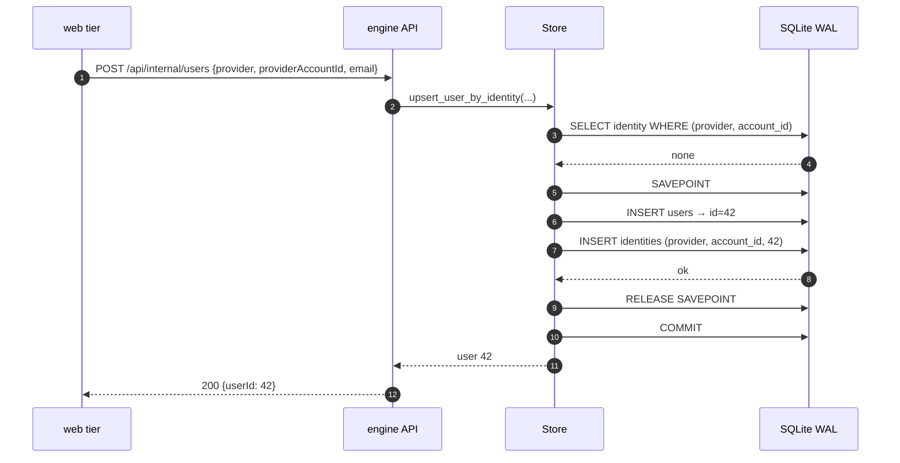
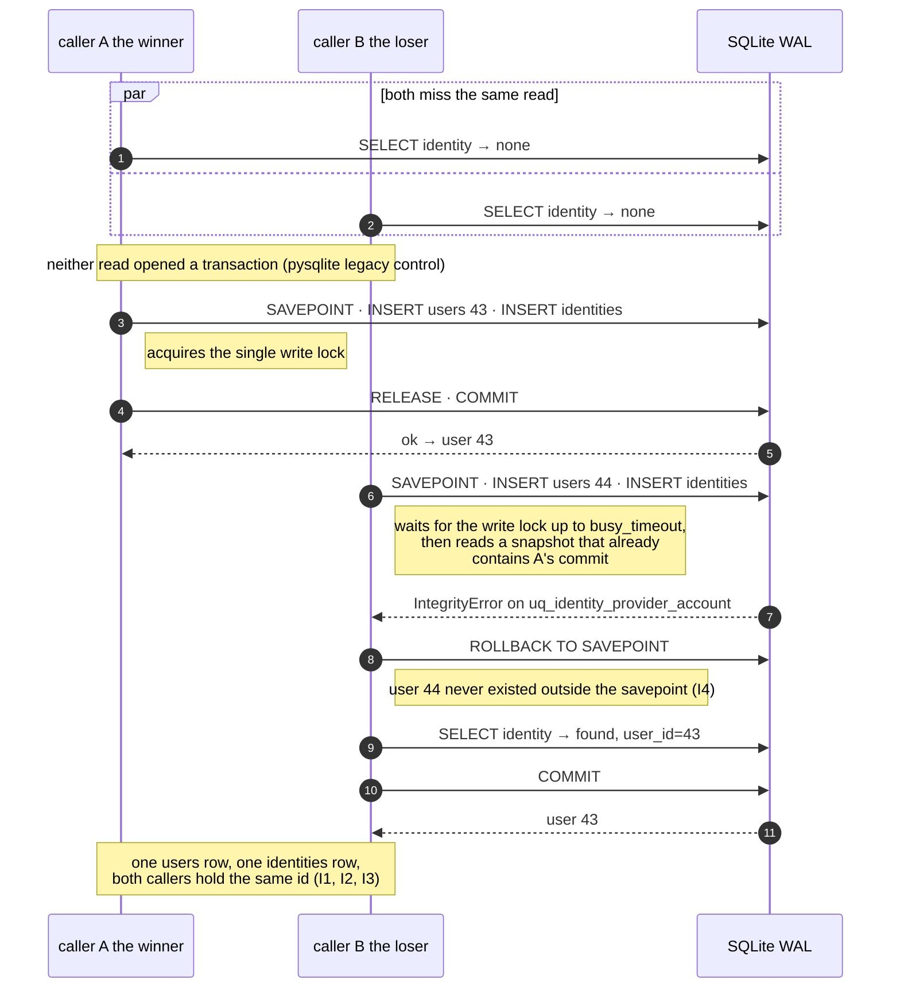
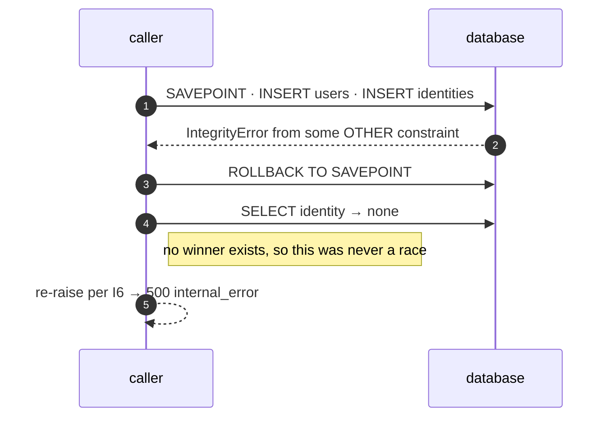

# Identity Upsert — Concurrency Contract

**Scope:** `Store.upsert_user_by_identity` in `examples/store.py`, reached over
`POST /api/internal/users`. It is the only way a third-party login becomes an engine user, so its
concurrency behaviour is the foundation every authenticated surface stands on.

**Status:** specification. The invariants and the normal path describe code that exists today; §4
specifies a change (savepoint + conflict handling) that does **not** exist yet and is a prerequisite
for [`SESSION_IDENTITY_RECOVERY_DESIGN.md`](SESSION_IDENTITY_RECOVERY_DESIGN.md), which multiplies
concurrent first-sightings of the same identity.

This document owns the storage-level reasoning. Callers should reference it rather than restate it.

---

## 1. Invariants

These hold for every caller, at every concurrency level, on every supported backend. They are the
contract; everything after this section is how it is kept.

| # | Invariant |
|---|---|
| **I1** | **One engine user per `(provider, provider_account_id)`.** The pair resolves to the same `users.id` forever. Enforced by `UniqueConstraint("provider", "provider_account_id", name="uq_identity_provider_account")` — the database, not application logic, is the arbiter. |
| **I2** | **Idempotent.** Any number of calls with the same pair — sequential, concurrent, from any number of processes — create at most one `users` row and exactly one `identities` row, and all return the same user. |
| **I3** | **No duplicate identities.** Two rows with the same pair are unrepresentable. There is no code path, including every failure path, that can produce one. |
| **I4** | **No orphan users.** A `users` row is never committed without its `identities` row. A lost race must leave the store exactly as a successful re-resolve would. |
| **I5** | **Email is never an identity key.** It is refreshed as profile context when supplied and matched never, so two providers carrying the same address resolve to two distinct users. |
| **I6** | **Unrelated integrity failures are never swallowed.** Conflict handling recognises *this* conflict; anything else propagates. |

I4 and I6 are the two the current code does not yet guarantee. See §4.

## 2. Concurrency guarantees offered to callers

What a caller may rely on:

- **Safe to call concurrently** with itself for the same identity or any other, from any thread or
  process. No caller-side locking, ordering, or deduplication is required.
- **Safe to retry** — I2. A caller that times out and retries cannot create a second account.
- **Returns a fully resolved user or raises.** There is no partial success and no sentinel.
- **Contention manifests as latency, not error**, up to `busy_timeout` (5 s, §5). Beyond it, and for
  any other failure, the caller sees an exception — surfaced by the API as a typed
  `500 internal_error` — and is expected to treat it as transient.

What a caller may **not** rely on:

- **Which** concurrent call performs the insert. First-sighting is a race with no defined winner; both
  callers receive the same user, and neither can tell which one created it.
- **`users.email` / `display_name` reflecting its own arguments** after a concurrent call. Both are
  last-write-wins profile context, refreshed only when a non-`None` value is supplied. Nothing in the
  product keys on them (I5).
- **Row ids being contiguous or gap-free.** A rolled-back savepoint may consume a rowid on some
  backends. Nothing may infer ordering or population size from an id.

## 3. How concurrent first-sighting must behave

Two or more callers see no identity and both attempt to create one.

**Required outcome:** one `users` row, one `identities` row, and *every* caller returns that same
user. No caller observes an error caused solely by having lost the race.

**Required mechanism:** the unique constraint decides, and the loser recovers by reading the winner's
row. Specifically:

1. The loser must not create a second identity — guaranteed by the constraint (I3).
2. The loser must not leave a `users` row behind — this is what the savepoint is for (I4).
3. The loser must find the winner's row on re-read. This is not a hope: the constraint violation is
   *evidence* that the winner's row is visible to the loser's transaction, since a violation can only
   be raised against data the statement can see. If the re-read comes back empty, the failure was not
   this race, and I6 requires re-raising.
4. Neither caller may spin. One conflict, one re-read, done — no retry loop, no backoff, no jitter.

**Explicitly not required:** a lock, an advisory lock, table-level serialisation, or a "get-or-create"
mutex in the web tier. The constraint already provides mutual exclusion at exactly the granularity
needed, and paying for a lock on every sign-in to make a rare race tidier is the wrong trade.

## 4. The specified algorithm

The pattern is not novel here: `record_improvement_lifecycle` in the same file already does
savepoint → `IntegrityError` → re-select for `(user_id, rec_key)`, with a comment naming the unique
constraint as the arbiter. This is that pattern, with one difference that matters.

```python
with self.session() as s:
    identity = s.scalar(select(Identity).where(
        Identity.provider == provider,
        Identity.provider_account_id == provider_account_id))

    if identity is None:
        try:
            # THE SAVEPOINT SPANS BOTH INSERTS. `users` is written first (to assign the id the
            # identity references), so a savepoint around only the identity insert would leave the
            # user row behind in the enclosing transaction when the identity conflicts — an orphan
            # user per lost race (I4). This is the one way this differs from the lifecycle pattern,
            # which inserts a single row.
            with s.begin_nested():
                user = User(email=email, display_name=display_name)
                s.add(user)
                s.flush()                        # assigns user.id
                s.add(Identity(provider=provider,
                               provider_account_id=provider_account_id, user_id=user.id))
                s.flush()                        # the conflict surfaces HERE, inside the savepoint
        except IntegrityError:
            # Lost the race. The savepoint rollback discards both inserts and expunges the `User`
            # instance created inside it, so `user` must be rebound from the winner's row — which the
            # violation proves is visible to this transaction.
            identity = s.scalar(select(Identity).where(
                Identity.provider == provider,
                Identity.provider_account_id == provider_account_id))
            if identity is None:
                raise                            # not this race — I6, never swallow it
            user = identity.user
    else:
        user = identity.user

    if email is not None:
        user.email = email                       # profile context, last-write-wins (I5)
    if display_name is not None:
        user.display_name = display_name
    s.flush()
    s.refresh(user)
    return user
```

Four details are load-bearing, and each is a way a plausible-looking variant would be wrong:

| Detail | Why |
|---|---|
| `begin_nested()`, not bare `try` | A statement error leaves the transaction unusable on PostgreSQL, and leaves the failed inserts pending on SQLite. The savepoint is what makes "carry on in the same transaction" legal. |
| The savepoint spans **both** inserts | Otherwise every lost race commits an orphan `users` row (I4). |
| The explicit second `s.flush()` | Without it the identity insert is emitted at commit, *outside* the savepoint and outside the `try`, so the conflict escapes the handler entirely. |
| `raise` when the re-read is empty | An `IntegrityError` from something else (a foreign-key failure, a future constraint) must not be reported as success (I6). |
| Rebinding `user` in the handler | The savepoint rollback expunges the instance added inside it. Reusing that stale object instead of the winner's would return a user that is not in the database. |

## 5. Why this is safe on SQLite today

Verified against the running configuration rather than assumed:

| Fact | Value | Where |
|---|---|---|
| SQLAlchemy | 2.0.51 | installed |
| SQLite | 3.45.1 | installed |
| Journal mode | `wal` | `SQLITE_PRAGMAS`, confirmed via `PRAGMA journal_mode` |
| Busy timeout | 5000 ms | idem |
| Pool (file DB) | `QueuePool` — several connections, one per active thread | `_make_engine` |
| Pool (in-memory) | `StaticPool` — a single shared connection | idem (matters for testing, §7) |
| Driver transaction control | pysqlite legacy (`isolation_level == ''`) | confirmed at runtime |
| API process model | one uvicorn process, no `--workers`; sync `def` endpoints run in the anyio threadpool | `api_fastapi.py`, `Dockerfile.api` |
| Other writer processes | `ingest` and the backup scheduler share the same file | `docker-compose.yml` |

So concurrency is real today — multiple threads in the API process, plus other containers on the same
database file. Three properties combine to make the algorithm correct:

1. **WAL gives one writer at a time, and readers never block.** Two threads can both run the initial
   `SELECT` concurrently and both miss.
2. **The driver's legacy transaction control means the `SELECT` runs outside any transaction.** pysqlite
   issues no `BEGIN` for a read; it begins a deferred transaction on the first DML statement. So the
   loser's write transaction starts *after* its own read and after the winner's commit, and therefore
   sees the winner's row. This is why the loser gets a clean `IntegrityError` rather than
   `SQLITE_BUSY_SNAPSHOT` from trying to upgrade a stale read snapshot — a distinction that decides
   which exception the handler must catch.
3. **`busy_timeout=5000` absorbs write-lock contention.** The loser waits for the writer's lock rather
   than failing immediately; only a >5 s stall surfaces as `OperationalError: database is locked`,
   which is contention, not conflict, and is correctly treated as transient by the caller.

**Assumption to state, because a future change could silently invalidate point 2:** the algorithm's
exception type depends on the driver's legacy transaction control. Switching to explicit
`BEGIN IMMEDIATE`, setting `isolation_level=None` with manual transaction management, or adopting
SQLAlchemy 2.1's SQLite transaction-control options could move the loser's failure from
`IntegrityError` to an `OperationalError` snapshot conflict. If any of those lands, the handler must
also treat that as "lost the race, re-read" — and §7's race test is what would catch it.

## 6. Sequence diagrams

### Normal path — first sighting, uncontended



A returning identity is shorter still: the `SELECT` hits, the savepoint block is skipped, and only the
profile refresh is written.

### Concurrent first sighting — the race



### The failure that must not be swallowed



## 7. Testing requirements

**The in-memory fixture cannot reproduce the race.** `tests/test_store.py` builds
`Store("sqlite:///:memory:")`, which uses `StaticPool` — a *single* shared connection, so concurrent
sessions serialise and no conflict can occur. Any race test must use a **file-backed** temporary
database so each thread gets its own connection. Without this, a race test passes for the wrong reason,
which is worse than no test.

| # | Test | Asserts |
|---|---|---|
| 1 | Two threads, file-backed DB, barrier-synchronised on the same new identity | `users` count == 1, `identities` count == 1, both threads return the same id (I1, I2, I3) |
| 2 | Same, then count `users` | == 1 — the orphan-user regression (I4). Fails against a savepoint that wraps only the identity insert. |
| 3 | Sequential repeat: same pair called five times | one user, one identity, same id each time (I2) |
| 4 | Same email under `google` and `dev` | two distinct users (I5) — the anti-hijack test; must fail if the join key ever becomes email |
| 5 | `email=None` / `display_name=None` on a returning identity | existing values preserved, not nulled |
| 6 | An `IntegrityError` whose re-read finds nothing | propagates (I6). Inject via a monkeypatched `Identity` insert or a deliberately violated foreign key. |
| 7 | Race under contention: N threads, one identity | no `OperationalError` escapes at N within the threadpool's width; `busy_timeout` absorbs the waiting (§5.3) |

Tests 1, 2 and 6 are the new ones; 3–5 extend existing coverage.

## 8. If the engine migrates to PostgreSQL

The algorithm is chosen to be portable, so the answer is short: **the code does not change.** What
changes is the reasoning behind why it works, and one configuration detail that must be checked.

| Aspect | SQLite today | PostgreSQL |
|---|---|---|
| Arbiter of I1/I3 | `UNIQUE` constraint | the same constraint, unchanged by the migration |
| Concurrency of first-sighting | rare — one writer at a time | **common** — true concurrent writers, so the handler moves from a corner case to a routine one. This is why it must be correct rather than merely present. |
| Loser's failure | `IntegrityError` (unique violation), thanks to the driver's read-outside-transaction behaviour | `IntegrityError` wrapping SQLSTATE `23505`. Same exception class from SQLAlchemy; the handler is unchanged. |
| Is the savepoint still needed? | yes, to keep the enclosing transaction usable and to prevent orphan users | **more** than needed — mandatory. A failed statement aborts the whole PostgreSQL transaction; without a savepoint, every subsequent statement raises until rollback. |
| Does the re-read see the winner? | yes — proven by the violation being raised against visible data | yes **under READ COMMITTED** (the default), which takes a fresh snapshot per statement. **Under REPEATABLE READ or SERIALIZABLE it does not** — the snapshot is fixed at transaction start, so the re-read returns nothing and the algorithm must instead roll the whole transaction back and retry it. **Check the isolation level before migrating**; if anything sets it above READ COMMITTED, §4 needs a transaction-level retry wrapper. |
| Lock-wait behaviour | `busy_timeout=5000` | `lock_timeout` / `statement_timeout`; contention appears as waiting on the conflicting row, resolved when the winner commits |
| Cheaper alternative | — | `INSERT … ON CONFLICT (provider, provider_account_id) DO NOTHING RETURNING id`, one round trip, no savepoint. Available in SQLite 3.24+ too, but only through dialect-specific constructs (`sqlalchemy.dialects.{sqlite,postgresql}.insert`), so it trades one portable implementation for two. Not worth it unless profiling says so — this path runs at most once per sign-in. |

Migration checklist for this table specifically: (a) confirm the transaction isolation level is READ
COMMITTED; (b) confirm `uq_identity_provider_account` came across as a real unique index, not an
advisory or partial one; (c) re-run the §7 tests against PostgreSQL — tests 1 and 2 are the ones that
would catch a regression, and they will now exercise genuine concurrency rather than a narrow window.

## 9. Non-goals

- **Merging identities.** Two providers for one person are two users today (I5). Account linking is a
  product feature with its own design, not a storage concern.
- **Deleting or reassigning identities.** Out of scope; nothing does it.
- **Serialising sign-ins.** A lock would make the race disappear and make every sign-in pay for it.
  The constraint is cheaper and stronger.
- **Retry loops.** One conflict, one re-read. A loop here would be masking a different bug.
