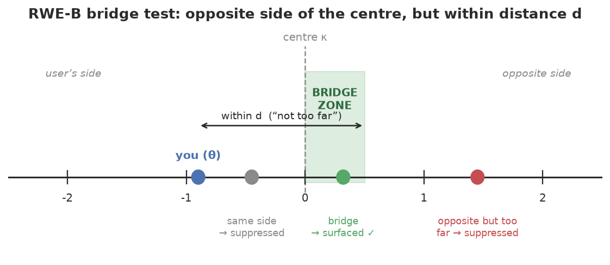
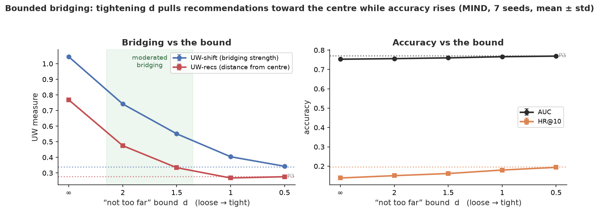
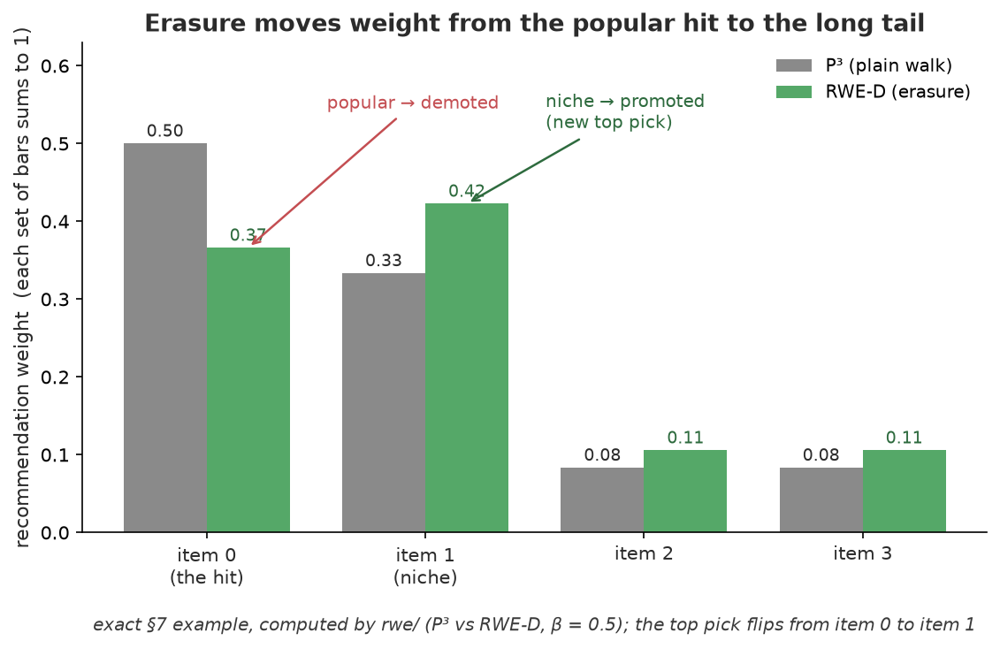
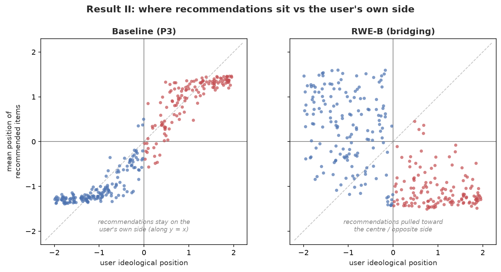
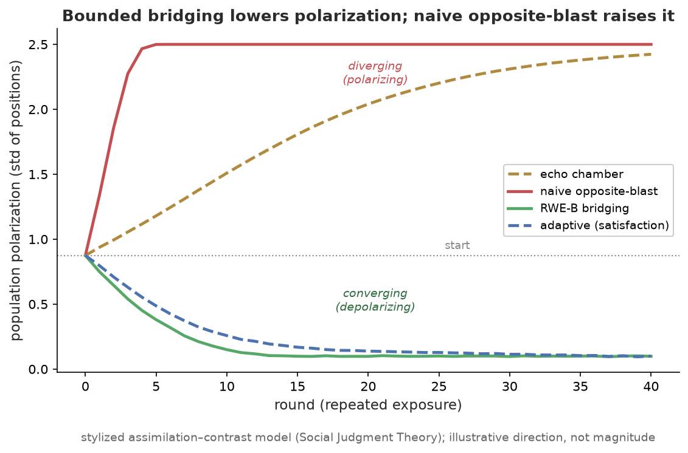
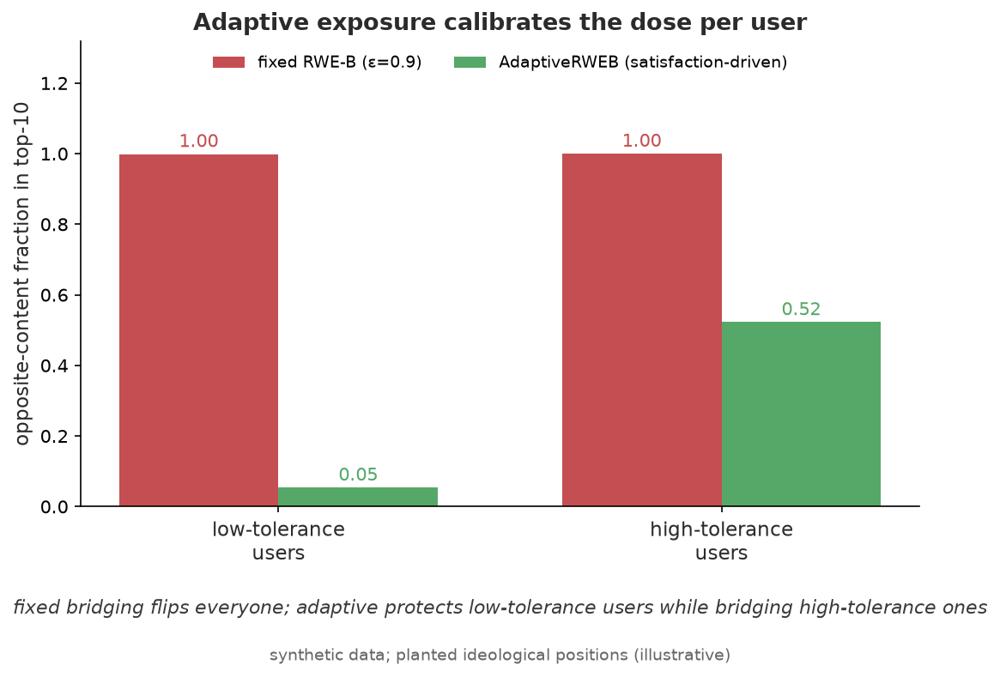

# The Math Behind Every Piece — Explained from Scratch

> **Viewing note:** equations render on **github.com in a browser** (desktop or
> phone browser both work). The **GitHub mobile app** does not support math
> rendering and shows raw LaTeX like `$x^2$` — that's the app, not this file.

This is the **math companion** to the project. [`GUIDE.md`](../GUIDE.md) tells the
*story* in plain words; [`README.md`](../README.md) is the *API*; this file walks
through **every formula we implement** — but *slowly*, assuming **no maths
background beyond high school**. Each formula comes with a plain-English
translation and a symbol-by-symbol reading. Start with the cheat-sheet in §0 and
refer back to it whenever a symbol looks scary.

**Source-of-truth rule.** The tested code in `rwe/` is the real definition; every
formula here was checked against the code it cites, and the worked numbers in §7
are *printed by the code itself*. If a formula here ever disagrees with the code,
the code wins.

### Contents

0. [How to read the symbols (cheat-sheet)](#0-how-to-read-the-symbols-cheat-sheet)
1. [Notation for this project](#1-notation-for-this-project)
2. [The graph and the random walk](#2-the-graph-and-the-random-walk)
3. [Baselines: P³ and RP³-β](#3-baselines-p³-and-rp³-β)
4. [Random Walk with Erasure — the key formula](#4-random-walk-with-erasure--the-key-formula)
5. [RWE-D: spreading to the long tail](#5-rwe-d-spreading-to-the-long-tail)
6. [RWE-B: bridging to the other side](#6-rwe-b-bridging-to-the-other-side)
7. [A fully worked number example](#7-a-fully-worked-number-example)
8. [The ideology model (placing people on a line)](#8-the-ideology-model-placing-people-on-a-line)
9. [Reading lean from text](#9-reading-lean-from-text)
10. [The evaluation metrics](#10-the-evaluation-metrics)
11. [The opinion-change simulation](#11-the-opinion-change-simulation)
12. [The satisfaction extension](#12-the-satisfaction-extension)
13. [Map: formula → code](#13-map-formula--code)

Equation numbers like (6), (11) refer to Paudel & Bernstein, *"Random Walks with
Erasure,"* WWW '21.

---

## 0. How to read the symbols (cheat-sheet)

Keep this handy. None of the maths below is harder than these pieces.

| symbol | say it as | what it means |
|---|---|---|
| $\sum_{j} x_j$ | "sum over $j$" | add up $x$ for every $j$ (a loop that totals things) |
| $\dfrac{a}{b}$ | "a over b" | divide $a$ by $b$ |
| $x^2$,&nbsp; $\sqrt{x}$ | "x squared", "root x" | multiply $x$ by itself; the reverse of squaring |
| $(a-b)^2$ | "squared distance" | how far apart two numbers are, made positive by squaring |
| $\lvert x\rvert$ | "absolute value of x" | distance from zero — drop any minus sign ($\lvert-3\rvert=3$) |
| $x \odot y$ | "element-wise product" | two equal-length lists → list of pairwise products $[x_1 y_1, x_2 y_2, \dots]$ |
| $x \cdot y$ | "dot product" | multiply matching entries **and add them up** → one number |
| $\sigma(z)$ | "sigmoid of z" | a squashing curve that turns any number into a probability in $(0,1)$ |
| $\theta,\phi,\psi,\alpha,\dots$ | greek letters | just *names* for numbers we are solving for |
| $x_u$ | "x sub u" | the value of $x$ belonging to user $u$ |
| $\bar{x}$ | "x bar" | the **average** of the $x$ values |
| $x^{-a}$,&nbsp; $x^{0.5}$ | "x to the minus a / to the half" | $x^{-a}=1/x^{a}$ (reciprocal power); $x^{0.5}=\sqrt{x}$ |
| $A^{\top}$ | "A transpose" | flip a table's rows and columns ($A^{\top}A$ counts co-occurrences) |
| $x \mapsto y$ | "x maps to y" | a rule turning $x$ into $y$ (e.g. $q\mapsto q^{v}$ raises each $q$ to the power $v$) |
| $z \in [0,1)$ | "z is in 0 to 1" | $z$ is a number from $0$ up to (but not including) $1$ |
| $\text{mean}(\dots)$ | "the average" | add the things up, divide by how many there are |
| $\text{sign}(x)$ | "sign of x" | $+1$ if $x>0$, $-1$ if $x<0$ |
| $a \propto b$ | "a proportional to b" | $a$ equals $b$ times some constant (so they rank the same) |
| $\nabla$ | "gradient" | the direction to nudge a number to make a score go up (used in training) |

That's the whole toolkit. Everything else is built from these.

---

## 1. Notation for this project

| symbol | meaning | in the code |
|---|---|---|
| $m,\ n$ | how many users, how many items | `FeedbackGraph.m`, `.n` |
| $A$ | the clicks table: $A_{ui}=1$ if user $u$ clicked item $i$, else $0$ | `FeedbackGraph.A` |
| $P$ | the "step" table: chance of walking from one node to a neighbour | `FeedbackGraph.P` |
| $k$ | how many steps the walker takes (we use $3$, must be odd) | `BaseRecommender.k` |
| $p$ | the walker's landing chances over items (a list that adds to $1$) | `item_distribution` |
| $q$ | the erasure ("tax") on each item, a number in $[0,1)$ | `_item_erasure` |
| $\text{deg}_j$ | item $j$'s **degree** = how many users clicked it (its popularity) | `item_degrees` |
| $\theta_u$ | user $u$'s political position on a left↔right line | `IdeologyResult.theta` |
| $\phi_e,\ \psi_i$ | an elite's / an article's position on that same line | `.phi`, `.psi` |

---

## 2. The graph and the random walk

**The picture.** Draw every user and every item as a dot. Draw a line between a
user and an item whenever that user clicked that item. This dots-and-lines
picture is a **graph** (think of a subway map). Users only connect to items and
items only connect to users — lines always cross between the two groups (this is
called *bipartite*).


*Figure — users (left) and items (right); a line means "this user clicked this
item." The walker travels along these lines. Lines only ever cross between the
two sides, never within a side.*

**The walker.** Imagine a tiny walker that starts on *you* and, each step, hops to
a random neighbour: you → one of your items → another user who liked it → one of
*their* items, and so on. The table $P$ just records these hop chances: from a dot
with $4$ lines, each neighbour gets chance $\tfrac14$. Formally $P = D^{-1}A^G$
(eq 2) — the $D^{-1}$ just means *divide each row by how many neighbours it has* so
the chances add to $1$. (`FeedbackGraph` builds $A^G$, the full dot-to-dot table
eq 1, and $P$.)

**Where it lands.** Start the walker on user $s$ and take $k$ steps. The list of
landing chances over all dots is written

```math
v_s P^k \qquad\text{(start on }s\text{, take }k\text{ steps).}
```

Because lines always cross sides, after an **odd** number of steps the walker is
always on an *item*. That is why $k=3$: it's the first odd number that reaches
*new* items (step 1 only reaches items you already clicked). We pull out just the
item part and call it $p$ — a list of "how likely the walker is to land here,"
adding up to $1$. Code: `k_step_distribution` does the $k$ hops; `item_distribution`
keeps the item part.

> **Why 3 steps and not 1?** One step from you reaches only items *you already
> clicked*. Three steps — you → your item → other fans → *their* items — is the
> first point where genuinely new, taste-related items show up. This is the
> classic "people like you also liked…" idea.

---

## 3. Baselines: P³ and RP³-β

These are the two simple recommenders we compare against.

**P³** (`class P3`): just recommend the items with the highest landing chance
$p_j$. Simple and accurate, but popular items hog the walker, so it's
repetitive.

**RP³-β** (`class RP3Beta`): take P³'s score and **divide by popularity** to give
small items a chance:

```math
\text{score}^{\text{RP3}}_j \;=\; \frac{p_j}{\text{deg}_j^{\,\beta}} .
```

**In plain words:** divide each item's score by its popularity raised to the
power $\beta$. With $\beta=0$ nothing changes (you get P³); bigger $\beta$ pushes
popular items down and rare ("long-tail") items up. Code: `p * deg**(-beta)`.

---

## 4. Random Walk with Erasure — the key formula

This is the heart of the project. It's one idea and one formula — worth going
slowly.

**The idea (a tax that recycles).** Run the walk and get the landing chances $p$.
Now put a **tax** $q_j$ on each item: item $j$ *keeps* a fraction $1-q_j$ of the
mass that lands on it, and the *taxed* fraction $q_j$ is sent back to the start
and **walks again**. The walked-again mass lands, gets taxed again, walks again…
forever. An item's final score is **all the mass it ever keeps**, across every
pass.

A heavily-taxed item (high $q$) keeps little and donates a lot; a lightly-taxed
item keeps almost everything. Choosing *which* items to tax is the whole trick
(§5 and §6 make two different choices).


*Figure — the walk lands mass on items (black arrows); each item keeps the
un-taxed part (green, sent to the recommendation list) and sends the taxed part
back to you (red, dashed) to walk again. High tax → suppressed; low tax →
recommended.*

**The formula (eq 3).** Let $c = p \cdot q$ be the total fraction taxed away on
one pass (a single number; the $\cdot$ is the dot product from §0). Then the
score works out to a clean closed form:

```math
\text{score} \;=\; \frac{p \odot (1-q)}{1 - c}, \qquad c = \textstyle\sum_j p_j q_j .
```

**Reading it.**
- $p \odot (1-q)$ — top line: what each item *keeps* on the first pass (its landing
  chance times its un-taxed fraction).
- $1 - c$ — bottom line: **one** number, the same for every item.

**Why that bottom line appears (the only derivation here, done gently).** Follow a
single unit of mass:

- Pass 1: it spreads as $p$. Items keep $p\odot(1-q)$. The taxed part that comes
  back totals $c$.
- Pass 2: that returning $c$ re-walks, so items keep $c \times p\odot(1-q)$, and
  $c\times c = c^2$ comes back.
- Pass 3: items keep $c^2 \times p\odot(1-q)$, and so on.

Add up what items keep over **all** passes:

```math
p\odot(1-q)\,\big(1 + c + c^2 + c^3 + \cdots\big).
```

That bracket is a shrinking sum (since $c<1$, e.g. $1+\tfrac12+\tfrac14+\cdots=2$).
The standard result is $1+c+c^2+\cdots = \dfrac{1}{1-c}$. Substituting gives the
formula above. **Done.**

**The one thing to remember:** the bottom line $1-c$ is the *same* for every item,
so it **does not change the ranking** — it just rescales. So erasure is a pure
*re-ranking* knob: change the tax $q$, change which items win, without re-running
the walk. Code (`BaseRecommender._score_batch`) is literally:

```python
erased   = p * q
retained = p - erased
c        = erased.sum(axis=1, keepdims=True)
return retained / (1.0 - c)
```

and `RWE.score_iterative` runs the slow pass-by-pass loop; a test checks they
match (and §7 shows them agreeing to the last decimal).

---

## 5. RWE-D: spreading to the long tail

**Goal:** stop popular items from dominating. So **tax an item by how popular it
is** (eq 4):

```math
q^D_j \;=\; 1 - \text{deg}_j^{-\beta}.
```

**In plain words:** a blockbuster (huge degree) gets taxed almost fully ($q$ near
$1$) so most of its mass is recycled to others; a niche item (degree $1$) gets
taxed $0$ and keeps everything. Put this tax into the keep-amount $p_j(1-q^D_j)$
and it simplifies to $p_j \cdot \text{deg}_j^{-\beta}$ — which (ignoring the
constant bottom line) is **exactly RP³-β** from §3.

So **RWE-D is RP³-β in disguise** — that's a deliberate sanity check: the erasure
framework *contains* the known method as a special case. The extra knob $v$ (the
exponent `RWE.v`, applied as $q\mapsto q^{v}$) lets RWE-D bend away from RP³-β when
the paper's grid search wants it to. Code: `class RWED`.

---

## 6. RWE-B: bridging to the other side

**Goal:** show a left-leaning reader some *good* right-leaning articles (and vice
versa) — but only ones that are *different, not too far*. Now the tax depends on
**political position**, not popularity.

Each user has a position $\theta_u$ and each item a position $\text{pos}_i$ on a
left↔right line (from §8 or §9). Pick a **center** $\kappa$ (the middle of the
crowd). Two ingredients:

**(a) Closeness.** How near an item sits to the user, scaled to $[0,1]$:

```math
\text{sim}(u,i) \;=\; 1 - \frac{\lvert\text{pos}_i - \theta_u\rvert}{\text{(widest gap on the line)}} .
```

$1$ = same spot, $0$ = opposite ends. (The denominator is just the full width of
the line, so the fraction is between $0$ and $1$.)

**(b) The "bridge" test.** An item is a **bridge** for a user if **both** of these
are true:

1. **Opposite sides of the center:** $(\theta_u-\kappa)(\text{pos}_i-\kappa) < 0$.
   This product is negative only when one of them is left of center and the other
   is right of it — a neat trick for "on opposite sides."
2. **Not too far apart:** $\lvert\text{pos}_i-\theta_u\rvert \le d$, i.e. the gap
   between them is within the distance bound $d$.



*Figure — for a left-leaning reader (blue), the **bridge zone** (green) is the
slice that is both past the centre **and** within distance $d$. A close
same-side item fails test 1; a far opposite item fails test 2; only the item
inside the zone is surfaced.*

**The tax (eq 5):**

```math
q^B_{u,i} \;=\; \begin{cases} \text{sim}(u,i) & \text{if } i \text{ is a bridge for } u,\\ \varepsilon & \text{otherwise (}\varepsilon = 0.9\text{, a big tax).} \end{cases}
```

**Why this surfaces bridges.** Remember an item keeps a fraction $1-q$:
- **Non-bridges** (same side, or too far): taxed $\varepsilon=0.9$, so they keep
  only 10% — pushed *down*.
- **Bridges** (opposite side, close): taxed by $\text{sim}$, which is *small* for
  the nearest opposite items, so $1-q$ is *large* — they keep most of their mass
  and rise to the *top*.

So RWE-B promotes exactly the *opposite-side-but-nearby* items — the gentle
cross-cutting reads. Code: `RWEB.similarity`, `.is_bridge`, `._compute`.

**The control knob $d$ (the project's main extension).** `max_distance` $=d$ caps
how far across the aisle a bridge may sit:
- $d=\infty$ (no cap): *any* opposite item qualifies → the walk can land on the
  far **opposite extreme** (the "naive opposite-blast" that §11 shows *backfires*).
- small $d$: only items *just* past the center qualify → recommendations sit
  **near the middle** (the calming regime).

Turning $d$ down slides the recommendations from "opposite extreme" to "near
center" smoothly, with almost no accuracy cost (see `docs/RESULTS.md`);
$d\approx 1.5\text{–}2$ is the sweet spot.



*Figure — real MIND data (7 seeds): tightening the bound $d$ (left → right) pulls
recommendations from the opposite extreme toward the centre (left panel) while
accuracy climbs back toward the P3 baseline (right panel). The shaded band is the
$d\approx 1.5\text{–}2$ sweet spot.*

---

## 7. A fully worked number example

A tiny 3-user × 4-item case, with **every number printed by the real code**
(script: `scratchpad/worked_example.py`).

```
who clicked what:   user0 → {item0, item1}
                    user1 → {item0, item2}
                    user2 → {item0, item3}
popularity (degree): item0=3 (the hit),  item1=item2=item3=1 (tail)
```

**Step 1 — the walk** (3 steps from user 0). Landing chances over the 4 items:

```math
p = [\,0.5000,\ 0.3333,\ 0.0833,\ 0.0833\,], \qquad \text{(they add to }1).
```

The hit (item 0) grabs half; the user's own niche item 1 grabs a third.

**Step 2 — the RWE-D tax** ($\beta=0.5$, so $q^D_j = 1 - 1/\sqrt{\text{deg}_j}$):

```math
q = [\,0.4226,\ 0,\ 0,\ 0\,].
```

Only the popular item is taxed ($1-1/\sqrt3 = 0.4226$); the degree-1 tail items
are taxed $0$.

**Step 3 — the formula.** Taxed-away fraction
$c = p\cdot q = 0.5\times0.4226 = 0.2113$, then
$\text{score} = \dfrac{p\odot(1-q)}{1-c}$:

```math
\text{score} = [\,0.3660,\ 0.4226,\ 0.1057,\ 0.1057\,].
```

**Check — the formula vs. the slow loop agree exactly:**

```
RWED.scores()          = [0.3660  0.4226  0.1057  0.1057]
RWED.score_iterative() = [0.3660  0.4226  0.1057  0.1057]
identical?  True
```

**What the tax did.** Under plain P³ the hit wins easily: its score is $6\times$
the tail's. After RWE-D the hit is **pushed below the user's own niche item 1**
($0.366 < 0.423$) and its lead over the tail shrinks to $3.46\times$. Same walk,
same relevance — popularity simply taxed down. (At recommendation time the
already-seen items 0 and 1 are hidden; we show all four scores here just to see
the mechanism.)



*Figure — both bars are recommendation-weight distributions (each set sums to 1).
Erasure moves weight off the popular hit (item 0, down) onto the user's own niche
pick (item 1, up) and the tail — flipping the top recommendation from item 0 to
item 1. These are the exact numbers above, drawn by `rwe/`.*

---

## 8. The ideology model (placing people on a line)

> **This is the most advanced section. You can skim the algebra** — the picture in
> the first paragraph is the real takeaway.

**The picture.** We want to put every user and article on a single left↔right line
using behaviour alone (who follows/shares whom). The rule we assume: **people
endorse things close to them**. So if we *see* a lot of endorsing between a user
and an elite, they're probably *near* each other on the line. We slide everyone
along the line until the pattern of "who endorses whom" is best explained by
closeness. The output is a position number for each person and item. (Section 6,
`rwe/ideology.py`.)


*Figure — everyone (users and items) ends up as a point on one left↔right line.
The green arc is RWE-B reaching a left user across the centre to a nearby
opposite-side "bridge" (§6).*

**The rule, as a formula (eq 6).** The chance user $u$ endorses elite $e$ goes
*down* as the squared distance between their positions goes *up*:

```math
\Pi^R_{u,e} = -(\theta_u-\phi_e)^2 + \alpha_u + \beta_e, \qquad \Pr(\text{endorse}) = \sigma(\Pi^R_{u,e}).
```

**Reading it:** $(\theta_u-\phi_e)^2$ is their squared distance (the minus sign
makes "far apart" mean "unlikely"); $\alpha_u,\beta_e$ are just "how active/popular"
fudge factors; $\sigma$ (sigmoid, §0) turns the result into a probability. The
joint model adds the same rule for users sharing articles, giving each article a
position $\psi_i$ (eq 9).

**What "fitting" means.** We score how well current positions explain the data
with one number $\mathcal{L}$ (the *log-likelihood*, eq 11): it is high when
endorsements we actually saw were predicted as likely. We also subtract a small
penalty $\tfrac{\lambda}{2}(\dots)$ that keeps positions from flying off to huge
values (this is *regularization* — it just says "stay modest"). Then we **nudge
all the positions uphill** on $\mathcal{L}$, over and over, until it stops
improving.

**The nudges (gradients — safe to skip).** "Uphill" is computed from the
**prediction error**
$\text{err} = (\text{did it happen?}) - (\text{predicted chance})$. For example
the nudge to a user's position is

```math
\nabla_{\theta_u} = \sum_{e} \text{err}_{u,e}\cdot\big(-2(\theta_u-\phi_e)\big) \;-\; \lambda\,\theta_u,
```

i.e. *error × direction-to-the-elite*, summed over elites, minus the stay-modest
pull. Each position type ($\theta,\phi,\psi$ and the fudge factors) has a matching
nudge — these are exactly the `g_theta`, `g_phi`, … lines in `IdeologyModel.fit`.
We apply them with **Adam**, a standard "smart step-size" updater that scales each
nudge so blocks of very different sizes all learn at a sensible pace.

**Two clean-ups after fitting.** The line has no built-in zero, scale, or
direction, so afterwards we (1) **standardize** $\theta$ to mean $0$ and spread
$1$ (and move $\phi,\psi$ the same way) and (2) optionally **flip** the whole line
so a known person lands on the left. Without these, the raw numbers would be
arbitrary from run to run.

> **Important caveat (it shaped our results).** On the MIND news data, fitting
> this to *co-click* behaviour gave a **topic** axis, not a left↔right one (both
> ends were 2019 political news, split by subject). That's why our headline
> results use the **text-based** lean of §9 instead. The axis-quality number
> (correlation ≈ 0.27 with human labels) is in `docs/RESULTS.md`.

---

## 9. Reading lean from text

When behaviour gives a topic axis instead of left↔right, we read each article's
lean straight from its **words** (`examples/classify_lean.py`). A pretrained
text classifier reads the title + abstract and outputs three probabilities —
$\Pr_L$ (left), $\Pr_C$ (center), $\Pr_R$ (right). We turn those into one position
number by a weighted average, with left $=-1$, center $=0$, right $=+1$:

```math
\text{pos}_i \;=\; s\,\big(-1\cdot\Pr_L + 0\cdot\Pr_C + 1\cdot\Pr_R\big) \;=\; s\,(\Pr_R - \Pr_L).
```

**In plain words:** if the model is sure it's right-wing, $\Pr_R\approx1$ and
$\text{pos}\approx +s$; sure it's left-wing → $-s$; mixed/centered → near $0$. The
scale $s=2$ stretches it to the range $[-2, 2]$ to match the other axis. Code is
one line: `scale * (probs @ label_positions)`. (Always check the model's label
order matches $[-1,0,1]$ — the script prints it for you.)


*Figure — the positions this formula actually produces on MIND: article leans
(top) and user θ (bottom, the click-mean) on the shared left↔right scale, left
(blue) vs. right (red). This real distribution is what the §6 bridging and §10
RQ3 metrics are measured against (drawn by `examples/plot_axis.py` on the
ingested data — not a mock-up).*

---

## 10. The evaluation metrics

How we score a recommender. All in `rwe/metrics.py`. The recommendations are a
table of each user's ranked item ids.

### Is it accurate?

**AUC** (`auc`) — *"if I pick one item the user really liked and one random item
they didn't, how often do we rank the liked one higher?"* $0.5$ = coin-flip,
$1$ = perfect. The formula (Mann–Whitney $U$; *a detail — skip if you like, the
sentence above is the point*) for one user, with $R_+$ = sum of
the ranks of the liked items, $n_+$ liked and $n_-$ not:

```math
\text{AUC}_u = \frac{R_+ - \tfrac{n_+(n_++1)}{2}}{n_+\,n_-}, \qquad \text{AUC} = \text{mean over users}.
```

(The subtraction removes the liked items' ranks *among themselves*; the bottom is
the number of liked-vs-unliked pairs.) Items the user trained on are excluded.

**Hit@k** (`hit_rate_at_k`) — of the user's held-out liked items, what fraction
show up in their top $k$? (a recall.)

**Precision@k** (`precision_at_k`) — of the $k$ items we showed, what fraction
were liked?

**NDCG@k** (`ndcg_at_k`) — like Hit@k but **rewards putting hits near the top**. A
hit at position $r$ (counting from $0$) is worth $1/\log_2(r+2)$ — position $1$ is
worth $1$, position $2$ about $0.63$, and so on — then we divide by the best
possible total so the score sits in $[0,1]$.

### Is it diverse (does it use the whole catalog)?

**Gini diversity** (`gini_diversity`) — measures how *evenly* recommendations are
spread over all items. The Gini number is $0$ when every item is shown equally
(maximally fair/diverse) and near $1$ when a few items hog everything; we report
$1-\text{Gini}$ so **higher = more diverse**. (Formula: sort the per-item show-counts
$x_{(1)}\le\dots\le x_{(n)}$, total $T$, then
$\text{Gini} = \frac{2\sum_j j x_{(j)}}{nT} - \frac{n+1}{n}$.)

**Catalog coverage** (`catalog_coverage`) — what fraction of all items get shown to
*somebody*.

**Average item degree** (`average_item_degree`) — average popularity of the items we
recommend; **lower = more long-tail**.

**Personalization** (`personalization`) — how *different* users' lists are from each
other. We measure the overlap between two lists with
$\lvert A\cap B\rvert / \sqrt{\lvert A\rvert \lvert B\rvert}$ (a "cosine"),
average it over user pairs, and
report $1$ minus that — higher means more personalized.

**Surprisal** (`surprisal`) — average "novelty,"
$\text{mean}\big[-\log_2(\text{deg}_i / m)\big]$: rarer items (small degree
relative to the $m$ users) score higher.

### Does it bridge politically? (RQ3)



*Figure — each dot is a user: their own position (across) vs. the average
position of what they're recommended (up). A baseline (left) keeps people on
their own side (dots hug the diagonal); RWE-B (right) pulls them toward the
centre/opposite side (dots flatten toward the middle). The metrics below put
numbers on this.*

Let $\bar r_u$ = the *average position* of the items we recommend to user $u$, let
$\rho_u$ = the user's own position $\theta_u$, and $\kappa$ = the center.

**RecRange@k** (`rec_range_at_k`) — width of a user's recommendation list on the
line: $\max(\text{positions}) - \min(\text{positions})$, averaged over users.

**Directed shift** (`directed_shift`) — *"on average, did we push people toward the
other side?"*

```math
\text{dshift} = \text{mean over users of}\ \big[-\text{sign}(\rho_u-\kappa)\cdot(\bar r_u-\rho_u)\big].
```

The $-\text{sign}(\rho_u-\kappa)$ flips left vs. right so that **crossing toward the
center counts as positive for everyone**. Higher = more bridging.

**UW-shift** (`weighted_shift`) — our headline bridging score: the same directed
shift, but **weighting extreme users more** (bridging a die-hard matters more than
nudging a moderate). The bold idea is the point; the formula below is a detail you
can skim. With weight $w_u = \lvert\rho_u-\kappa\rvert$:

```math
\text{UW-shift} = \frac{\sum_u w_u\,[-\text{sign}(\rho_u-\kappa)]\,(\bar r_u-\rho_u)}{\sum_u w_u}.
```

**UW-recs** (`weighted_position`) — *where do the recommendations actually land?*
The extremity-weighted distance of the average recommendation from the center,
$\dfrac{\sum_u w_u \lvert\bar r_u-\kappa\rvert}{\sum_u w_u}$. **Lower is better:** low
means bridged reads sit *near the center*; high means they sit at the *opposite
extreme* (the backfire danger). This is the number the $d$-knob (§6) drives from
$0.77$ down to $0.27$.

**UW-range** (`weighted_range`) — the same extremity-weighted idea applied to
RecRange.

> "UW" = *user-weighted* (weights use the user's own position). Feeding the user's
> *history* position instead gives the "TW" (training-weighted) twin. The exact
> weighting isn't spelled out in the paper's main text, so we follow its two
> stated goals: reward crossing the center, and count extreme users more.

---

## 11. The opinion-change simulation

The §10 metrics tell us *where recommendations land*. To argue that landing
*near the center* actually **calms** people (and the *opposite extreme*
**backfires**), we simulate how opinions move (`rwe/opinion_dynamics.py`), using a
classic psychology model (*assimilation–contrast / Social Judgment Theory*).

**The update rule.** Show a user at position $\theta$ some content at position
$\text{shown}$; let $d = \text{shown}-\theta$ be the gap. Then:

- **Close content** ($\lvert d\rvert \le L_a$): the user moves a little **toward** it
  — they're persuaded. Move $= +\mu_a d$.
- **Far content** ($\lvert d\rvert \ge L_r$): the user moves **away**, deeper into
  their own side — the **backfire effect**. Move $= -\mu_b d$.
- **In between:** ignored.

($L_a$ = how close before they listen; $L_r$ = how far before they recoil; the
$\mu$'s are small step sizes.) In code, `update()`.

**The policies we compare** (what `shown` is, given the user's $\theta$):

| policy | what it shows | result |
|---|---|---|
| echo chamber | same side, a bit more extreme | drives people apart |
| naive opposite-blast | the far opposite pole | triggers backfire |
| RWE-B bridging | opposite side but *within* listening range $L_a$ | brings people together |
| adaptive (satisfaction) | bridging that reaches *less* for extreme users | never backfires |

**The outcome we track:** **polarization** = the spread (standard deviation) of
everyone's positions. Bounded bridging *shrinks* the spread; the naive blast
*grows* it — **same goal, opposite result, depending on how far you reach.** That
simulated result, plus the real-data knob $d$ from §6, is the project's argument.



*Figure — population polarization over repeated exposure. The naive
opposite-blast (red) drives people apart (backfire); bounded RWE-B bridging
(green) and the adaptive policy (blue) bring them together. Direction is the
point here, not exact magnitude.*

---

## 12. The satisfaction extension

Instead of one global bound $d$, this extension learns **per-user** how much
opposing content each person can take (`rwe/satisfaction.py`). The chain:

1. **Build a page-to-page graph:** two articles are linked if the same people read
   both ($C = A^{\top}A$ — "co-reading counts").
2. **Find communities:** group articles that are read together (a standard
   *label-propagation* algorithm), and label each group by its average position
   (its viewpoint).
3. **Measure satisfaction:** simulate a reader wandering this page graph from their
   own articles; **count how long they linger inside the first opposing-viewpoint
   group** before leaving. Long stay = comfortable with the other side.
4. **Turn that into a dial** in $[0,1]$ (`exposure`).
5. **Set each user's tax personally:**

```math
\varepsilon_u \;=\; \varepsilon_{\text{low}} + \text{exposure}_u\,(\varepsilon_{\text{high}}-\varepsilon_{\text{low}}).
```

**In plain words:** people who tolerate the other side (high exposure) get their
*own-side* content taxed *harder*, so more opposing reads surface; sensitive
people get a gentler dose. It's "different, but not too far" tuned per person.
Code: `SatisfactionModel`, `AdaptiveRWEB`.



*Figure — a fixed bridging dose flips everyone the same amount (red); the
adaptive policy (green) gives high-tolerance users more opposing content while
protecting low-tolerance users from too much.*

---

## 13. Map: formula → code

| idea | where in this doc | file · object |
|---|---|---|
| step table + walk | §2 | `rwe/graph.py` · `FeedbackGraph.P`, `k_step_distribution` |
| P³, RP³-β | §3 | `rwe/random_walk.py` · `P3`, `RP3Beta` |
| **erasure formula** | §4 | `rwe/random_walk.py` · `_score_batch` (slow check: `score_iterative`) |
| RWE-D (tax by popularity) | §5 | `rwe/random_walk.py` · `RWED` |
| RWE-B (tax by position) + bound $d$ | §6 | `rwe/random_walk.py` · `RWEB.similarity`, `.is_bridge`, `._compute` |
| ideology model + nudges | §8 | `rwe/ideology.py` · `IdeologyModel.fit` |
| text lean | §9 | `examples/classify_lean.py` · `_positions_from_probs` |
| all metrics | §10 | `rwe/metrics.py` |
| opinion-change rule | §11 | `rwe/opinion_dynamics.py` · `update`, `POLICIES` |
| per-user satisfaction → tax | §12 | `rwe/satisfaction.py` · `SatisfactionModel`, `AdaptiveRWEB` |

For real-data numbers see [`RESULTS.md`](RESULTS.md); for the plain-language tour
see [`GUIDE.md`](../GUIDE.md); for the writeup see [`PAPER.md`](PAPER.md).

---

*Every formula here was checked against the cited code; the §7 numbers are printed
by `rwe/` directly. Written to be readable without a maths background — if any part
still feels too dense, that's a bug in this file, not in you.*
