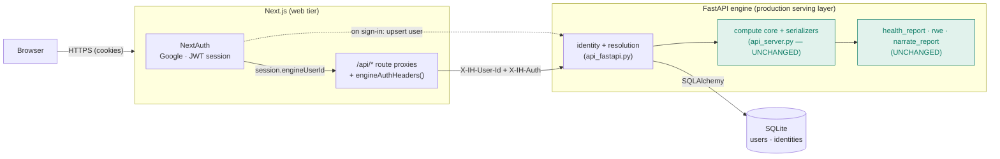
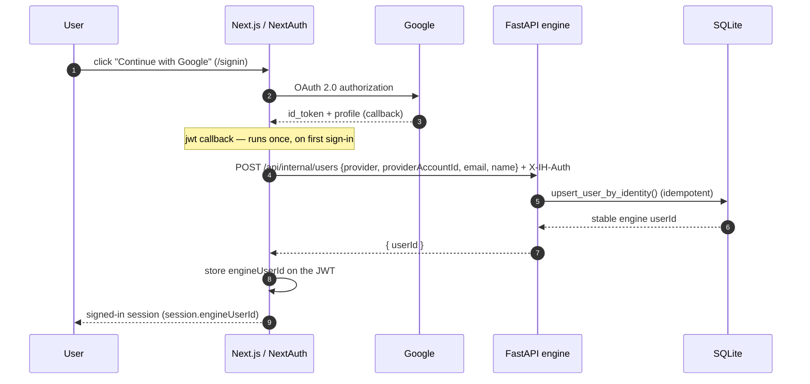
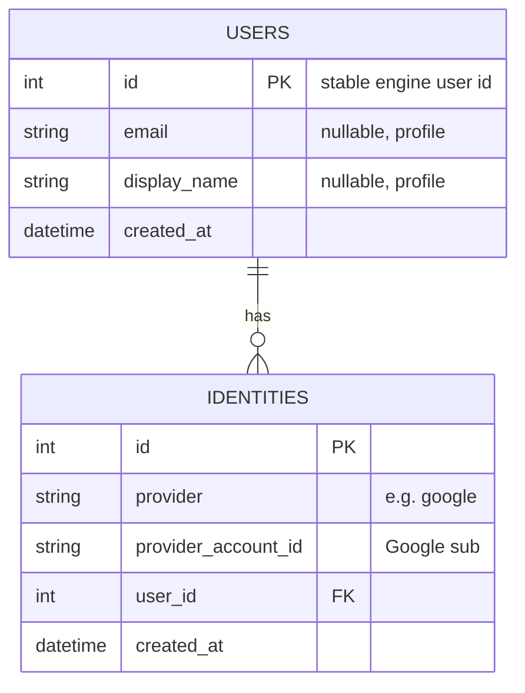
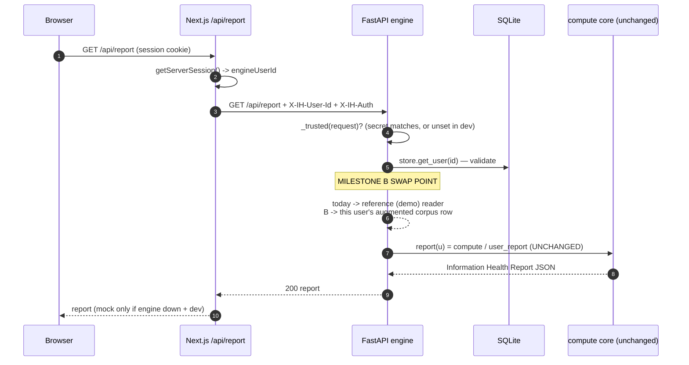

# Milestone A Review — Production Identity Foundation

**Scope reviewed:** commits `51679fe` → `c595e2c` (A/1–A/4).
**Result:** a real person can sign in with Google and be resolved to a stable engine user
id, over an authenticated web↔engine link, with all durable state in SQLite — and **no
research algorithm changed.** Signed-in users still resolve to the reference reader; putting
a *real* reader on these rails is Milestone B.

---

## 1. High-level architecture

**Boundaries that hold:** the browser talks only to Next.js; the engine is never
browser-facing. Next.js authenticates the user and calls the engine server-to-server with a
shared secret. The engine's compute core and algorithms sit *behind* the new identity layer,
untouched.

---

## 2. Authentication flow (Google → engine user id)

If the engine is unreachable at sign-in, `engineUserId` is simply absent and the user resolves
to the demo reader until it recovers — sign-in never hard-fails on the engine.

---

## 3. Database schema

- **One user, many identities.** Uniqueness is the pair `(provider, provider_account_id)`
  (constraint `uq_identity_provider_account`) — the same Google account always resolves to the
  same user; email is context, not the join key.
- Two tables only, by design — reading history, the scored-article cache, and report/rec
  snapshots are added *when the milestone that needs them lands* (B/C/D), each via
  `create_all` (no migration framework yet — see debt §6).

---

## 4. Request flow for a signed-in user (e.g. GET report)

The rails are complete end-to-end; the single line that changes in B is **which reader `u`
resolves to** — from the reference reader to the user's own augmented row.

---

## 5. Research pipelines: unchanged (with evidence)

`git diff --name-only 51679fe~1 c595e2c` — the complete file set Milestone A touched — contains
**zero** research or algorithm files. Verified absent: `rwe/**`, `health_report.py`,
`narrate_report.py`, `simulate_users.py`, `ingest_mind.py`, `ingest_politosphere.py`,
`classify_*`, `adaptive_satisfaction.py`, `mind.py`, and **`api_server.py`** (the compute core
+ serializers). The only engine file changed is the FastAPI *wrapper* `api_fastapi.py`.

| Pipeline / component | Lives in | Status |
| --- | --- | --- |
| MIND ingest / eval | `examples/ingest_mind.py`, `rwe/mind.py`, `examples/eval_mind.py` | **unchanged** |
| Politosphere ingest | `examples/ingest_politosphere.py` | **unchanged** |
| Qbias PoC | `examples/simulate_users.py` (`qbias=`), `examples/validate_qbias.py` | **unchanged** |
| Information Health Report | `examples/health_report.py` | **unchanged** |
| RWE recommenders | `rwe/random_walk.py`, `graph.py`, `satisfaction.py`, `baselines.py` | **unchanged** |
| AI Coach | `examples/narrate_report.py` | **unchanged** |
| Compute core + JSON serializers | `examples/api_server.py` | **unchanged** |
| Serving layer (wrapper) | `examples/api_fastapi.py` | *extended* — adds store + identity endpoints; existing responses byte-identical (strict contract tests still pass) |

**Test evidence:** full suite **280 passed** — every pre-existing pipeline test plus the new
store/identity tests. The strict HTTP-vs-serializer equality tests confirm the report,
recommendations, and coach responses are unchanged for the demo path.

---

## 6. Technical debt introduced (honest list)

| Item | Severity | Note / when addressed |
| --- | --- | --- |
| Signed-in user resolves to the **demo reader** (placeholder) | expected | intentional; resolved in **B/5** when the augmented row exists |
| Real-user header resolution is wired but currently a **no-op difference** | low | dormant seam; becomes live in B — kept minimal on purpose |
| Schema via `create_all`, **no Alembic** migrations | low | fine while additive; adopt migrations before altering columns / at Postgres cutover |
| SQLite engine is **per-process**; WAL not enabled | low | fine for single-process beta; multi-worker write concurrency needs WAL/Postgres (deferred to public beta) |
| **NextAuth v4** (not Auth.js v5) | low | deliberate for a guaranteed-stable build; a future, optional migration |
| `npm audit` reports transitive vulnerabilities | low | pre-existing + dependency-tree; triage before public beta, not fabricated by A |
| Header still shows non-functional **Notifications / Profile / Settings** | pre-existing | mock UI from earlier increments, not A debt; cleaned up in B/D |

No dead code or duplicated algorithm implementations were introduced; the compute core is
reused, not copied.

---

## 7. Security assumptions & limitations

- **Shared secret (`RWE_INTERNAL_SECRET`)** — a symmetric secret in env. When **unset**, the
  engine trusts *any* caller (local-dev convenience) — so it **must be set** in any shared
  deployment, and the **engine must never be exposed to browsers** (private network only). It's
  a static secret (manual rotation, no per-request signing/expiry); read per-request so
  rotation needs no restart.
- **OAuth / sessions** — Google only; **stateless JWT** sessions mean there is **no
  server-side revocation** (a stolen session cookie is valid until it expires). `NEXTAUTH_SECRET`
  must be strong, and the OAuth callback locked to known origins.
- **Engine trusts the web tier's asserted user id** — a leaked secret or a compromised web tier
  could impersonate any user. Mitigations: private link + secret; not browser-reachable.
- **SQLite** — single-file DB: backups are file backups; **data at rest is not encrypted**
  (stored PII = email + display name); not suited to high write concurrency or multi-node. Move
  to Postgres at public beta.
- **No rate limiting / abuse protection** on the internal endpoints yet — acceptable behind a
  private link for a closed beta; add before public exposure.

None of these block a closed beta on a private network; all are flagged for the public-beta
hardening pass.

---

## 8. What remains before a signed-in user gets a *true* personalized report

The identity rails are done; the personalization engine is next.

| Remaining | Milestone | Delivers |
| --- | --- | --- |
| **Augmented-corpus builder** — append the user's scored reads as one row → run existing `compute` / `user_report` / `RWEB` unchanged | **B/5** | the mechanism for any real per-user result |
| **Initial Information Health Estimate** from selected outlets — labeled, no fabricated reads | **B/6** | the first (estimated) result at onboarding |
| **Onboarding flow** (value → publisher pick → estimate) | **B/7** | reach a result in under two minutes |
| **Progressive account creation** + persist onboarding choices & first result | **B/8** | the result becomes *theirs* and survives |
| **Reading ingestion** (extension → paste URL → RSS) + scoring pipeline | **C** | real reads → the **Measured** report *replaces* the estimate |

Until B/5 lands, a signed-in user is deliberately served the reference reader — the honest
placeholder behind today's rails.

---

*Milestone A review · identity foundation complete · algorithms preserved · awaiting approval to
begin Milestone B.*
