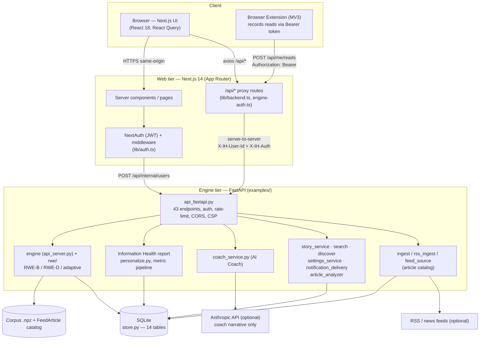
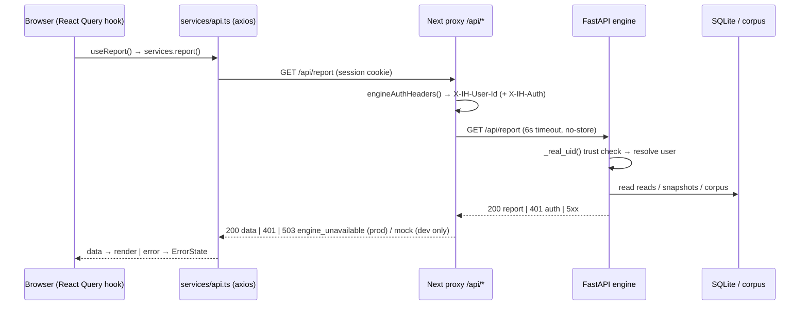
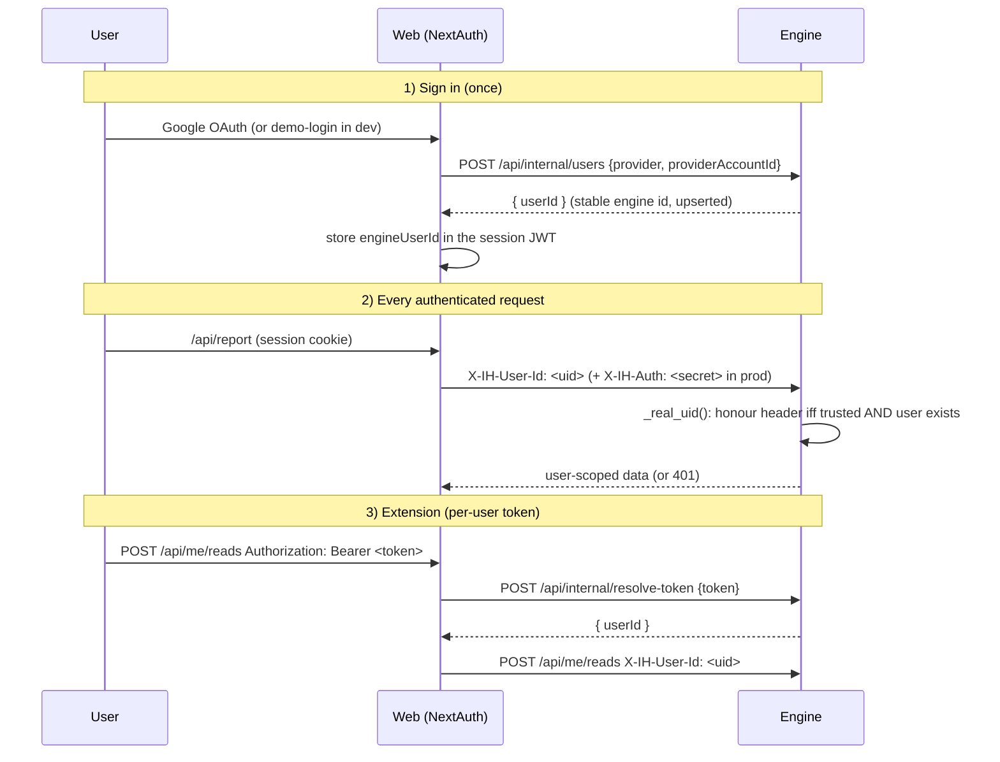
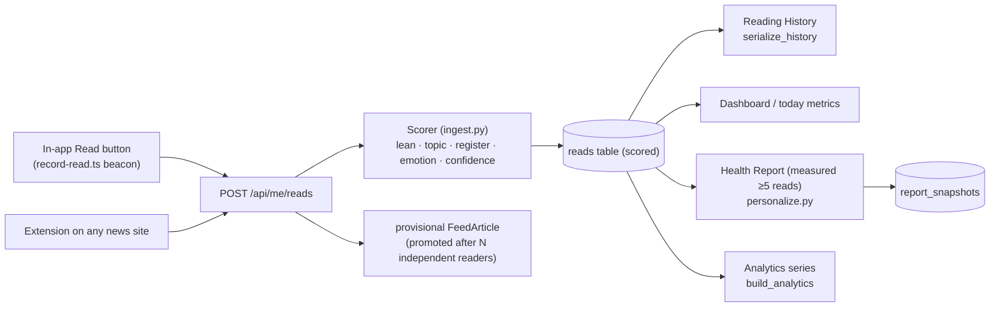
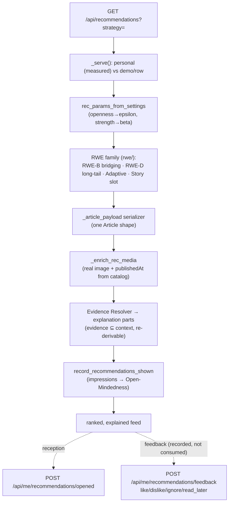
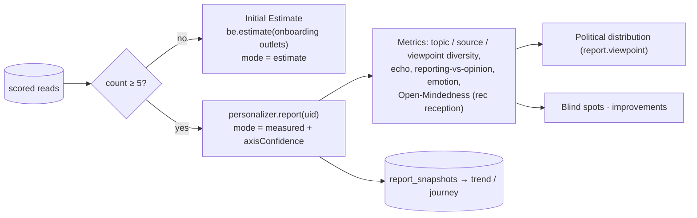
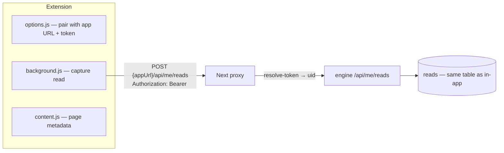
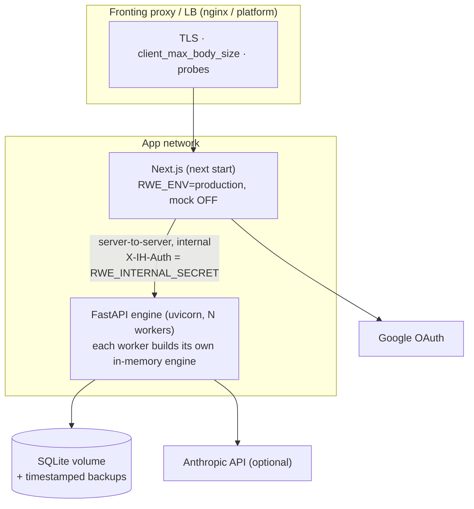

# RC1 — Release Architecture

Release-level architecture for the **Information Health** product (the web app + engine + browser
extension built on the RWE recommender). This is the consolidated RC1 view; the exhaustive,
file-by-file walkthrough lives in [`../SYSTEM_ARCHITECTURE_GUIDE.md`](../SYSTEM_ARCHITECTURE_GUIDE.md),
the report maths in [`../HEALTH_REPORT.md`](../HEALTH_REPORT.md) / [`../MATH.md`](../MATH.md), and the
recommender research in the top-level [`../../README.md`](../../README.md).

## 1. Overview

Information Health is a two-tier application over a research recommender:

- **Web tier** — a Next.js 14 (App Router) app. Renders the UI and hosts a thin server-side **proxy**
  (`app/api/*`) that is the *only* thing that talks to the engine. It owns sessions (NextAuth /
  Google) and never computes health numbers itself.
- **Engine tier** — a FastAPI service (`examples/api_fastapi.py`) wrapping the `rwe/` recommender,
  the Information Health report, the AI coach, story clustering, search, and the article ingest
  pipeline. It owns all durable state in one SQLite database (`examples/store.py`).
- **Browser extension** — a Manifest V3 extension that records real reads from any news site into the
  same canonical pipeline via a per-user API token.

The design rule that shapes everything: **the engine is the single source of truth for user state and
every health number; the web tier is a rendering + session layer that fails closed** (in production it
never fabricates data — see the mock policy in §3 and [`OPERATIONS.md`](OPERATIONS.md)).

## 2. Component diagram

## 3. Request flow (the one path every feature takes)

Every screen reads server state through one uniform chain. There is exactly one implementation per
tier, so transport, auth, caching, and error handling live in one place each.

**Mock policy (fail-closed).** `MOCK_FALLBACK_ENABLED` (`web/lib/backend.ts`) is **off** whenever
`NODE_ENV=production` unless explicitly overridden. In production an unreachable engine returns a
typed `503`, never fabricated data. Account-state routes (history, saved, settings-save, reads,
feedback, tokens) never mock even in dev. The status-preserving proxy pattern
(`lib/engine-fallback.ts`) keeps **401 (auth), 503 (unavailable), and transport failure distinct** —
they are never collapsed.

## 4. Authentication flow

Three trust tiers, fail-closed. OAuth establishes a JWT session; the web tier attributes every engine
call to a stable engine user id; the extension exchanges a token for that id.

- **Production is fail-closed:** the engine **refuses to boot** in `RWE_ENV=production` without
  `RWE_INTERNAL_SECRET`; without it, it would have to trust any caller presenting `X-IH-User-Id`. The
  web app likewise refuses to boot without `NEXTAUTH_SECRET`, `RWE_INTERNAL_SECRET`, `RWE_BACKEND_URL`,
  and Google OAuth.
- **Anonymous / demo:** exhibit routes (`/api/report`, `/api/dashboard`, `/api/recommendations`,
  `/api/coach`) resolve an anonymous caller to the synthetic **demo reader**; per-user `/api/me/*`
  routes return **401**. Page routes are gated by `web/middleware.ts`.

## 5. Data flow (a real read, end to end)

A read is scored once and becomes the shared substrate for History, the Dashboard, the measured
Report (after `ESTIMATE_MIN_READS = 5` reads), and Analytics — one pipeline, no duplicate computation.
Full metric derivations: [`../METRIC_PIPELINE.md`](../METRIC_PIPELINE.md), [`../HEALTH_REPORT.md`](../HEALTH_REPORT.md).

## 6. Recommendation pipeline

Ranking is deterministic and **isolated from feedback** — B1 recommendation feedback is recorded to
`rec_feedback` but consumed by no ranking path (RC1). Sliders map to per-request recommender
parameters; nothing is retrained online. Deep dives: [`../RECOMMENDATION_ENGINE_STATUS.md`](../RECOMMENDATION_ENGINE_STATUS.md),
[`../RECOMMENDATION_EVALUATION_ENGINE.md`](../RECOMMENDATION_EVALUATION_ENGINE.md).

## 7. Information Health pipeline

Every score is computed by the real pipeline from real reads; unknown-outlet lean is **null, never a
fabricated centre** (L2.2), and estimate vs measured is explicitly labelled. Independent recomputation
lives in the metric-validation notebook (see [`../METRIC_PIPELINE.md`](../METRIC_PIPELINE.md)).

## 8. Extension integration

The extension writes to the **same** `/api/me/reads` pipeline the in-app Read button uses (single
source of truth); tokens are minted/revoked in Settings and never exposed on the engine's public
surface. See [`../EXTENSIONS.md`](../EXTENSIONS.md) and [`../../extension/README.md`](../../extension/README.md).

## 9. Deployment architecture

- The engine is **internal** (not browser-facing): CORS is locked (`[]`) in production; the web tier
  reaches it server-to-server with the shared secret.
- Each uvicorn worker builds its own in-memory recommender at startup — **size memory per worker**,
  and rate limits are per process (N× with `--workers N`).
- Container images: `deploy/Dockerfile.web`, `deploy/Dockerfile.api`, `deploy/docker-compose.yml`.
  Full production guidance: [`../../DEPLOYMENT.md`](../../DEPLOYMENT.md).
