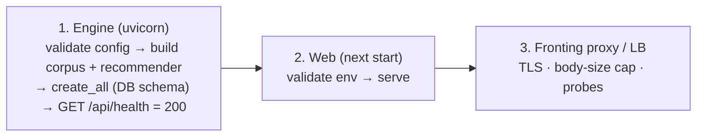

# RC1 — Operations Runbook

Operator-facing runbook for deploying and running Information Health. The authoritative, exhaustive
deployment guide is [`../../DEPLOYMENT.md`](../../DEPLOYMENT.md) (backups, Docker, security headers,
ingestion, rate-limit tuning); this page is the RC1 quick reference + a troubleshooting guide.

## 1. Required environment variables

Set on the **web tier** unless noted. `RWE_ENV=production` makes the missing-config checks fatal
(both tiers refuse to boot). Template: [`../../web/.env.example`](../../web/.env.example).

| Variable | Tier | Required in prod | Purpose |
|---|---|---|---|
| `RWE_ENV` | both | — (the switch itself) | `production` turns on fail-closed auth + config validation + locked CORS + mock OFF |
| `NEXTAUTH_SECRET` | web | **yes** | signs session JWTs (`openssl rand -base64 32`) |
| `NEXTAUTH_URL` | web | **yes** | canonical app URL for OAuth callbacks |
| `GOOGLE_CLIENT_ID` / `GOOGLE_CLIENT_SECRET` | web | **yes** | Google sign-in (the only prod auth) |
| `RWE_INTERNAL_SECRET` | **both** | **yes** | shared secret authenticating web→engine calls; **must match** on both tiers; the engine refuses to boot without it in prod |
| `RWE_BACKEND_URL` | web | **yes** | engine origin the proxy calls (e.g. `http://engine.internal:8000`) |
| `RWE_DB_URL` | engine | recommended | SQLite URL (default `sqlite:///<repo>/data/ih_beta.db`); point at a persistent volume |
| `RWE_ALLOW_MOCK_FALLBACK` | web | leave unset | force dev mock on/off; **off in prod by default** — do not enable |
| `RWE_CORS_ORIGINS` | engine | optional | comma-separated browser origins; default **locked (none)** in prod |
| `ANTHROPIC_API_KEY` | engine | optional | enables the generated AI-coach narrative (deterministic grounded reply without it) |
| `RWE_RSS_FEEDS` / `RWE_RSS_ENABLED` | engine | optional | live news catalog (see DEPLOYMENT.md → "News ingestion") |
| `RWE_LOG_LEVEL` | engine | optional | `INFO` (default) / `WARNING` |
| `RWE_RATELIMIT_ENABLED`, `RWE_RATELIMIT_<SCOPE>_PER_MIN` | engine | optional | per-scope rate limits (auth/ai/ingest/write/read) |
| `RWE_BODY_LIMIT_*`, `RWE_MAX_READS_*` | engine | optional | request-size / batch caps |
| `RWE_DEV_LOGIN`, `NEXT_PUBLIC_DEV_LOGIN` | both | **must be unset** | demo credentials sign-in; force-off in prod, and only for local/E2E |
| `RWE_SEARCH_DEBUG`, `RWE_STORIES_DEBUG`, `RWE_DEV_TOKEN` | engine | **must be unset** | diagnostic/dev affordances; off by default |

**Pre-flight checklist** before a production deploy: `RWE_ENV=production` on both tiers; the five
required web secrets set; `RWE_INTERNAL_SECRET` identical on both; `RWE_CORS_ORIGINS` set to the real
origin (or rely on the internal default); every `*_DEV_*` / `*_DEBUG` flag unset; `RWE_ALLOW_MOCK_FALLBACK`
unset. The startup validators enforce most of this and fail fast if it's wrong.

## 2. Startup sequence

1. **Engine first.** It validates configuration (fail-fast, §"Startup validation" in DEPLOYMENT.md),
   builds the in-memory recommender + corpus, and creates any missing DB tables. It is ready when
   `GET /api/health` returns `200`. Cold start is a few seconds (corpus build).
2. **Web tier.** `next start` (a production build); it validates its env and refuses to boot on
   missing prod config. Point `RWE_BACKEND_URL` at the engine.
3. **Fronting proxy** for TLS, a hard `client_max_body_size`, and health probes.

Local dev (two processes): `python examples/api_server.py` (engine) + `npm run dev` in `web/`.
See [`../../DEPLOYMENT.md`](../../DEPLOYMENT.md) → "Run locally".

## 3. Production deployment steps

1. Build images: `deploy/Dockerfile.api`, `deploy/Dockerfile.web` (or `deploy/docker-compose.yml`
   from the repo root: `docker compose up` → web `:3000`, api `:8000/docs`).
2. Provision a **persistent volume** for the SQLite DB (`RWE_DB_URL`); see §5.
3. Set the environment (§1). Confirm both tiers boot (the validators are the gate).
4. Scale the engine with `uvicorn … --workers N` — **each worker builds its own in-memory engine**, so
   size memory per worker and note rate limits are per process.
5. Put a fronting proxy in front (TLS, body cap, probes → `/api/health`).
6. (Optional) Configure the live news catalog (`RWE_RSS_FEEDS`) and run the ingest job.

Non-Docker production build details: [`../../DEPLOYMENT.md`](../../DEPLOYMENT.md) → "Production build
without Docker".

## 4. Database initialization

- **Schema is automatic.** On startup `store.py` runs `Base.metadata.create_all` (creates any missing
  tables) plus lightweight `ALTER TABLE ADD COLUMN` migrations for additive columns — so deploying a
  newer build over an existing DB is safe and requires no manual migration step. New *tables* (e.g.
  `rec_feedback` in RC1) are created automatically.
- **First boot** with a fresh `RWE_DB_URL` creates an empty, ready database. The 14 tables are listed
  in [`ENGINEERING.md`](ENGINEERING.md) → "Data model".
- **Durability pragmas** (WAL, busy-timeout, synchronous) are applied per connection; see DEPLOYMENT.md
  → "SQLite settings".

## 5. Backup & recovery

Full procedures (with commands) are in [`../../DEPLOYMENT.md`](../../DEPLOYMENT.md) → "Data durability &
backups"; the essentials:

- **Backup (online):** a consistent, timestamped copy can be taken while the engine runs — it writes
  `<db-dir>/backups/ih_beta-<ts>.db`. Storage status (row counts, newest backup) is served at
  `GET /api/internal/storage` and via the CLI.
- **Restore:** **stop the engine**, replace the DB file (and remove stale `-wal`/`-shm`), restart.
- **Disaster recovery & data-loss matrix:** DEPLOYMENT.md enumerates exactly what is lost for each
  failure (crash vs volume loss vs corruption) — user state lives only in the SQLite volume, so back
  that volume up on your platform's schedule in addition to the app-level backups.
- **Integrity:** `PRAGMA quick_check` / `integrity_check` are exposed through the storage endpoint.

## 6. Logs & observability

- **Structured logs:** the engine emits one JSON line per request —
  `{"event":"request","method","path","status","durationMs","requestId"}` — plus a `startup` line,
  `rate_limited`, `payload_too_large`, and `unhandled_exception` events. Secrets, headers, and bodies
  are **never** logged. Set verbosity with `RWE_LOG_LEVEL`. Logs go to stdout/stderr (capture with your
  platform's log driver).
- **Tracing:** every response carries `X-Request-ID`; every error body includes `error.requestId`, so a
  user-visible failure maps to a log line.
- **Web tier:** client render errors surface a generic error boundary (no stack shown to users) and log
  to the browser console; wiring a crash reporter (e.g. Sentry) is a post-RC1 enhancement (see
  [`RELEASE_NOTES.md`](RELEASE_NOTES.md)).

## 7. Health checks

- **`GET /api/health`** → `200` with the active profile, dataset summary, and recommendation source.
  Use it for liveness/readiness probes (the Compose file already does).
- **`GET /api/internal/storage`** → DB size, row counts, backups, integrity (trusted endpoint; requires
  the internal secret in prod).
- **`GET /api/internal/{feeds,corpus,refresh}`** → feed health, corpus validation, refresh generation —
  operational introspection (trusted).

## 8. Troubleshooting guide

| Symptom | Likely cause | Action |
|---|---|---|
| **Engine won't start**, logs a `FATAL: refusing to start` banner | `RWE_ENV=production` without `RWE_INTERNAL_SECRET` (or other missing config) | Set the secret (identical on both tiers), or unset `RWE_ENV`/`RWE_REQUIRE_AUTH` for local dev. This is the fail-closed guard working. |
| **Web won't start**, config validation error | Missing `NEXTAUTH_SECRET` / `RWE_INTERNAL_SECRET` / `RWE_BACKEND_URL` / Google OAuth in prod | Set the five required web vars (§1). |
| **Every `/api/me/*` returns 401** for a signed-in user | web and engine `RWE_INTERNAL_SECRET` differ, or the engine can't see the user | Make the secret identical on both tiers; confirm sign-in upserted the engine user (`POST /api/internal/users`). |
| **Report/Dashboard show `503 engine_unavailable`** | engine down / unreachable, mock off (correct prod behavior) | Check the engine `GET /api/health`; verify `RWE_BACKEND_URL` and network path. The 503 is the *intended* fail-closed response, not a bug. |
| **Users see demo/estimate data instead of their own** | fewer than `ESTIMATE_MIN_READS` (5) reads, or no onboarding | Expected: the Initial Estimate shows until 5 reads accrue, then the report becomes Measured. |
| **Recommendation lean / balance looks wrong for a niche outlet** | unknown outlet → lean is `null` (Unknown), never centre (L2.2) | Expected behaviour; unknown lean is excluded from aggregation, shown as "Unknown". |
| **`429 Too Many Requests`** | per-process rate limit hit | Tune `RWE_RATELIMIT_<SCOPE>_PER_MIN`; remember limits are per worker (N× with `--workers N`). |
| **`413 Payload Too Large`** | body exceeds a per-class cap | Legitimate cap; increase `RWE_BODY_LIMIT_*` only if intended, and set a proxy-level body cap for chunked uploads. |
| **Extension reads don't appear** | wrong app URL or stale/invalid token | In the extension options, confirm the app URL and re-mint the token in Settings; the engine 404/401 messages name the exact issue. |
| **AI coach replies feel templated** | no `ANTHROPIC_API_KEY` | Expected: a deterministic grounded reply; add the key to enable the generated narrative. |
| **Data lost after a restart** | DB was on ephemeral storage | Point `RWE_DB_URL` at a persistent volume; see §5 and the data-loss matrix. |

For anything not covered here, the log line's `requestId` (also in the error body) is the correlation
key — grep the engine logs for it.
