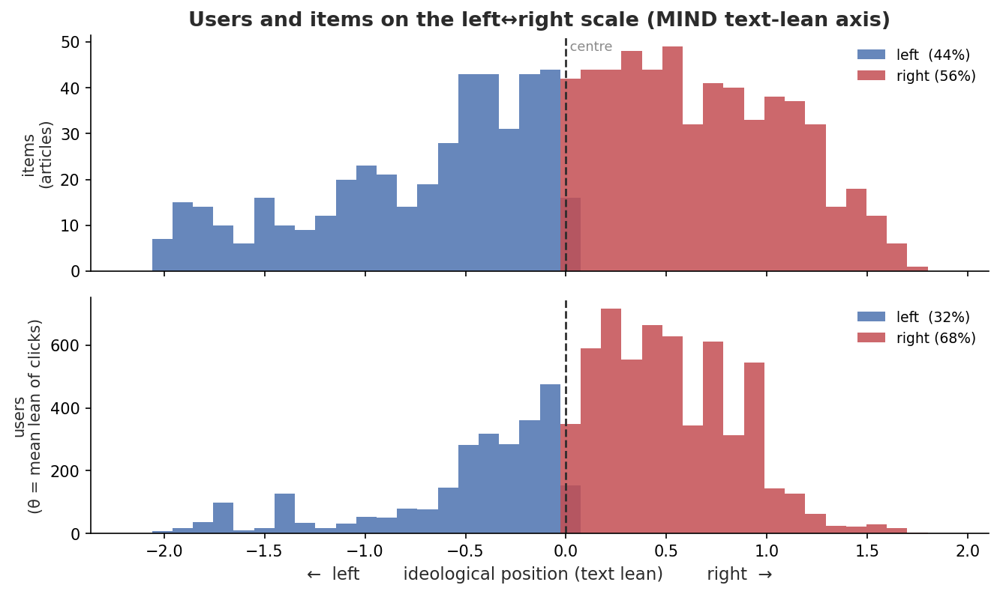

# Real-data results (MIND-small)

First real-data run of the pipeline in `docs/PAPER_PLAN.md`. The MIND tables are
from `examples/eval_mind.py` on **MIND-small**; the long-tail result (RQ2) is then
replicated on **two more public datasets** — **MovieLens-1M** and **Reddit
Politosphere** (each in its own section below). Reproduce with the Colab notebooks
(`notebooks/run_mind_eval.ipynb`, `notebooks/run_politosphere_eval.ipynb`). All tables — RQ2, RQ3, and the bounded-bridging
sweep — are **mean ± std over 7 seeds**, with a Wilcoxon signed-rank `p` vs P3 on the
main comparison. These tables were **independently re-run end-to-end (2026-06-25)
from the Colab notebook and reproduce to the printed precision**. Read the
limitations at the end — chiefly that the *MIND* ideological axis (used for the
flagship RQ3) is a noisy proxy; a separate **behavioral** axis built on Reddit
Politosphere **does** validate (`lean_corr = 0.57 ± 0.19` over 5 seeds), and carries an
independent RQ3.

## Setup

- **Data:** MIND-small train; political articles only (sub-category *politics* /
  *elections*); `--min-user-clicks 10 --min-item-clicks 10`, 15k users sampled.
- **Subset evaluated:** 8,415 users with political clicks · 1,019 political
  articles · 29,635 clicks.
- **Ideological positions:** text political-lean classifier
  (`bucketresearch/politicalBiasBERT`, LEFT/CENTER/RIGHT → −1/0/+1, scaled to
  ≈[−2, 2]) over each article's title+abstract — `examples/classify_lean.py`.
  See the **axis caveat** below.
- **Protocol:** 70/30 per-user split; top-10 ranking; diversity@20; baselines
  ItemKNN / P3 / RP³-β plus RWE-D and RWE-B (`ε=0.9`).



*The populated axis (`examples/plot_axis.py` on `mind_text.npz`): article positions
(top) and user positions θ (bottom) on one shared left↔right scale — left-leaning
(blue) on the left, right-leaning (red) on the right. This is the **visual of the
alignment check** below (Pearson r = +1.00; 44 % / 56 % of articles left / right of
centre). Users skew further right (32 % / 68 %) than the article pool, consistent
with right-leaning articles drawing proportionally more clicks (θ is the click-mean).*

## RQ2 — long-tail diversity (RWE-D)

Mean ± std over **7 seeds** (re-drawn train/test splits); all differences vs P3 are
consistent across the 7 splits (Wilcoxon signed-rank `p = 0.016`, the n=7 floor).

| model | hit@10 | auc | gini_div | coverage | avg_deg ↓ | surprisal |
|---|---|---|---|---|---|---|
| ItemKNN | .108±.004 | .719±.002 | .406±.004 | .989±.002 | 118±2.1 | 8.51±.04 |
| P3 | **.196±.003** | **.771±.001** | .151±.001 | .909±.005 | 265±0.9 | 5.91±.01 |
| RP³-β | .070±.003 | .744±.002 | .683±.003 | .996±.002 | 93±1.2 | 8.61±.01 |
| **RWE-D** | .065±.003 | .743±.002 | **.708±.003** | **.996±.002** | **87±1.4** | **8.74±.01** |

**RWE-D is the strongest long-tail diversifier on every axis** (highest gini /
coverage / surprisal, lowest average item degree) at **AUC parity with RP³-β**
(.743 vs .744). The diversity gaps dwarf the seed-to-seed std, so they are robust.
Top-*k* hit-rate drops — the standard diversity↔accuracy trade-off (same regime as
RP³-β); `--rwed-v` toward 1.0+ trades it back. These metrics are position-
independent, so they reproduce the paper's long-tail result directly. ✅

## RQ2 on a second dataset — MovieLens-1M

To check the long-tail win is not MIND-specific, the same RQ2 comparison on
**MovieLens-1M** (`examples/eval_movielens.py`: 6,040 users · 3,706 items ·
1,000,209 ratings as implicit feedback; 70/30 split; **mean ± std over 5 seeds**).
MovieLens has no ideological axis, so only the long-tail half (RQ2) transfers.

| model | hit@10 | auc | gini_div | coverage | avg_deg ↓ | surprisal |
|---|---|---|---|---|---|---|
| ItemKNN | .101±.001 | .894±.000 | .024±.000 | .159±.002 | 1300±6.8 | 2.298±.007 |
| P3 | .094±.000 | .896±.000 | .010±.000 | .046±.002 | 1665±4.4 | 1.880±.004 |
| RP³-β | .127±.001 | .918±.000 | .024±.000 | .264±.004 | 1474±4.7 | 2.149±.005 |
| **RWE-D** | **.127±.001** | **.918±.000** | **.025±.000** | **.274±.005** | **1470±4.6** | **2.163±.005** |

**The long-tail result reproduces.** RWE-D **ties RP³-β exactly on accuracy**
(AUC .918, hit@10 .127, NDCG@10 .426 — identical) while **edging it on the
long-tail axes**: coverage (.274 vs .264) and surprisal (2.163 vs 2.149) by
≈2–3× the seed std, with gini and avg-degree trending the same way (within seed
noise). Against P3 it **dominates on both sides** — far higher coverage
(.274 vs .046), higher surprisal and lower avg-degree, **and** higher accuracy
(AUC .918 vs .896, hit@10 .127 vs .094). One honest dataset difference: the
accuracy↔diversity trade-off is **milder than on MIND** — MovieLens is denser and
less long-tailed, so RWE-D pays no top-*k* penalty vs P3 here (on MIND it did).
The *direction* of the long-tail win is identical on both datasets, so it is not a
MIND artifact. ✅

## RQ2 + RQ3 on a third dataset — Reddit Politosphere (behavioral axis)

A third public dataset, and the one we built specifically to *fix* the ideological
axis: the **Reddit Politosphere** (Hofmann et al., ICWSM 2022), where the
left↔right axis is learned from **behaviour** — an ideal-point fit on the
user×subreddit endorsement graph (`examples/ingest_politosphere.py`), not text.
Evaluated subset: **15,000 users · 114 political subreddits · 106,662 endorsements**
(US-2016 election window; subreddits with **≥200 distinct commenters**; single seed).

| model | hit@10 | auc | gini_div | coverage | avg_deg ↓ | surprisal |
|---|---|---|---|---|---|---|
| ItemKNN | .653 | .897 | .269 | .982 | 1829 | 3.469 |
| P3 | .649 | .894 | .230 | .746 | 1906 | 3.308 |
| RP³-β | .675 | .903 | .321 | **1.000** | 1768 | 3.616 |
| **RWE-D** | **.675** | **.903** | **.322** | **1.000** | **1766** | **3.621** |

**RQ2 replicates a third time.** RWE-D ties RP³-β on accuracy (AUC .903, hit@10
.675) and is the top long-tail diversifier (highest gini/coverage/surprisal, lowest
avg-degree), dominating P3 on diversity at equal-or-better accuracy. The long-tail
result now holds on **three independent public datasets** — news (MIND), movies
(MovieLens), and social (Reddit).

**And here the ideological axis *validates* — the first of our three constructions to
do so.** The behavioral ideal point matches the labeled subreddit leans at
**`lean_corr = 0.57 ± 0.19` across 5 seeds** (8-restart likelihood-selected fit; min
0.33, max 0.82; n=20 labeled subreddits), and on the stronger seeds (including the
single-seed npz behind the example cards, `lean_corr 0.82`) the axis extremes are
cleanly ideological:

- **left** — `r/communism101` (−3.3), `r/DebateCommunism`, `r/COMPLETEANARCHY`,
  `r/FULLCOMMUNISM`, `r/socialism`, `r/Anarchism`, `r/DebateAnarchism` …
- **right** — `r/The_Donald` (+2.8), `r/The_Farage`, `r/Vote_Trump`,
  `r/AskThe_Donald`, `r/randpaul`, `r/Le_Pen`, `r/conservatives` …

communism/anarchism/socialism at one pole, Trump/Farage/Le Pen/conservatives at the
other — an unmistakable left–right ordering recovered from endorsement **behaviour
alone**, no text and no outlet labels. The automatic axis-alignment check agrees:
users sit on their expected side **98.8 %** of the time (item spread 43 % left /
57 % right).

**It is threshold-sensitive *and* fit-sensitive, and we report both honestly.** At the
looser ingest filter (`--min-item-clicks 20`, **295** subreddits including many
niche/small ones) the *same* fit gave **`lean_corr = 0.13`** with ideologically
*scrambled* extremes — the low-signal subreddits inject idiosyncratic dimensions that
swamp left–right. Restricting to subreddits with **≥200 distinct commenters** (114
subs) removes that noise. Separately, the ideal-point objective is **non-convex**, so a
single random init is seed-unstable: across 5 seeds a 1-restart fit gave `lean_corr` =
{0.82, 0.01, 0.09, 0.69, 0.64} (mean **0.45 ± 0.33**), collapsing to ~0 on **2/5**
seeds. Keeping the **highest-likelihood of 8 restarts** — an *unsupervised* selection
(the model's own data log-likelihood, never the labels, so not circular) — removes the
collapses and gives **`lean_corr = 0.57 ± 0.19` over 5 seeds** (min 0.33, max 0.82). The
RQ3 bridging is robust *regardless* of the axis seed: **RWE-B `uw_shift` 1.97 ± 0.04,
beating the best baseline on 5/5 seeds**. The honest read: the axis **consistently**
recovers ideology (positive every seed, strongly on the majority), on **n=20** labels
and with the denoising filter — a *validated-but-moderate* axis, not a definitive one.

**RQ3 transfers — and this time on a validated axis.** Ideological bridging
(`eval_mind.py` RQ3 on the Politosphere npz):

| model | rec_range | shift@10 | **uw_shift** | uw_recs |
|---|---|---|---|---|
| ItemKNN | 3.520 | .546 | .836 | .989 |
| P3 | 3.675 | .655 | 1.125 | .708 |
| RP³-β | 3.736 | .366 | .558 | 1.089 |
| RWE-D | 3.735 | .364 | .554 | 1.092 |
| **RWE-B** | **4.418** | **1.224** | **1.932** | .664 |

**RWE-B bridges hardest on the validated axis too** — highest `uw_shift` (1.932,
~1.7× P3's 1.125 and ~3.5× RP³-β's 0.558), highest directed `shift@10` (1.224) and
`rec_range` (4.418), while *not* over-shooting to the opposite extreme (`uw_recs`
.664, below every baseline's). Because this axis **is** behaviorally validated as
ideological, this is a **genuine ideological-bridging result**, not a merely
suggestive one: the same RWE-B mechanism that bridges the (weak) MIND text-lean axis
also bridges a left–right axis recovered from real endorsement behaviour. (Caveats as
above: n=20 labels, threshold-dependent, and a fit-sensitivity fixed by 8-restart
likelihood selection; the bridging itself is robust — `uw_shift` 1.97 ± 0.04 over 5
seeds.)

### The audit side — the balance metrics, demonstrated on the validated axis

The same validated axis powers the per-user **Information Health Report**
(`examples/health_report.py --domain reddit`), the project's *auditing* companion to
the recommender. On Politosphere it is the **inverse of MIND**: Topic/Reporting/Emotion
go `n/a` (one category, no article text), but **Viewpoint Balance** and **Echo Chamber**
now rest on the *validated* behavioral axis — the metrics MIND could not support — and
Source Diversity reads as community breadth. Three real readers (single seed,
pseudonymous indices):

| reader | #subs | top subreddits | mix L/C/R | Viewpoint | Echo (↑=balanced) | reads as |
|---|---|---|---|---|---|---|
| #9553 | 7 | r/DebateCommunism, r/ShitLiberalsSay, r/CapitalismVSocialism | 57/29/14 | 87 | **45** | left-leaning, **one-sided** |
| #7667 | 8 | r/AskTrumpSupporters, r/Ask_Politics, r/POLITIC | 38/12/50 | 74 | **88** | balanced, low echo |
| #12757 | 9 | r/EnoughTrumpSpam, r/NeutralPolitics, r/Libertarian | 33/22/44 | 68 | **89** | balanced across the aisle |


The report **differentiates** a one-sided participant (#9553, Echo 45 — mostly
left-debate subreddits) from genuinely cross-cutting ones (#7667 / #12757, Echo ≈ 88
— active in both `r/AskTrumpSupporters` and `r/EnoughTrumpSpam`). Because the axis
underneath is *validated*, these are the report's balance metrics shown as
**measurements, not the directional hints they are on MIND** — the concrete payoff of
the third dataset.

**Read the per-user numbers with the axis caveat.** They inherit the axis's
imperfections (`lean_corr 0.57 ± 0.19` over 5 seeds, n=20 labels; the cards use the
`0.82` single-seed npz): the axis can mis-place an
individual subreddit — e.g. `r/ShitLiberalsSay` is *far-left* (it mocks liberals from
the left), so #9553's small "right" share is partly a placement error. So treat them
as **directional on a validated-but-imperfect axis**, not a precise per-person verdict.

## RQ3 — ideological bridging (RWE-B)

Mean ± std over 7 seeds (all vs-P3 differences Wilcoxon `p = 0.016`).

| model | rec_range | shift@10 | **uw_shift** | uw_recs |
|---|---|---|---|---|
| ItemKNN | 2.574±.032 | .245±.007 | .379±.010 | .247±.007 |
| P3 | 2.481±.028 | .213±.003 | .339±.005 | .278±.006 |
| RP³-β | 2.541±.005 | .263±.002 | .401±.005 | .233±.003 |
| RWE-D | 2.545±.006 | .266±.003 | .405±.005 | .231±.004 |
| **RWE-B** | 2.102±.012 | **.637±.006** | **1.044±.007** | .768±.007 |

**RWE-B bridges by far the most** — highest weighted shift across the centre
(`uw_shift` 1.04 ± .007, ~2.6× every baseline's ≈0.4) — while retaining accuracy
(hit@10 .139 ± .004, auc .753 ± .002; cf. P3 .196/.771). It does **not** widen the
range; it *concentrates* recommendations on the opposite side (and, unbounded, on
the opposite **extreme** — `uw_recs` .768, the highest). That over-shoot is the
"naive opposite-blast" mode, and motivates the sweep. ✅ (this table runs on the
**weak** MIND text-lean axis — but the same RWE-B bridging is independently confirmed
on the **validated** Politosphere behavioral axis above, where `uw_shift` 1.932 again
tops every baseline).

## Bounded bridging — the `max_distance` sweep

`eval_mind.py --seeds 7 --sweep-max-distance 3,2,1.5,1,0.5` (mean ± std over 7 seeds):

| `d` | hit@10 | auc | uw_shift | **uw_recs ↓** |
|---|---|---|---|---|
| ∞ | .139±.004 | .753±.002 | 1.044±.007 | **.768±.007** |
| 3 | .139±.004 | .753±.002 | 1.044±.007 | **.767±.007** |
| 2 | .151±.004 | .756±.002 | .742±.006 | **.475±.006** |
| 1.5 | .162±.003 | .760±.002 | .551±.004 | **.334±.004** |
| 1 | .180±.004 | .766±.002 | .404±.004 | **.268±.005** |
| 0.5 | .194±.003 | .769±.002 | .343±.005 | **.276±.006** |
| *P3* | .196±.003 | .771±.001 | .339±.005 | .278±.006 |

**Tightening the "not too far" bound monotonically pulls `uw_recs` from .77 → .27**
(each step ≫ the ±.005 std) — recommendations move from the opposite *extreme*
toward the *centre* — while accuracy rises toward P3. The bridging magnitude
(`uw_shift`) softens with it: by `d ≲ 1` RWE-B ≈ P3 (bridging gone). The
**moderated-bridging window is `d ≈ 1.5–2`** (still bridges above P3, recs pulled
centre-ward, accuracy preserved). The bound `d` is a clean **control knob** between
opposite-extreme exposure and near-centre exposure. The same monotone curve also
appears on the co-click axis, i.e. the effect is robust (and partly geometric — see
caveats).

## The simulation link (what makes it a *depolarization* claim)

The real data shows RWE-B can be tuned to land recommendations **near the centre**
(low `uw_recs`) rather than the opposite extreme. The opinion-dynamics simulation
(`rwe/opinion_dynamics.py`, assimilation–contrast / Social Judgment Theory) shows
**near-centre exposure depolarizes** where **opposite-extreme exposure backfires**.
Together:

> RWE-B bridges hardest; the bound `d` controls whether its recommendations sit at
> the opposite extreme (backfire regime) or near the centre (depolarizing regime),
> without costing accuracy.

That is the contribution — a *combination* of real-data control + simulated
outcome, not a measured opinion change.

## Limitations (state these plainly)

1. **The ideological axis is a noisy proxy.** The text classifier (trained on full
   articles, applied to headlines) scored **743 / 1019 political articles
   near-centre**; the extremes mix partisan framing with opinion-vs-news framing.
   Validated against a 40-headline independent-rater set (`validate_lean.py`):
   **Spearman r = 0.27, Pearson 0.30, 75 % sign-agreement on the non-neutral
   items** — a *weak-but-positive* ideology proxy. So RQ3 reads are suggestive;
   a larger multi-rater gold set or true outlet-lean labels would firm it up.
   An automated **LLM second-opinion** check (model-vs-model *convergent validity*,
   not human gold) sharpens this: relabeling **120** stratified political headlines
   blind — titles only, `examples/llm_label.py` (free Gemini) — and correlating with
   the classifier gives **Spearman −0.28** (n=120; sign-acc 0.41 on the 39 items the
   LLM called non-centre): the two *disagree*. Inspecting the disagreements shows why —
   the MIND political slice is dominated by late-2019 impeachment coverage, where the
   LLM codes anti-Trump *content* as left while the article-trained classifier keys on
   surface lexicon and scores the same factual headlines right; **neither recovers an
   outlet's editorial slant from a bare headline** (a careful human would call most of
   them centre). So on a topically-skewed slice the axis can be not just low-resolution
   but mildly *anti-aligned* — concrete evidence the MIND text-lean RQ3 is suggestive
   only, and further motivation for the behavioral Politosphere axis below. (The two-BERT
   agreement of +0.38 in `# 7b` reflects *shared* article-classifier method bias, not
   independent validation — which is exactly why the LLM cross-check was worth running.)
   An automatic **axis-alignment check** (`eval_mind.py`, printed each run)
   confirms users and items share one *correctly-oriented* scale: on the
   **text-lean axis** each user's position correlates Pearson **r = +1.00** with
   the mean lean of their clicked articles and **100 %** of users sit on their
   expected side (item spread 44 % left / 56 % right). That is a *sanity check*
   (user positions **are** the click-mean, so it only proves the axis is not
   sign-flipped). On the **co-click `--ideology` axis** the same check is an
   *independent* signal and gives only **r = +0.37** — corroborating, with a
   number, that the co-click axis is topical rather than ideological (cf. the
   Spearman 0.27 vs human labels). So the axis is well-*oriented* but
   weakly-*resolved*: a noisy proxy, not a misaligned one. To reduce the
   single-model noise, `examples/ensemble_lean.py` averages several independent
   bias models into one axis (z-scored, then rescaled); validate any axis against a
   gold set with `examples/validate_lean.py` (calibration cannot help here — Spearman
   is rank-based, so a *less-noisy* model, not a rescaled one, is what lifts it).
   **Two of three axis constructions are weak; the third — the behavioral one —
   validates.** We tried (i) the **text-lean** classifier (Spearman ≈ 0.27 vs a
   40-headline human set, ≈ 0 on a second blind 40, and **−0.28 vs a 120-headline LLM
   second opinion**; it conflates *topic* with *stance*), (ii) the **MIND co-click**
   ideal point (`r = 0.37`, topical), and
   (iii) a **Reddit Politosphere behavioral** ideal point built precisely to fix this
   (`examples/ingest_politosphere.py`). The behavioral axis **validates**:
   `lean_corr = 0.57 ± 0.19` over 5 seeds against labeled subreddit leans, with cleanly
   ideological extremes (communism/anarchism left, Trump/Farage/conservatives right; see
   the third-dataset section) — recovered from endorsement behaviour alone. Three honest
   caveats keep it from being definitive: it is **threshold-sensitive** (at the looser
   ingest filter the same fit gave `lean_corr = 0.13` with scrambled extremes — it
   needs the low-signal subreddits filtered out), it was **fit-sensitive** until we
   selected the highest-likelihood of 8 restarts (a 1-restart fit collapsed to ~0 on
   2/5 seeds; the unsupervised restart selection fixed it), and it rests on **n=20**
   labeled subreddits. The lesson is itself a finding: a left–right
   axis is **hard to recover from text or news co-clicks** (both come out topical),
   but **is** recoverable from explicit community-endorsement behaviour once
   low-signal communities are filtered. **The flagship 7-seed MIND RQ3 still runs on
   the weak text-lean axis, so those reads are *suggestive*; but the bounded-bridging
   *mechanism* is now demonstrated on a *validated* ideological axis (the Politosphere
   RQ3 above) — which, with the mechanism's robustness on any 1-D axis (Limitation 2),
   is the contribution.**
2. **The `uw_recs ↓` effect is partly geometric.** A smaller bound mechanically
   forces opposite-side items closer to the user (hence the centre) on *any* 1-D
   axis — it also appears on the topic axis. So the sweep is a robust *mechanism*,
   not by itself proof of *ideological* depolarization; the depolarization link is
   the simulation.
3. **Significance is across seeds, not observations.** The 7-seed tables show the
   gaps are *stable* (Wilcoxon `p = 0.016`, the n=7 floor), but that is not a
   per-user test. Two checks address this. (a) The **MovieLens-1M RQ2 replication**
   above confirms the long-tail win on a *second* public dataset (5 seeds). (b) A
   **per-user paired Wilcoxon vs P3** (`eval_mind.py --per-user-sig`, **n ≈ 2,546**
   paired users on one split) makes every method's accuracy gap to P3 significant
   far below any threshold — RWE-D `p ≈ 8e-235 / 2e-102 / 3e-129`
   (auc / hit@10 / ndcg@10), RWE-B `p ≈ 4e-175 / 2e-34 / 2e-69`, with ItemKNN and
   RP³-β likewise `p < 1e-60`. This confirms the per-user differences are **real,
   not seed noise**; the signed-rank test does *not* crown a winner — for raw
   accuracy **P3 leads**, and RWE-D / RWE-B trade it for diversity / bridging (it is
   that *gap* which is significant). The long-tail half is dataset-agnostic;
   MovieLens has no ideological axis, so only RQ2 transfers.
4. **Reproducibility / accuracy of base RWE** is on synthetic + this MIND run; the
   paper's private Twitter numbers are not reproduced.

## Reproduce

```
notebooks/run_mind_eval.ipynb           # end-to-end in Colab
examples/classify_lean.py               # text lean -> news_id,position
examples/ingest_mind.py --positions-csv # -> mind_text.npz
examples/eval_mind.py [--sweep-max-distance ...]
examples/eval_mind.py --per-user-sig    # per-user paired Wilcoxon vs P3
examples/eval_movielens.py --ratings ml-1m/ratings.dat   # 2nd-dataset RQ2 check
examples/validate_lean.py               # axis-quality number
examples/plot_axis.py --npz mind_text.npz  # users + items on the L<->R scale
```

_Last updated: 2026-06-30 (5-seed robustness on the behavioral axis: an 8-restart
likelihood-selected ideal-point fit gives `lean_corr = 0.57 ± 0.19` (min 0.33, max 0.82)
and removes the single-restart seed-collapse (which hit ~0 on 2/5 seeds); RQ3 bridging
robust at `uw_shift` 1.97 ± 0.04, beating the best baseline 5/5. Earlier: Reddit
Politosphere folded in as the third RQ2 dataset + validated behavioral axis at
`--min-item-clicks 200`; MovieLens-1M RQ2 + per-user significance 2026-06-28; MIND tables
reproduced 2026-06-25; LLM convergent-validity check on the MIND text-lean axis added
2026-06-30: Spearman −0.28 (n=120), reinforcing the suggestive-only reading)._
