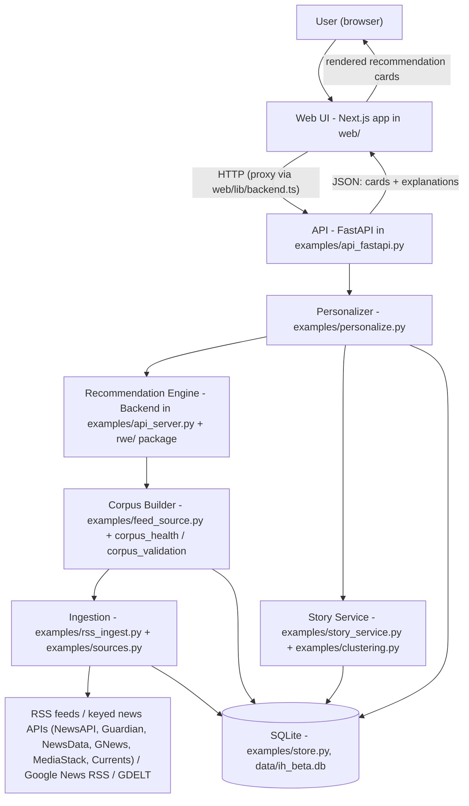
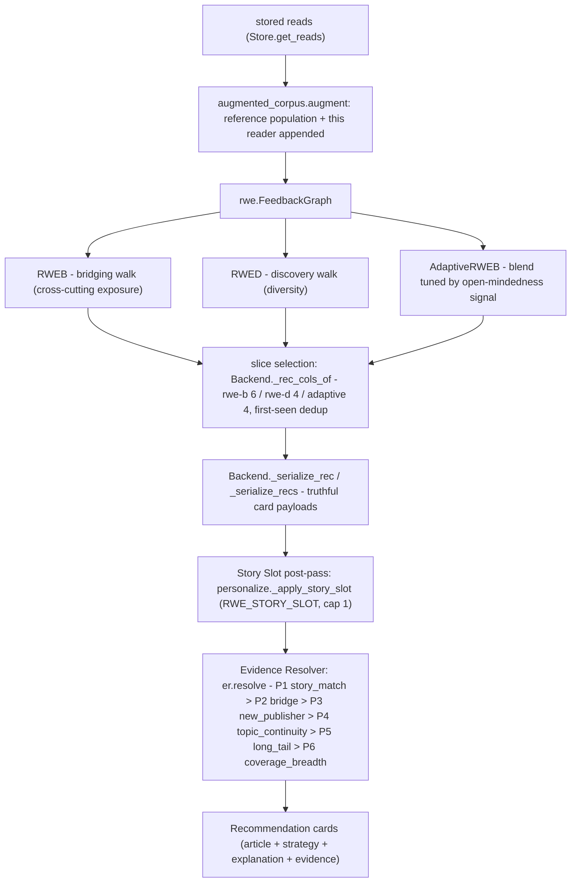
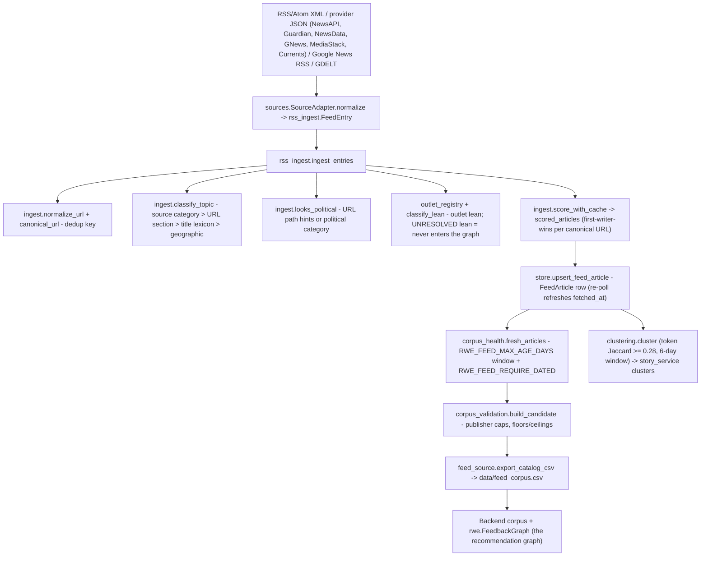
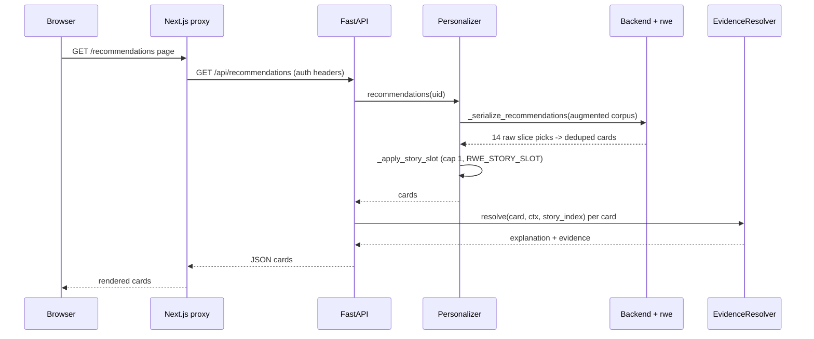
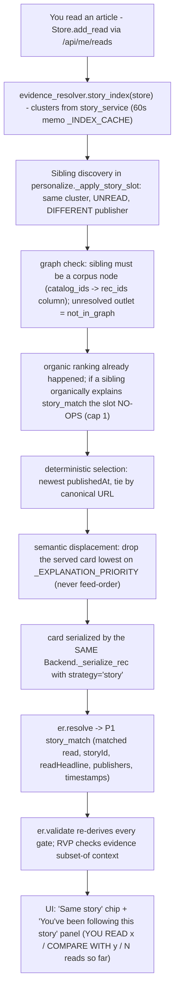
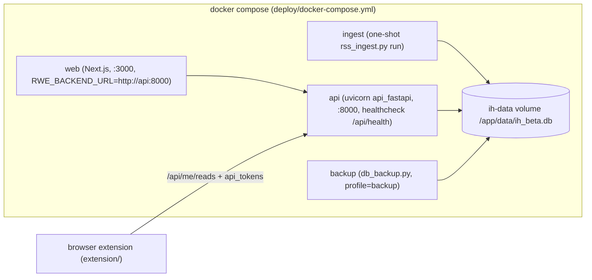
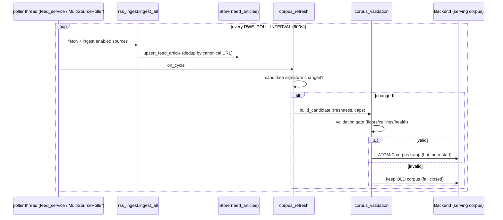

# SYSTEM ARCHITECTURE GUIDE

**Audience:** the developer maintaining this project (you, six months from now).
**Scope:** the whole system — research engine, ingestion, recommendation serving, web app, deployment — grounded in the actual files of this repository. Every component named here exists; every file path is real.

> One sentence to remember what this project is: **a news product ("Information Health") whose feed is powered by a research recommender (Random Walks with Erasure) and whose defining rule is that every recommendation must carry a provable, evidence-backed explanation.**

---

## 1. High-Level Architecture



### The components, in plain English

| Component | Why it exists / problem it solves | Inputs | Outputs | Depends on |
|---|---|---|---|---|
| **Web UI** (`web/`) | People need a product, not an API. Next.js app: dashboard, recommendations, discover, stories, history, analytics, report, coach, settings — in 5 languages. | JSON from the API | Rendered pages; recommendation cards with explanations | The API only (never the DB) |
| **API** (`examples/api_fastapi.py`) | One HTTP front door with auth, rate limits, validation, logging. Owns "who is asking" and serialization; owns no algorithm. | HTTP requests | JSON (`/api/recommendations`, `/api/report`, `/api/stories`, ~35 routes) | Personalizer, Store, story/discover/search modules |
| **Personalizer** (`examples/personalize.py`) | Turns *one real user's stored reads* into a personal feed and Measured report without changing the research engine: it appends the reader to the reference population (an *augmented corpus*) and runs the unchanged engine. Also hosts the **Story Slot** post-pass. | user id, stored reads | recommendations, report, explain diagnostics | Backend (engine), Store, `augmented_corpus.py`, `evidence_resolver.py` |
| **Recommendation Engine** (`examples/api_server.py` `Backend` + `rwe/`) | The actual ranking science. `rwe/` implements Random Walks with Erasure (`FeedbackGraph`, `RWEB`, `RWED`, `AdaptiveRWEB`); `Backend` wraps it with corpus loading, slice selection, and truthful card serialization. | a corpus (articles + click population), a reader row | ranked article columns per strategy; serialized cards | numpy/scipy, `rwe/`, `health_report.py` |
| **Story Service** (`examples/story_service.py`) | Groups articles about the *same news event* across publishers — the basis of Story pages and Story Match. Token-Jaccard union-find clustering (`examples/clustering.py`), no ML model, deterministic. | catalog articles (title tokens + publishedAt) | story clusters (id, members, publishers, timeline) | Store, `clustering.py` |
| **Corpus Builder** (`examples/feed_source.py`, `corpus_health.py`, `corpus_validation.py`, `corpus_refresh.py`) | The engine needs a *bounded, healthy, fresh* corpus, not the raw catalog. Applies freshness windows, publisher caps, floors/ceilings, then validates before anything goes live. | FeedArticle catalog + env config | a corpus CSV (`data/feed_corpus.csv`) the Backend loads; hot-swapped candidates | Store, `corpus_health` thresholds |
| **Ingestion** (`examples/rss_ingest.py`, `examples/sources.py`, `examples/ingest.py`) | Gets real news in, normalized: parse feeds, canonicalize URLs, classify topic/lean/political, dedupe, persist. Every non-RSS adapter (NewsAPI, Guardian, NewsData, GNews, MediaStack, Currents, Google News RSS, GDELT) normalizes into the *same* pipeline so downstream code never knows the source. | RSS/Atom XML / provider JSON / Google News RSS / GDELT | `FeedArticle` rows (+ per-feed health rows) | Store, classifiers (`classify_lean/emotion/register.py`, `outlet_registry.py`) |
| **SQLite Store** (`examples/store.py`) | Single durable source of truth. One env var (`RWE_DB_URL`) selects the database; SQLAlchemy models; everything else is stateless and rebuildable from it. | writes from ingestion + user actions | rows for every other component | SQLAlchemy |

Two more first-class citizens that sit *beside* the serving path:

- **Evidence Resolver** (`examples/evidence_resolver.py`) — chooses THE one explanation per card from a strict priority ladder and can re-derive/validate every claim (`resolve()`, `validate()`, `story_index()`). This is the system's honesty layer.
- **Validation pipelines** (`examples/rec_pipeline/`, `examples/metric_pipeline/`, `examples/validate_recs.py`) — offline golden-scenario pipelines that prove the feed and the metrics are justified, deterministic, and history-sensitive. CI-friendly; also exposed as Colab notebooks in `deploy/`.

---

## 2. Low-Level Architecture

### 2.1 The recommendation engine (serving a feed)



Classes/functions involved, in call order:

1. `personalize.Personalizer._model(user_id)` — builds/caches the user's **augmented model** (`PersonalModel`): reference corpus + the reader's reads appended via `augmented_corpus.augment`. Cache key = (reads version, reception version), so new reads rebuild it.
2. `api_server.Backend._serialize_recommendations(corpus, rec, u, strategy, params)` — computes the reader's political side (`hr.user_report` → mean lean), picks the plan (`[("rwe-b",6),("rwe-d",4),("adaptive",4)]` for the default feed), and calls:
3. `Backend._rec_cols_of` — walks each strategy's full ranking and admits columns into that strategy's *slice* (rwe-b admits **political articles only**; skipped ranks are why a rank-15 article can be outside a top-6 slice).
4. `Backend._serialize_recs` → `_serialize_rec` — dedup first-seen across slices, then serialize each card: article payload, evidence-gated `reason`, `strategy`, `helpsMetric`, `crossCutting` (via `_cross_of`: political ∧ reader has a side ∧ opposite sign ∧ |lean| ≥ 0.5).
5. `personalize._apply_story_slot(user_id, m, recs)` — **only when `RWE_STORY_SLOT` is enabled and no explicit `?strategy=` filter**: inserts at most ONE validated story sibling at the top (see §5), displacing the semantically lowest card.
6. At serve time, `api_fastapi` attaches the explanation: `evidence_resolver.resolve(rec, ctx, index)` per card, where `ctx = personalize.explanation_context(user_id)` (reads, familiarity, top topics, mean lean, topic/lean shares).

### 2.2 The ingestion pipeline (an article's journey in)



Module responsibilities:

- `examples/ingest.py` — the shared vocabulary of ingestion: `RawRead`, `ScoredRead` scoring, `canonical_url`, `classify_topic` (one canonical classifier for ALL sources), `looks_political`, `score_with_cache`.
- `examples/rss_ingest.py` — RSS/Atom parsing (`parse_feed`), the shared terminal pipeline (`ingest_entries`), the batch runner (`ingest_all`), per-feed health, and the `status` CLI.
- `examples/sources.py` — `SourceAdapter` (RSS / GDELT / Google News RSS) + the `KeyedJSONAdapter` chassis (NewsAPI, Guardian, NewsData, GNews, MediaStack, Currents — env-prefix config, combo rotation, daily budgets, 429 accounting), `SourceRegistry`, `MultiSourcePoller`. Adapters only *normalize*; they all terminate in `ingest_entries`, so downstream never learns the provider.
- `examples/feed_service.py` — the background RSS poller thread (`RWE_FEED_POLL`, default 600s), a loop *around* `rss_ingest.ingest_all` with an `on_cycle` seam.
- `examples/corpus_refresh.py` — the hot-refresh wiring: on a poll cycle, if the candidate corpus signature changed, build → validate → sanity-check → **atomic swap** of the Backend corpus; fail-closed (a bad candidate never replaces a serving corpus).
- `examples/corpus_health.py` — freshness (`feed_max_age_days`, `feed_require_dated`, `fresh_articles` with the read-demand exemption), retention planning (monotonic, floor-respecting), health thresholds.
- `examples/clustering.py` + `examples/story_service.py` — deterministic story clusters from title tokens + time window; `story_intelligence.py` adds per-story analysis.

---

## 3. Repository Walkthrough

```
rwe/            The research core (paper code). Pure algorithms, no product.
examples/       The PRODUCT layer: ingestion, store, engine glue, API, tools.
web/            Next.js 14 web app (TypeScript, Tailwind, next-auth, i18n x5).
extension/      Browser extension: records real reads into /api/me/reads.
tests/          Pytest suite (~940 tests) - engine, product, contracts, goldens.
deploy/         Dockerfiles, docker-compose.yml, Colab notebooks, feed list.
docs/           Research docs (MATH.md, PAPER.md), product docs (BETA_ARCHITECTURE.md...).
notebooks/      Research evaluation notebooks (MIND, Politosphere).
data/           Runtime data (gitignored): ih_beta.db, feed_corpus.csv.
```

### Key files (purpose · when it runs · called by · depended on by · if removed)

**`rwe/__init__.py`, `rwe/random_walk.py`, `rwe/graph.py`** — `FeedbackGraph`, `P3`, `RP3Beta`, `RWE`, `RWED`, `RWEB`; `rwe/satisfaction.py` adds `AdaptiveRWEB`. Runs inside every feed computation. Called by `api_server.Backend`. Everything downstream depends on it. Removed → there is no recommender.

**`examples/store.py`** — all persistence: `Store` + models (`users`, `identities`, `onboarding`, `user_settings`, `report_snapshots`, `scored_articles`, `reads`, `api_tokens`, `rec_events`, `saved_articles`, `feed_articles`, `feed_health`). Runs on every request and every ingest. Called by everything. Removed → no durable state.

**`examples/ingest.py`** — shared ingestion vocabulary (canonical URL, topic classifier, political flag, score cache). Runs during ingest AND when a user records a read (`/api/me/reads`). Removed → sources fragment into inconsistent scoring.

**`examples/rss_ingest.py` / `examples/sources.py` / `examples/feed_service.py`** — the three layers of "get news in": parser+pipeline / multi-source adapters / background poller. `rss_ingest.py run` executes at deploy (compose `ingest` service, Colab cell 2); the poller runs when `RWE_FEED_POLL=1`.

**`examples/feed_source.py`** — bridges catalog→engine: `enabled()` (`RWE_RECS_SOURCE=feed`), `prepare(store)` → `export_catalog_csv` (applies `corpus_health.fresh_articles` with the read-demand exemption) → `data/feed_corpus.csv`; `load_url_map` gives the Backend its item-id↔URL resolver. Removed → recommendations fall back to the synthetic/qbias reference corpus (no real URLs).

**`examples/api_server.py`** — `Backend`: corpus loading (`resolve_profile`: synthetic/qbias/MIND/politosphere/feed-CSV), model construction, slice selection, truthful serializers, health-report glue, the coach. *Despite the name it is not the server* — it's the engine wrapper the FastAPI app drives. Removed → no feed assembly.

**`examples/personalize.py`** — `Personalizer` (augmented per-user models, measured reports, recommendations, explain) and the **Story Slot** (`story_slot_enabled`, `_apply_story_slot`, `_EXPLANATION_PRIORITY`). Called by `api_fastapi` per request. Removed → only the demo/synthetic path remains.

**`examples/evidence_resolver.py`** — `resolve()` (P1–P6 ladder), `validate()` (re-derives every gate), `story_index()` (+60s memo `_INDEX_CACHE`). Called at serve time, by the RVP, by the auditor, by tests. Removed → cards lose their honest explanations.

**`examples/api_fastapi.py`** — the production HTTP layer: ~35 routes, auth (session header / `RWE_INTERNAL_SECRET` / API tokens), request limits (`reqlimits.py`, `ratelimit.py`), structured logging, startup validation, publishedAt enrichment (`_attach_published_at`), poller/hot-refresh wiring. Runs as the server process. Removed → no API.

**`examples/health_report.py`** — the Information-Health metrics (`user_report`: echo chamber, viewpoint balance, source diversity, mean lean, top categories). Used by report pages AND by the engine (reader side derivation, C6 share facts).

**`examples/rec_pipeline/` + `examples/validate_recs.py`** — the Recommendation Validation Pipeline: `extract.py` (build a case from a golden fixture or a real history), stages (`evidence`, `explanation`, `determinism`, `ranking`), 10 golden fixtures in `golden/`. Run via CLI or `deploy/rec_validation_colab.ipynb`. Removed → no offline proof the feed is justified.

**`examples/metric_pipeline/`** — same idea for the *metrics* (recompute the dashboard's numbers independently and diff against production).

**`examples/audit_story_coverage.py`** — the read-only Story Coverage & Recommendation Health auditor (`audit`, `serve_and_diagnose`, `full_report`, `print_report`; CLI `--report/--list-users/--serve`; Colab twin `deploy/story_coverage_audit_colab.ipynb`). Your first tool for "why is/isn't X recommended".

**`examples/db_backup.py`** — timestamped, integrity-checked SQLite snapshots (`backup` / restore), compose `backup` service.

**`web/lib/backend.ts` + `web/app/api/*`** — the web side's proxy to the engine (server-side; the browser never talks to FastAPI directly). `web/lib/auth.ts` — next-auth (dev demo login / Google in prod). `web/lib/i18n-core.ts` + `web/messages/` — i18n (5 catalogs generated by `messages/_build_catalogs.py`). `web/components/recommendations/recommendation-card.tsx` — THE card (strategy chip, explanation, evidence drawer). `web/types/domain.ts` — the payload contract.

**`deploy/docker-compose.yml`** — the production shape: `ingest` (one-shot) → `api` (healthchecked) → `web`, plus `backup`; named volume `ih-data` for the SQLite file.

---

## 4. Recommendation Pipeline — one article, beginning to end

Follow one real article (say a Fox News politics piece) from the wire to a click:

1. **Arrives** — the poller (`feed_service`, every `RWE_POLL_INTERVAL`=600s) or the one-shot `rss_ingest.py run` fetches CNN/Fox/Guardian feeds listed in `deploy/rss_feeds.example.txt`; `rss_ingest.parse_feed` yields `FeedEntry`s.
2. **Stored** — `rss_ingest.ingest_entries` → `ingest.canonical_url` (dedup key) → `ingest.score_with_cache` (topic via `classify_topic`, political via `looks_political`, outlet lean via `outlet_registry`/`classify_lean`, emotion/register) → `store.upsert_feed_article` (new row, or merge that refreshes `fetched_at`).
3. **Classified** — the scored dict on the row now carries `category`, `political`, `lean` — these decide slice admission and bridging later.
4. **Story cluster** — `story_service.cluster_from_store` groups it with same-event articles (`clustering.cluster`: token Jaccard ≥ 0.28 within a 6-day `publishedAt` window, ≥2 publishers). `evidence_resolver.story_index` memoizes the lookup.
5. **Candidate** — on boot or hot refresh: `feed_source.prepare` → `corpus_health.fresh_articles` (60-day window; `RWE_FEED_REQUIRE_DATED` drops undated rows; read articles exempt) → `corpus_validation.build_candidate` (per-publisher cap `RWE_FEED_MAX_PER_OUTLET`, floors) → `data/feed_corpus.csv` → `Backend` builds the corpus + `FeedbackGraph`. **If the outlet's lean is unresolved, the article never enters the graph** (`not_in_graph`).
6. **Scored** — for user N: `Personalizer._model` augments the population with N's reads; `RWEB`/`RWED`/`AdaptiveRWEB` rank every column; `Backend._rec_cols_of` fills the slices (6/4/4, political-only rwe-b, first-seen dedup).
7. **Story Slot** — `personalize._apply_story_slot`: if enabled and a validated unread different-publisher sibling of something N read is in the corpus (and no organic story card exists), insert the newest such sibling at position 0, dropping the ladder-lowest card.
8. **Resolver** — `api_fastapi` (route `/api/recommendations`) calls `evidence_resolver.resolve` per card with `explanation_context(N)` + `story_index` → one explanation (`story_match` / `bridge` / `new_publisher` / `topic_continuity` / `long_tail` / `coverage_breadth`) with evidence (shares, familiarity, story ids). `_attach_published_at`/`_enrich_rec_media` join real dates/images by canonical URL.
9. **API → React card** — the web app's server proxy (`web/app/api/recommendations`, `web/lib/backend.ts`) forwards to the browser; `recommendation-card.tsx` renders the strategy chip (`Same story` / `Bridging` / …), the explanation from `web/lib/rec-presentation.ts`, lean chip, real date (`timeAgo`).
10. **User clicks** — "Read article" opens the real URL and posts `/api/me/recommendations/opened` (reception, feeds Open-Mindedness) ; actually reading it records via `/api/me/reads` (extension or in-app), which changes the history → next feed differs (history-sensitivity is a validated property).



---

## 5. Story Match Pipeline



Functions to know, in order: `store.add_read` → `story_service.cluster_from_store` / `clustering.cluster` → `evidence_resolver.story_index` → `personalize.story_slot_enabled` (env `RWE_STORY_SLOT`, default off) → `personalize._apply_story_slot` (all gates; cap 1; organic cards count) → `api_server._serialize_rec` (`strategy == "story"` reason branch) → `evidence_resolver.resolve` (P1) → `evidence_resolver.validate` → `rec_explain._story_match_diag` (per-card diagnostic: `matched` / `not_in_any_story` / `no_story_mate_in_history` / `only_same_publisher_coverage`) → web `recommendation-card.tsx` (chip `rec.strategy.story` = "Same story").

**Measurement twin:** `examples/audit_story_coverage.py` reports Story Coverage, **Servable** Story Coverage (siblings that survived graph + freshness), Story Conversion, and mutually exclusive opportunity buckets (`converted` / `capSatisfied` / `rankedBelowCutoff` / `notInGraph` / `freshness`) with a bucket-driven health verdict.

**Design decisions that are pinned by tests:** P1 beats Bridge (`story_over_bridge` golden); cap 1 with organic counting; newest-first selection; semantic displacement; truthful `strategy="story"` provenance; goldens run slot-off (`rec_pipeline/extract.py` pins `RWE_STORY_SLOT=0`).

---

## 6. Data Flow

**Tables** (`examples/store.py`): `users`, `identities` (provider+account → user), `onboarding`, `user_settings` (sliders), `report_snapshots` (report cache/history), `scored_articles` (the score cache — first writer wins per canonical URL), `reads` (per-user scored reads; `article_id` = canonical URL), `api_tokens` (extension auth), `rec_events` (recommendation reception → Open-Mindedness), `saved_articles`, `feed_articles` (THE catalog), `feed_health` (per-source ingest health).

**How data moves:** sources → `feed_articles` (+ `scored_articles` cache) → corpus CSV → engine memory; user actions → `reads`/`rec_events`/`saved_articles` → augmented models → feeds/reports. The web app holds no state of its own.

**Caches and their invalidation:**

| cache | where | key / TTL | invalidated by |
|---|---|---|---|
| score cache | `scored_articles` table | canonical URL, forever | never (known first-writer-wins tradeoff; a richer later source does NOT re-score) |
| story index | `er._INDEX_CACHE` | store URL + newest row, 60s | time, or `er._INDEX_CACHE.update(key=None, index=None)` in tools/tests |
| per-user model | `Personalizer._cache` | (reads version, reception version) | any new read / reception change; `invalidate(uid)` |
| serving corpus | `Backend` memory (from `data/feed_corpus.csv`) | boot or hot swap | `corpus_refresh` on poll cycles |
| report snapshots | `report_snapshots` table | per user/report | new measured report |

**Polling → rebuild → hot reload:** `feed_service`/`sources.MultiSourcePoller` (RSS 600s; most API providers 900s when enabled; MediaStack 5400s; GDELT 1800s) run `ingest_all` per cycle → `corpus_refresh` computes the candidate signature; if changed: `corpus_validation.build_candidate` → health gates → **atomic swap** of the Backend corpus (fail-closed: validation failure keeps the old corpus serving). Article ids (`Q{i}`) are **positional per corpus build** — never join feeds across builds by id; join by canonical URL.

**Serving:** every `/api/recommendations` request recomputes the feed from the cached per-user model over the current corpus (deterministic given corpus+history — pinned by the RVP determinism stage).

---

## 7. Production Architecture

- **FastAPI** (`examples/api_fastapi.py`, run by uvicorn; `deploy/Dockerfile.api`): auth (dev header `X-IH-User-Id` in dev; `RWE_ENV=production` demands `RWE_INTERNAL_SECRET` and disables demo login), request caps (`reqlimits.py`), rate limits (`ratelimit.py`), structured JSON logging (`RWE_LOG_LEVEL`), startup validation (refuses production with ephemeral DB), `/api/health` (includes `recommendationSource` diagnostics).
- **Next.js** (`deploy/Dockerfile.web`): production build, server-side proxy (`RWE_BACKEND_URL=http://api:8000`), next-auth (Google in prod; `NEXTAUTH_SECRET/URL` validated at boot), `middleware.ts` guards.
- **SQLite** on the named volume `ih-data` (`/app/data/ih_beta.db`); `db_backup.py backup` writes integrity-checked snapshots to `/app/data/backups` (compose `backup` profile; schedule via host cron). Postgres later = change `RWE_DB_URL` only.
- **Background threads:** the poller (`RWE_FEED_POLL=1`) and hot refresh live inside the API process — no separate worker infrastructure.
- **Environment variables** (the operational surface, all read at boot unless noted): `RWE_DB_URL`, `RWE_PROFILE`, `RWE_RECS_SOURCE=feed`, `RWE_FEED_MIN_ARTICLES` (50), `RWE_FEED_MAX_PER_OUTLET` (40), `RWE_FEED_MAX_AGE_DAYS` (60; 0 disables), **`RWE_FEED_REQUIRE_DATED`** (opt-in: candidacy requires a real publishedAt), **`RWE_STORY_SLOT`** (opt-in: the Same-story card), `RWE_FEED_POLL` + `RWE_POLL_INTERVAL`, `RWE_RETENTION_MAX_AGE_DAYS/MAX_COUNT` (default off), `RWE_NEWSAPI_*`, `RWE_GDELT_ENABLED`, `RWE_ENV`, `RWE_INTERNAL_SECRET`, `ANTHROPIC_API_KEY`/`GEMINI_API_KEY` (coach narrative; grounded fallback without).
- **Health checks:** compose healthcheck hits `/api/health`; `rss_ingest.py status` shows per-feed dates/health; `/api/internal/corpus`, `/api/internal/feeds`, `/api/internal/refresh`, `/api/dev/diagnostics` expose internals.
- **Validation in production:** the corpus validation gate before any hot swap; `er.validate()` gates on explanations; the RVP (`validate_recs.py`) runs the same checks offline; CI (`.github/workflows/ci.yml`) runs the full pytest matrix + web typecheck/tests/build on every push.
- **Deployment:** `docker compose -f deploy/docker-compose.yml up --build` (ingest → api → web), or the Colab notebook `deploy/information_health_colab.ipynb` (the current beta: engine subprocess + Next build + cloudflared tunnel).

---

## 8. Technology Stack

| Technology | Why we use it | Where | What you should learn |
|---|---|---|---|
| **Python 3.11** | The entire engine + product backend | `rwe/`, `examples/` | comfortable intermediate: modules, dataclasses, typing, threads |
| **numpy / scipy** | The random-walk math (sparse matrices, vector ops) | `rwe/graph.py`, `random_walk.py` | array thinking; sparse matrix basics |
| **pandas / networkx** | dataset prep + research analysis | `rwe/data.py`, notebooks, eval scripts | basic dataframes (not needed for serving) |
| **SQLAlchemy + SQLite** | one durable store, zero-ops | `examples/store.py` | models, sessions, simple migrations; `sqlite3` CLI |
| **FastAPI + uvicorn** | typed HTTP layer with pydantic response models | `examples/api_fastapi.py` | routing, dependency basics, TestClient |
| **token-Jaccard clustering** (no ML) | deterministic, explainable story grouping | `examples/clustering.py` | set similarity, union-find. *No embeddings / sentence-transformers / FAISS in this repo — do not go looking for them* |
| **TypeScript + React + Next.js 14 (App Router)** | the product UI + server-side API proxy | `web/` | components, app-router pages, server routes |
| **Tailwind CSS** | styling | `web/tailwind.config.ts`, components | utility classes, reading existing patterns |
| **next-auth** | sign-in (demo dev / Google prod) | `web/lib/auth.ts` | session flow, env config |
| **Custom i18n** | 5-locale catalogs with parity checks | `web/lib/i18n-core.ts`, `web/messages/_build_catalogs.py` | the `t()`/catalog pattern; run the generator after key changes |
| **Docker / compose** | reproducible deploy | `deploy/` | services, volumes, healthchecks |
| **pytest** (+ `node --test`) | ~940 engine tests; web unit tests | `tests/`, `web/lib/*.test.*` | fixtures, monkeypatch, running subsets |
| **GitHub Actions** | CI: pytest matrix + web typecheck/build | `.github/workflows/ci.yml` | reading CI logs |
| **Colab notebooks** | runnable validation/audit surfaces | `deploy/*_colab.ipynb` | how each cell maps to the CLI tools |

---

## 9. Learning Roadmap

**Level 1 — foundations (1–2 weeks if rusty)**
- *Python*: everything server-side. Min level: read/modify a 500-line module. Where: `examples/`. Resource: the official tutorial + "Fluent Python" (selectively). ~1 week.
- *Git*: this repo works in small, single-purpose commits with detailed messages — read `git log` as documentation. ~1 day.
- *SQL/SQLite*: inspect `data/ih_beta.db` with the `sqlite3` CLI; understand the 12 tables in §6. ~2 days.
- *HTTP/REST/JSON*: the API surface in §7; practice with `curl` against `/api/health`, `/api/recommendations`. ~1 day.
- *Environment variables*: THE configuration mechanism here. Read the config blocks at the top of `corpus_health.py`, `feed_service.py`, `deploy/docker-compose.yml`. ~half a day.

**Level 2 — the product stack (2–3 weeks)**
- *FastAPI*: `api_fastapi.py` top-to-bottom; write one throwaway route; learn `TestClient` (see `tests/test_api_fastapi.py`). Docs: fastapi.tiangolo.com. ~3 days.
- *SQLAlchemy*: `store.py` models + the `Store` façade. ~2 days.
- *React/TypeScript/Next.js*: `web/app/(app)/recommendations/page.tsx` → `recommendation-card.tsx` → `web/lib/backend.ts`; the payload contract in `web/types/domain.ts`. Docs: react.dev, nextjs.org/learn. ~1 week.
- *Docker*: run the compose stack locally; understand the `ih-data` volume and the one-shot `ingest` service. ~2 days.
- *Testing*: run `python -m pytest tests/ -q`; read `tests/test_story_slot.py` (modern full-stack style) and `tests/test_freshness.py` (env-flag style). ~2 days.
- *Logging*: structured JSON logs (`{"event": ...}`) in `api_fastapi.py`; `RWE_LOG_LEVEL`. ~half a day.

**Level 3 — the domain (3–4 weeks)**
- *Recommendation systems*: collaborative filtering on bipartite graphs. Where: `rwe/random_walk.py` (`P3`/`RP3Beta` baselines → `RWE` → `RWED`/`RWEB`). Read `docs/MATH.md` + the paper draft `docs/PAPER.md`. Resource: any RecSys intro + the P3α/RP3β papers. ~1 week.
- *Graph-based ranking*: `FeedbackGraph` (`rwe/graph.py`), why reads must join real catalog columns (`personalize._catalog_ids` — the "reader island" comment). ~3 days.
- *Story clustering / IR*: `clustering.py` (Jaccard, windows, union-find) + `story_service.py`; know the failure modes measured here: token-overlap mega-clusters, "missing timestamps never block a match". ~3 days.
- *Ranking→slices→explanations*: `Backend._rec_cols_of` → `evidence_resolver` ladder → `validate()`. This trio is the heart of the product. ~1 week.
- *Background workers*: `feed_service.py`, `sources.MultiSourcePoller`, `corpus_refresh.py` (signature → validate → atomic swap, fail-closed). ~2 days.
- *Production debugging*: the auditor (`audit_story_coverage.py`), the RVP (`validate_recs.py`), `rec_explain.py` exclusion queries — see §10. ~3 days, best learned by doing the playbook once.

**Level 4 — production ownership (ongoing)**
- *Architecture*: `docs/BETA_ARCHITECTURE.md`, `DEPLOYMENT.md` (root), `deploy/docker-compose.yml` comments (they are real documentation). 
- *Performance/caching*: the five caches in §6 and their invalidation; corpus size vs. request latency.
- *Monitoring/observability*: `/api/health` + `/api/internal/*` + `feed_health` table + `rss_ingest.py status`; there is no external APM — the built-in surfaces are the observability story.
- *Scaling path*: SQLite→Postgres is `RWE_DB_URL`; the engine is in-process and stateless-per-request beyond its caches. Resource: "Designing Data-Intensive Applications" for the concepts. 
- *Deployment*: practice a full compose deploy + `db_backup.py backup`/restore drill.

---

## 10. Maintenance Playbook

For every issue: the auditor and the explain endpoint are your first two tools.

**A recommendation is missing ("why isn't X in the feed?")**
- Files: `audit_story_coverage.py`, `rec_explain.py`, `personalize.py`.
- Debug: `python examples/audit_story_coverage.py --report --user <id>` (env: `RWE_RECS_SOURCE=feed`, plus the flags your engine runs with). For one article: `Personalizer.explain(uid, article=url)` → exclusion verdict: `seen_excluded` (they read it) / `below_cutoff` (with per-strategy ranks) / `not_in_graph` (unresolved outlet) / `not_in_catalog`.
- Verify/fix: if `not_in_graph` → outlet registry gap (add/resolve the outlet lean); if `below_cutoff` → working as designed (ranking); if missing from catalog → ingestion issue (see RSS below).

**Wrong/odd recommendation**
- Debug: `/api/internal/recommendations/explain` for the live feed, or the per-card decision trace (strategy, byStrategy ranks+inSlice, crossCutting inputs, storyMatch diag, resolver type, `validate()`).
- The known benign patterns: rwe-b card explaining as New Publisher (bridge gate truthfully failed — balanced reader or |lean|<0.5); Science/lifestyle articles passing the political URL heuristic.

**Story Match not working**
- Debug: the auditor's verdict is bucket-driven: `coverage` (no siblings exist) / `graph` (siblings from unresolved outlets) / `freshness` / `cap` (`RWE_STORY_SLOT` on and the one card is spent) / `ranking`. Check `RWE_STORY_SLOT=1` is set **in the engine's env**, not just the audit subprocess. Check `Servable Story Coverage` vs `Story Coverage` — the gap is the unresolved-outlet exposure.
- Files: `personalize._apply_story_slot`, `evidence_resolver.story_index`, `clustering.py`.

**Bridge cards missing**
- Cause #1 (measured): the reader's mean political lean is ~0 → `user_side=0` → nothing can be cross-cutting → zero Bridge explanations, correctly. Verify with the trace (`crossCutting: (value, userMeanLean, articleLean, articlePolitical)`) or the dashboard viewpoint mix. Fix: none needed — it's a balanced diet; bridges return when the diet has a side.
- Cause #2: candidate not `political=True` (slice admission) — check the stored flag vs `ingest.looks_political` (the `World`-category gap is a known miss).

**RSS not updating**
- Debug: `python examples/rss_ingest.py status` (per-feed health, last dates); `/api/internal/feeds`; `feed_health` table; engine log events. Check `RWE_FEED_POLL=1` and the poller thread started (startup log).
- Known real-world case: a legacy feed serving an undated 2023 cache — undated items get `fetchedAt` freshness and re-polls refresh `fetched_at`, making them immortal. Sizing snippet: count `feed_articles` with no `publishedAt` by `sourceFeed`. Fix: replace the feed URL (config), and/or `RWE_FEED_REQUIRE_DATED=1` (code path already shipped, default off).

**Database corruption / loss**
- `python examples/db_backup.py backup` regularly (compose `backup` service); restore per `DEPLOYMENT.md`. SQLite integrity: `sqlite3 data/ih_beta.db "PRAGMA integrity_check;"`. Remember: the DB is the ONLY state — corpus, clusters, models all rebuild from it.

**Corpus rebuild failure / feed suddenly synthetic**
- Symptom: `/api/health` `recommendationSource.source != "feed"` or cards without URLs. Causes: catalog under `RWE_FEED_MIN_ARTICLES` (50), feeds unreachable, validation gate rejecting the candidate (fail-closed keeps the OLD corpus — check logs for the gate reason). Debug: `/api/internal/corpus`, `/api/internal/refresh`.

**Cache inconsistency**
- Story index: 60s staleness is by design; tools/tests reset via `er._INDEX_CACHE.update(key=None, index=None)`.
- Score cache: `scored_articles` is first-writer-wins — a wrong early classification sticks for that URL (known tradeoff; `migrate_topics.py` was the one-shot reclassifier pattern).
- Per-user model: stale after manual DB edits → `Personalizer.invalidate(uid)` or restart.

**UI mismatch (card ≠ evidence)**
- Symptom: "No explanation for this card — the feed has likely refreshed…" in the drawer. Cause: feed rebuilt between page load and evidence fetch; article ids are per-build. Fix: reload (by design). For real drift suspicion: compare `/api/recommendations` explanation types against fresh `er.resolve` **joined by canonical URL, never by `Q` id**.

---

## 11. Code Reading Order

1. `README.md` + `docs/BETA_ARCHITECTURE.md` — what the product is; the map.
2. `examples/store.py` (models first) — the data model is the ground truth everything shares.
3. `examples/ingest.py` → `examples/rss_ingest.py` → `examples/sources.py` — how anything gets in, and the one shared pipeline boundary.
4. `examples/corpus_health.py` → `corpus_validation.py` → `feed_source.py` — catalog → healthy corpus.
5. `rwe/graph.py` + `rwe/random_walk.py` (+ `docs/MATH.md`) — the science; read `RWEB`/`RWED` signatures more than the math at first.
6. `examples/api_server.py` — `Backend`: corpus load, `_rec_cols_of`, `_serialize_rec`. The engine's product face.
7. `examples/health_report.py` — the metrics the whole product narrates.
8. `examples/augmented_corpus.py` → `examples/personalize.py` — how a real user gets a personal feed; the Story Slot.
9. `examples/clustering.py` → `story_service.py` → `evidence_resolver.py` — stories and the explanation ladder + `validate()`.
10. `examples/api_fastapi.py` — the HTTP layer stitching 2–9 together.
11. `web/types/domain.ts` → `web/lib/backend.ts` → `web/app/(app)/recommendations/page.tsx` → `web/components/recommendations/recommendation-card.tsx` — payload → proxy → page → card.
12. `examples/rec_pipeline/` + `examples/validate_recs.py`, then `examples/audit_story_coverage.py` — the proof-and-debugging tooling.
13. `tests/test_story_slot.py`, `tests/test_freshness.py`, `tests/test_story_match_regression.py` — tests as executable specs of the newest behavior.
14. `deploy/docker-compose.yml` + `DEPLOYMENT.md` — how it ships.

Why this order: data model → data in → corpus → algorithm → serving → personalization → explanations → HTTP → UI → validation → ops. Each step only depends on the ones before it, so nothing forward-references.

---

## 12. Architecture Diagrams (collected)

The diagrams above (§1 system, §2.1 engine, §2.2 ingestion, §4 request sequence, §5 story match) plus the deployment and refresh views:





---

### The five invariants to protect when you change anything

1. **Never fabricate:** no invented dates, scores, strategies, or explanations — every claim must be re-derivable (`er.validate`, RVP evidence⊆context).
2. **One ingestion boundary:** every source terminates in `rss_ingest.ingest_entries`; never add a second scoring/dedup path.
3. **Composition, not deletion:** freshness/caps shape the *corpus*; the catalog (Search/Stories/History) keeps everything; retention is the only deleter and respects floors.
4. **Fail closed on refresh:** a candidate corpus that doesn't validate never replaces a serving one.
5. **Flags default off, validate on beta, then default on** — the shipped pattern (`RWE_FEED_REQUIRE_DATED`, `RWE_STORY_SLOT`).
