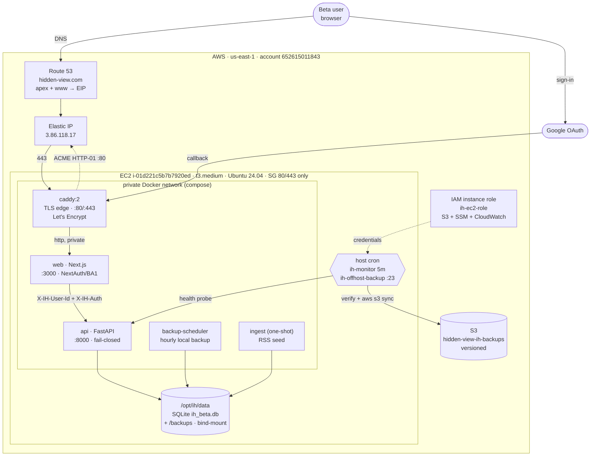

# Wave 0 Deployment Closeout — Information Health (hidden-view.com)

**Status:** ✅ Live in production (closed beta) · **Deployed:** 2026-07-20 · **Region:** us-east-1 ·
**Account:** 652615011843

The **as-built system of record** for the Wave 0 AWS deployment: architecture, resources, runtime
topology, backup/restore, monitoring, security, disaster recovery, known limitations, and the road to GA.
For the execution log (validation results + fixes) see
[`WAVE0_PRODUCTION_DEPLOYMENT_REPORT.md`](WAVE0_PRODUCTION_DEPLOYMENT_REPORT.md).

> Scope: a single EC2 instance running the existing two-tier Docker Compose stack. **No** Terraform, ECS,
> Kubernetes, RDS, ALB, or Auto Scaling — deliberately, for a closed beta. The pre-GA roadmap (§9) is where
> those come in.

---

## 1. Final architecture

**One-paragraph description.** The browser resolves `hidden-view.com` (Route 53) to the Elastic IP and
reaches **Caddy**, the only internet-facing process, which terminates TLS (auto Let's Encrypt) and
reverse-proxies over a **private Docker network** to the **Next.js web** tier. Web authenticates the user
with **Google OAuth (NextAuth)** behind the **BA1 allowlist**, then calls the **FastAPI engine** with a
shared internal secret (`X-IH-Auth`) + the user id (`X-IH-User-Id`). The engine reads/writes **SQLite** on
a **host bind-mount** (`/opt/ih/data`). Two host crons run unattended: a 5-minute health monitor and an
hourly off-host backup that `aws s3 sync`s integrity-checked snapshots to a **versioned S3 bucket** using
the **instance IAM role** (no static keys). The app/engine ports are never published — only 80/443 are open.

## 2. AWS resources created

| Resource | Identifier | Purpose / notes |
|---|---|---|
| EC2 instance | `i-01d221c5b7b7920ed` | t3.medium, Ubuntu 24.04, 30 GiB gp3 root, AZ us-east-1a |
| Elastic IP | `3.86.118.17` (`eipalloc-0ff44d5be53b01ae9`) | Stable public address; survives stop/reboot |
| Security group | `sg-02de782b0941bc1dd` | Inbound **80 + 443 only**; no SSH port (shell via SSM) |
| IAM role + instance profile | `ih-ec2-role` | S3 (backup bucket) + SSM (Session Manager) + CloudWatch; attached inline `ih-s3-backup` policy |
| S3 bucket | `hidden-view-ih-backups-652615011843` | Off-host backups; **versioning enabled** |
| Route 53 hosted zone | `Z03237571N84XNOE3T8QU` | `hidden-view.com` apex + `www` A records → EIP |
| VPC (default) | `vpc-05239174d0b1c67ee` | Default VPC/subnet; no custom networking |
| SSM Session Manager | — | Only shell access path (browser + CLI plugin); audited, no open SSH |

Software installed on the host by `bootstrap-ec2.sh`: Docker Engine + Compose v2, AWS CLI, 2 GB swap,
container log rotation (`/etc/docker/daemon.json`), the data directory, a `docker`-after-mount systemd
drop-in, and two cron jobs.

## 3. Runtime topology

| Service | Image | Ports | Restart | Role |
|---|---|---|---|---|
| `caddy` | `caddy:2` | **80, 443 (host)** | `unless-stopped` | TLS termination, ACME, HTTP→HTTPS + www→apex redirects, reverse proxy to `web` |
| `web` | `deploy-web` (Next.js) | 3000 (private) | `unless-stopped` | NextAuth/Google OAuth, BA1 allowlist, per-user proxy to engine |
| `api` | `deploy-api` (FastAPI) | 8000 (private) | `unless-stopped` | Recommendation engine, fail-closed auth, SQLite owner, Coach v2 |
| `backup-scheduler` | `deploy-api` | — | `unless-stopped` | Hourly local integrity-checked backup + local retention (`BACKUP_KEEP=48`) |
| `ingest` | `deploy-api` | — | one-shot | Seeds the RSS FeedArticle catalog at deploy; exits 0 |

- **Only `caddy` publishes host ports.** `web` and `api` are reachable only on the private compose network
  (`ports: !reset []` in the AWS override) — the engine is never internet-reachable.
- **Persistence:** the SQLite DB and local backups live on the host bind-mount `/opt/ih/data` (survives
  container recreation, redeploys, and reboots). Caddy certificates persist in the `caddy_data` volume.
- **Boot ordering:** a systemd drop-in makes `docker.service` require the data mount, so a reboot can never
  start the app against an empty directory.

## 4. Backup & restore strategy

**Backup (defense in depth):**

1. **In-container, integrity-checked** — `examples/db_backup.py` runs inside the `backup`/`backup-scheduler`
   container (has Python + SQLAlchemy + the same data mount), so the EC2 host needs no Python. Every backup
   runs `PRAGMA quick_check`.
2. **Local retention** — `backup-scheduler` writes hourly snapshots to `/opt/ih/data/backups` and prunes to
   `BACKUP_KEEP=48` (~2 days).
3. **Off-host to S3** — the `ih-offhost-backup` cron (`backup-offhost.sh`, hourly at :23) verifies the newest
   local backup, then `aws s3 sync`s all local backups to `s3://hidden-view-ih-backups-…/backups/` using the
   instance IAM role. Bucket **versioning** guards against overwrite/delete.

**Restore:**

- **Non-destructive verification** (the DR drill run at go-live) — pull a backup from S3 into a scratch file,
  `PRAGMA quick_check`, and confirm core tables/row counts — the live DB is never touched.
- **Real restore** — `deploy/ops/restore.sh <s3://…|local|newest>`: integrity-checks the backup **first**,
  snapshots the current DB to `*.pre-restore`, halts writes (`web`+`api`), atomically swaps, restarts, and
  re-runs the smoke test. `FORCE=1` skips the confirmation prompt.

Proven at go-live: newest S3 backup restored to scratch showed `quick_check: ok` and `users=1 reads=10`,
matching live — a complete off-host recovery path.

## 5. Monitoring strategy

| Layer | Mechanism | Cadence |
|---|---|---|
| Container health | Docker healthchecks (`api` liveness/ready; `caddy` admin-API probe on `:2019`) | 15–30 s |
| Host health monitor | `ih-monitor` cron → `monitor.sh`: checks `api/web/caddy` are running + engine live/ready **inside** the container (catches fail-closed crash-loops) | every 5 min |
| App observability (OBS1) | `/api/health/{live,ready}`, `/api/metrics` (internal-secret gated) | on demand / probes |
| Product analytics (PA1) | `/api/analytics/*` (internal-only, 404 without the secret) | on demand |
| Log rotation | `json-file` driver, `max-size=20m`, `max-file=5` (`daemon.json`) | continuous |

**Alerting (`ALERT_WEBHOOK`).** `monitor.sh` and `backup-offhost.sh` call one `alert()` helper. **Unset =
log-only** (the stack never depends on an alert channel). **Set =** one concise JSON POST per problem,
domain-prefixed and JSON-escaped, carrying **both** `text` (Slack/Mattermost/Google Chat) and `content`
(Discord) so a single URL works with either. Setup + live-test: `docs/PRODUCTION_ENVIRONMENT.md` → Alerting.

## 6. Security model

- **Attack surface:** only 80/443 open (SG `sg-02de782b0941bc1dd`); app + engine ports unpublished. No SSH
  port — shell access is **SSM Session Manager only** (IAM-authorized, audited).
- **Fail-closed auth (both tiers):** with `RWE_ENV=production` the engine refuses per-user calls without the
  shared `RWE_INTERNAL_SECRET` (`X-IH-Auth`) and refuses to boot if it's unset; the web tier `process.exit(1)`s
  if a required secret is missing. A misconfigured deploy stays **closed**, never open.
- **Invite-only (BA1):** Google is the only sign-in method; `BETA_ALLOWLIST` gates it. Enabled-but-empty =
  everyone denied (fail-closed).
- **Transport:** TLS everywhere public (Let's Encrypt via Caddy); HTTP→HTTPS + www→apex redirects; `Secure`
  cookies (`NEXTAUTH_URL=https://…`).
- **Credentials:** the instance IAM role supplies S3/SSM/CloudWatch access — **no static AWS keys on the box**.
  App secrets live in `deploy/.env` (`chmod 600`, git-ignored).
- **Data isolation:** engine reachable only from `web` over the private Docker network; SQLite on a host
  bind-mount, not exposed.

## 7. Disaster recovery summary

| Failure | Recovery | RPO / RTO |
|---|---|---|
| Container crash | `restart: unless-stopped` restarts it; monitor alerts if it stays down | seconds |
| Instance reboot (planned/unplanned) | Whole stack self-heals via restart policies + docker-after-mount; **verified zero data loss** | RPO 0 · RTO ~1–2 min |
| DB corruption | `restore.sh` from newest local/S3 backup (integrity-checked first; current DB snapshotted) | RPO ≤ 1 h · RTO minutes |
| Lost EBS / instance | New instance → `bootstrap-ec2.sh` → restore newest S3 backup → `deploy.sh` (EIP re-associates; DNS unchanged) | RPO ≤ 1 h · RTO ~30 min |
| Accidental backup overwrite/delete | S3 **versioning** retains prior object versions | — |

DR is **tested, not assumed**: the non-destructive S3-restore drill passed at go-live.

## 8. Known limitations (closed beta)

- **No high availability** — single instance, single AZ. A host/AZ failure is downtime until manual
  recovery (mitigated by fast, tested restore). Acceptable for an invite-only beta.
- **SQLite** — single-file DB; fine for beta concurrency, but not horizontally scalable.
- **Backup RPO ≤ 1 hour** — hourly cadence; up to an hour of writes could be lost in a total-loss scenario.
- **Alerting off by default** — `ALERT_WEBHOOK` is unset unless configured; until then, failures are logged
  but not pushed.
- **Secrets in a file** — `deploy/.env` (600) is acceptable on an SSM-only box but weaker than a secrets
  manager.
- **Corpus = RSS only** — `RWE_GDELT_ENABLED` / `RWE_NEWSAPI_ENABLED` are off (NewsAPI needs a key).
- **Caddy TLS certs** are host-local (in `caddy_data`); a from-scratch rebuild re-issues them (watch Let's
  Encrypt rate limits on repeated rebuilds).
- **Coach v2** engages only for **measured** readers (≥ 5 reads); new accounts see v1 until then (by design).

## 9. Recommendations before General Availability (GA)

**Reliability & scale**
- Move off single-instance SQLite: introduce a managed database and horizontal web/engine replicas behind a
  load balancer (the deliberately-excluded RDS/ALB/Auto Scaling belong here, evaluated as a unit).
- Multi-AZ; health-checked target group; graceful draining on deploy.
- Reduce RPO with continuous/streaming backups (e.g. WAL shipping or a managed DB's PITR).

**Security & secrets**
- Migrate `deploy/.env` secrets to **SSM Parameter Store / Secrets Manager**, rendered at deploy time.
- Add WAF/rate-limiting at the edge; formal secret-rotation runbook (`RWE_INTERNAL_SECRET`, `NEXTAUTH_SECRET`).
- Enable S3 bucket policy hardening (TLS-only, block public access assertions) + lifecycle expiry.

**Operations**
- Turn on `ALERT_WEBHOOK` (Slack/Discord) — now fully supported — and add an on-call path.
- Ship metrics/logs to CloudWatch (or a provider) with dashboards + alarms beyond the 5-min cron.
- Codify the infrastructure (the manual AWS steps here) as **Terraform/IaC** for reproducible environments.
- Add a staging environment and a blue/green or canary deploy for the web/engine images.

**Product/config**
- Decide on `RWE_STORY_SLOT`, `RWE_GDELT_ENABLED`, `RWE_NEWSAPI_ENABLED` for GA and wire keys as needed.
- Expand `BETA_ALLOWLIST` → open registration policy for GA.

---

*Companion documents: [`WAVE0_PRODUCTION_DEPLOYMENT_REPORT.md`](WAVE0_PRODUCTION_DEPLOYMENT_REPORT.md)
(validation + fixes) · [`PRODUCTION_ENVIRONMENT.md`](PRODUCTION_ENVIRONMENT.md) (every env var) ·
[`DEPLOYMENT_RUNBOOK.md`](DEPLOYMENT_RUNBOOK.md) (lifecycle commands) ·
[`AWS_EC2_DEPLOYMENT_GUIDE.md`](AWS_EC2_DEPLOYMENT_GUIDE.md) (why/how).*
